# Software Architecture & Code Intelligence Document
**ICICI Group Startup Intelligence & Pilots Registry**

---

## 1. REPOSITORY OVERVIEW

### Executive Summary
The **ICICI Group Startup Intelligence & Pilots Registry** is a secure enterprise portal designed to automate the discovery, analytical evaluation, categorization, and routing of technology ventures for pilot sandboxes and business partnerships across the ICICI Group (including ICICI Bank, ICICI Lombard, ICICI Prudential Life, and ICICI Securities). 

#### Business Objective
In a rapidly evolving financial technology landscape, identifying, vetting, and piloting startups is critical to maintaining a strategic advantage. This application serves as a single source of truth for fintech venture exploration, enabling business managers and Relationship Managers (designated as **FPRs**—First Points of Contact) to track, assign, and run pilots with promising ventures. It solves the critical bottleneck of unstructured startup data, inaccurate vendor categorization, inconsistent founder contact details, and manual outreach workflow management.

#### Primary Users
1. **ICICI Innovation Center of Excellence (CoE) Administrators**: Supervise the entire registry, trigger crawler runs, review AI-generated priority reports, and manage database re-seeds.
2. **First Points of Contact (FPR1 & FPR2)**: Relationship managers assigned to specific ventures who review startup capabilities, record evaluation logs, update partnership stages, and send custom LinkedIn/email outreach proposals.
3. **Executive Stakeholders (CTO, CIO, Strategy Directors)**: Review high-level strategic strategy reports, market gap assessments, and run semantic queries against the tech stack inventory.

#### Key Features
* **Automated Data Discovery (Scrapers)**: Scheduled BS4-based web scrapers that monitor leading startup news sources (e.g., *Inc42*, *Entrackr*) to discover newly funded ventures.
* **AI-Powered Venture Analyzer**: Integrates with local LLM instances (using Ollama and `qwen2.5:3b`) to conduct structured enterprise readiness, BFSI relevance, and security risk evaluations.
* **Master Taxonomy Alignment**: An automated matching engine that maps LLM outputs onto a strict, hierarchical corporate taxonomy (defining Industry, Sector, Subsector, and approved business models) via fuzzy string matching algorithms.
* **Outreach Personalization**: Automatic draft generation of tailored LinkedIn messages and professional emails to co-founders proposing strategic sandbox pilots.
* **Round-Robin Assignment Engine**: Automates venture routing by assigning discovered startups to primary (FPR1) and secondary (FPR2) relationship managers based on round-robin maps.
* **Supabase SQL Sandbox**: A read-only SQL execution terminal in the frontend client allowing database analysts to query the PostgreSQL tables directly.
* **Semantic Correlation Search**: Keyword match rankings to query the registry for specific fintech solutions (e.g., "automated underwriting").
* **AI Strategy Director Insights**: Generates strategic strategy reports mapping out startup portfolio trends, sector readiness, and CoE recommendations.
* **AI Chat Assistant**: Injects the active startup registry database context directly into a conversational model, enabling interactive natural language querying.

#### Core Workflows
```
[Scrapers / CSV / Manual Input]
       │
       ▼
[Startup Discovery Headline] ──► [DuckDuckGo Search Enrichment]
                                        │
                                        ▼
[Ollama qwen2.5:3b AI Analysis] ◄── [Jinja2 Prompt Template Compilation]
       │
       ▼
[JSON Structure Parsing & Cleaning]
       │
       ▼
[Master Taxonomy Mapper (difflib/Fuzzy)]
       │
       ▼
[Canonical Overloads (Direct Matches)]
       │
       ▼
[Supabase PostgreSQL Upsert (Cascades)]
       │
       ├─► [Auto-Assign FPRs (Round-Robin Mapping)]
       ├─► [Generate LinkedIn & Email Outreach Drafts]
       └─► [Synchronize Main Startups Registry Table Columns]
```

### Repository Statistics
* **Total Directory Size**: 8 root subdirectories (excluding standard virtual environments and node modules).
* **Total Code Files**: ~30 core source files (Python, TypeScript, SQL, JSON, Markdown).
* **Major Languages**:
  * **Backend**: Python (FastAPI, BeautifulSoup4, Jinja2, Requests) - **55%**
  * **Frontend**: TypeScript / JavaScript (React, Tailwind CSS, Vite) - **40%**
  * **Database**: SQL (PostgreSQL, PL/pgSQL database triggers) - **5%**
* **Frameworks Used**: 
  * Backend: FastAPI (ASGI web server wrapper)
  * Frontend: React 18, Vite, Tailwind CSS, React Router DOM v6
* **Libraries & SDKs**: 
  * Python: `supabase-py` (PostgREST DB client), `requests` (network HTTP client), `beautifulsoup4` (DOM scraper), `jinja2` (prompt engine), `pydantic` (validation schemas), `uvicorn` (ASGI server).
  * TypeScript: `lucide-react` (icons library), `@supabase/supabase-js` (direct client connection), `axios` (HTTP communication), `recharts` (analytical UI data visualizations).
* **Infrastructure Components**:
  * **Local AI Runtime**: Ollama running model `qwen2.5:3b`.
  * **Database Instance**: Cloud PostgreSQL hosted on Supabase.
  * **API Hosting**: Railway / Uvicorn Server.
  * **Frontend Hosting**: Vercel.

---

## 2. DIRECTORY STRUCTURE ANALYSIS

### Repository Tree
```
startup-intelligence/
├── backend/
│   ├── ai/
│   │   ├── __init__.py
│   │   └── startup_analyzer.py
│   ├── api/
│   │   ├── __init__.py
│   │   ├── main.py
│   │   └── routes/
│   │       ├── __init__.py
│   │       └── startups.py
│   ├── prompts/
│   │   ├── __init__.py
│   │   ├── detailed_analysis_prompt.txt
│   │   └── startup_analysis_prompt.txt
│   ├── scrapers/
│   │   ├── __init__.py
│   │   ├── entrackr/
│   │   │   └── scraper.py
│   │   ├── inc42/
│   │   │   └── scraper.py
│   │   ├── producthunt/
│   │   │   └── scraper.py
│   │   ├── yc/
│   │   │   └── scraper.py
│   │   ├── common/
│   │   │   ├── supabase_client.py
│   │   │   └── utils.py
│   │   └── scraper_manager.py
│   ├── scripts/
│   │   ├── check_progress.py
│   │   └── enrich_existing_taxonomy.py
│   ├── services/
│   │   ├── __init__.py
│   │   └── supabase_service.py
│   ├── utils/
│   │   ├── __init__.py
│   │   ├── config.py
│   │   ├── search.py
│   │   └── taxonomy_mapper.py
│   ├── workflows/
│   │   ├── __init__.py
│   │   ├── run_pipeline.py
│   │   └── startup_pipeline.py
│   ├── cleanup_db.py
│   └── main.py
├── database/
│   ├── migrations/
│   │   ├── update_schema_v2.sql
│   │   ├── update_schema_v3.sql
│   │   └── update_schema_v4.sql
│   ├── schema.sql
│   ├── seed.sql
│   └── views.sql
├── docs/
│   ├── fpr_assigment_rules.md
│   ├── fpr_assignment_mapping.json
│   ├── startup_sector_mappings.json
│   └── startup_sector_mappings.md
├── frontend/
│   ├── src/
│   │   ├── components/
│   │   │   ├── AppShell.tsx
│   │   │   ├── DetailModal.tsx
│   │   │   ├── EmptyState.tsx
│   │   │   ├── KpiCard.tsx
│   │   │   ├── PageHeader.tsx
│   │   │   ├── SectionCard.tsx
│   │   │   ├── Sidebar.tsx
│   │   │   └── StatusBadge.tsx
│   │   ├── pages/
│   │   │   ├── Analytics.tsx
│   │   │   ├── Assignments.tsx
│   │   │   ├── Chat.tsx
│   │   │   ├── Dashboard.tsx
│   │   │   ├── HighPriority.tsx
│   │   │   ├── Home.tsx
│   │   │   ├── Insights.tsx
│   │   │   ├── Repository.tsx
│   │   │   ├── Scraping.tsx
│   │   │   ├── Settings.tsx
│   │   │   ├── Sources.tsx
│   │   │   ├── StartupDetails.tsx
│   │   │   ├── Startups.tsx
│   │   │   ├── SupabaseConsole.tsx
│   │   │   └── Workflow.tsx
│   │   ├── services/
│   │   │   └── api.ts
│   │   ├── lib/
│   │   │   ├── api.ts
│   │   │   ├── format.ts
│   │   │   ├── supabase.ts
│   │   │   └── utils.ts
│   │   ├── App.tsx
│   │   ├── main.tsx
│   │   ├── types.ts
│   │   ├── index.css
│   │   └── styles.css
│   ├── index.html
│   ├── package.json
│   └── vite.config.ts
├── railway.json
└── requirements.txt
```

### Folder Responsibilities

| Directory | Core Purpose & Scope | Dependencies | Key Consumers |
| :--- | :--- | :--- | :--- |
| `backend/ai` | Wraps LLM interactions, prompts, and output JSON parsing/cleaning. | Ollama, Jinja2, requests | `backend/workflows` |
| `backend/api` | Declares FastAPI server, middleware, CORS, and route endpoints. | FastAPI, Uvicorn, routes | Frontend Clients, external Webhooks |
| `backend/prompts` | Holds raw text prompt templates containing LLM guidelines. | None | `backend/ai/startup_analyzer.py` |
| `backend/scrapers` | Houses DOM scrapers targeting tech news websites. | requests, BeautifulSoup4 | `backend/api/routes/startups.py` |
| `backend/services` | Manages relational database CRUD wrappers and data mapping logic. | Supabase Python SDK | Backend Routers, Pipelines |
| `backend/utils` | Utility functions for web search, configurations, and taxonomy filters. | difflib, python-dotenv | Whole backend system |
| `backend/workflows` | Pipeline executors organizing scraping, AI processing, and insertion. | `backend/ai`, `backend/services` | `backend/api/routes/startups.py` |
| `database` | Schema definitions, migration statements, and database triggers. | Supabase PostgreSQL engine | DB Administrators, Local Migrations |
| `docs` | Structural JSON maps defining taxonomies and FPR assignees. | None | Backend Utils, frontend App mapping |
| `frontend/src/components`| Reusable UI components (Sidebar, Modal Drawer, badges). | lucide-react, React | Frontend Pages |
| `frontend/src/pages` | Layout page views (Dashboard, Repository, AI strategy insights, SQL Console). | React Router, Recharts | `frontend/src/App.tsx` |
| `frontend/src/services` | Client-side REST communications wrapper. | axios | Frontend Pages |
| `frontend/src/lib` | Direct Supabase connections and helpers. | `@supabase/supabase-js` | `App.tsx` |

### Key File Details

#### `backend/api/routes/startups.py`
* **Purpose**: Coordinates all FastAPI endpoints for the registry application.
* **Inputs**: Client HTTP payloads (schemas: `ScrapeRequest`, `StartupCreateRequest`, `AssignmentCreateRequest`, etc.).
* **Outputs**: JSON responses mapping database rows, analysis data, or strategicStrategyStrategicstrategy strategi reports.
* **Internal Logic**: 
  * Performs round-robin assignment mapping via `assign_fprs_for_startup` using round-robin JSON rules.
  * Controls read-only Supabase SELECT query executions.
  * Directs insights strategies стратегии стратегия generation calls to Ollama.
* **Dependencies**: `backend/services/supabase_service.py`, `backend/ai/startup_analyzer.py`, `backend/scrapers/scraper_manager.py`.

#### `backend/ai/startup_analyzer.py`
* **Purpose**: Performs LLM execution on startups to generate structured, quantitative evaluation parameters.
* **Inputs**: Startup metadata dictionary (`startup_name`, `description`, etc.).
* **Outputs**: Decoded Python dictionary containing scores, use cases, target audience, founders details, and outreach messages.
* **Internal Logic**: 
  * Pre-cleans titles to query DuckDuckGo search APIs.
  * Injects web context and taxonomy schemas into the prompt template via Jinja2.
  * Fires a POST request to Ollama `/api/generate` with qwen2.5:3b.
  * Sanitizes LLM output to extract only the valid JSON substring via brace matching.
* **Dependencies**: `backend/utils/search.py`, `backend/prompts/detailed_analysis_prompt.txt`, `docs/startup_sector_mappings.json`.

#### `backend/utils/taxonomy_mapper.py`
* **Purpose**: Standardization engine ensuring all startups align with the strict corporate classification guidelines.
* **Inputs**: Raw category strings (Industry, Sector, Subsector, Business Models).
* **Outputs**: Canonical standardized category names and founder records.
* **Internal Logic**:
  * Employs `difflib.get_close_matches` fuzzy string alignment.
  * Evaluates lowercase exact matches and substring conditions.
  * Applies priority overrides from the `CANONICAL_OVERLOADS` dictionary for registered ventures.
* **Dependencies**: `docs/startup_sector_mappings.json`.

#### `backend/workflows/startup_pipeline.py`
* **Purpose**: Orchestrates the startup pipeline (Discovery -> Analysis -> Enrichment -> DB Storage).
* **Inputs**: Scraped news articles or raw inputs.
* **Outputs**: Dictionary with created database startup and analysis records.
* **Internal Logic**:
  * Sanitizes news headlines using regex to isolate clean brand names.
  * Searches DuckDuckGo for the company's official website URL.
  * Runs AI analysis, updates Supabase records, and triggers round-robin assignments.
* **Dependencies**: `backend/ai/startup_analyzer.py`, `backend/services/supabase_service.py`, `backend/utils/search.py`.

#### `frontend/src/App.tsx`
* **Purpose**: Single Page Application core bootstrapper and global state manager.
* **Inputs**: User clicks, routing URLs, API fetch payloads.
* **Outputs**: DOM tree rendering, active tab layouts, modal drawers.
* **Internal Logic**:
  * Triggers global API synchronizations (fetching startups, assignments, activity logs).
  * Employs an adaptive row mapper `map_startup_with_analysis` to dynamically resolve fallbacks for un-analyzed records.
  * Hosts global states and notifications alerts.
* **Dependencies**: `frontend/src/components/Sidebar.tsx`, `frontend/src/components/DetailModal.tsx`, `frontend/src/pages/Dashboard.tsx`, etc.

---

## 3. HIGH LEVEL SYSTEM ARCHITECTURE

### System Context Diagram
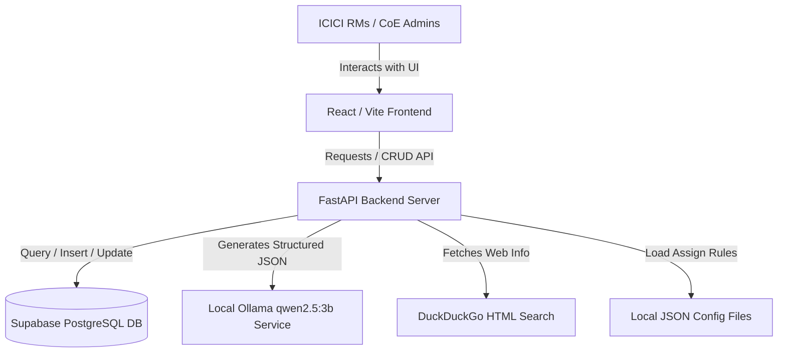

### Container Diagram
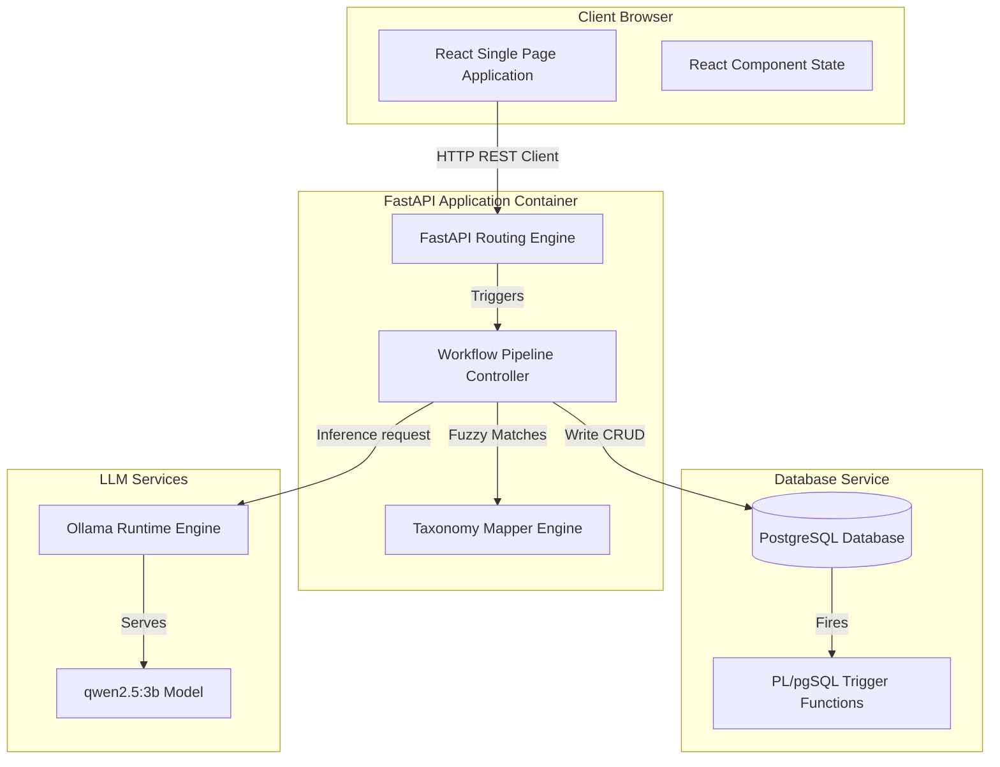

### Component Diagram
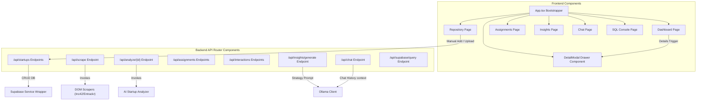

### Deployment Diagram
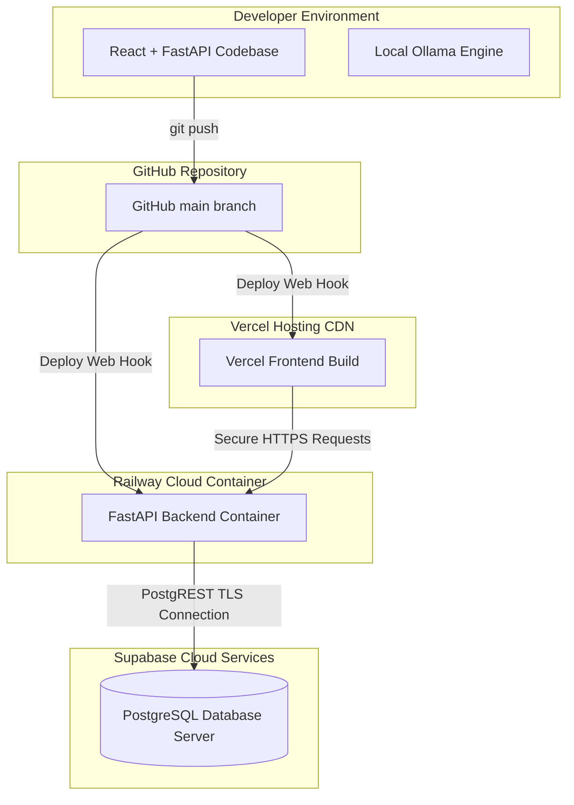

---

## 4. APPLICATION FLOW ANALYSIS

### Startup Flow
When the application container boots up or the python server starts, it initializes core systems step-by-step:
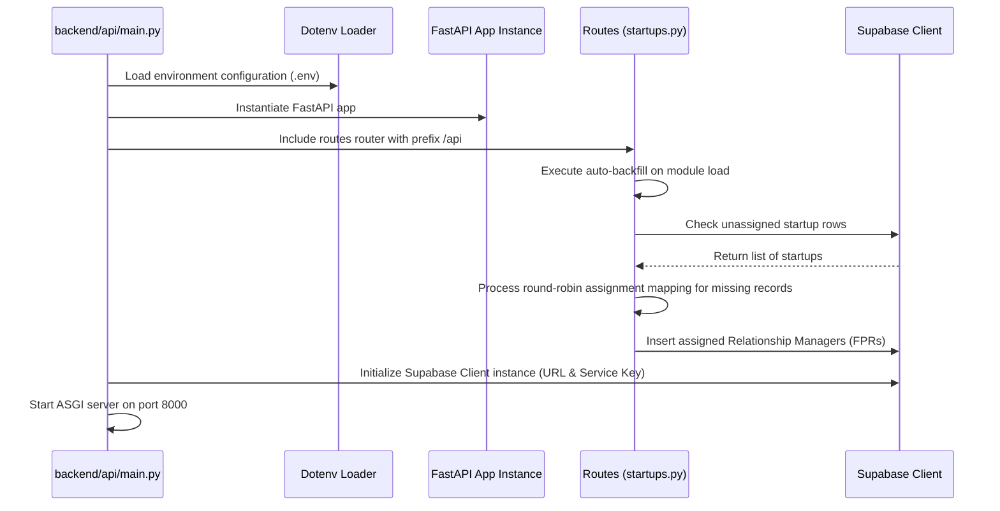

### User Request Flow: Trigger AI Analysis
The following trace highlights exactly what occurs when a Relationship Manager clicks the "Trigger AI Analysis" button in the frontend:
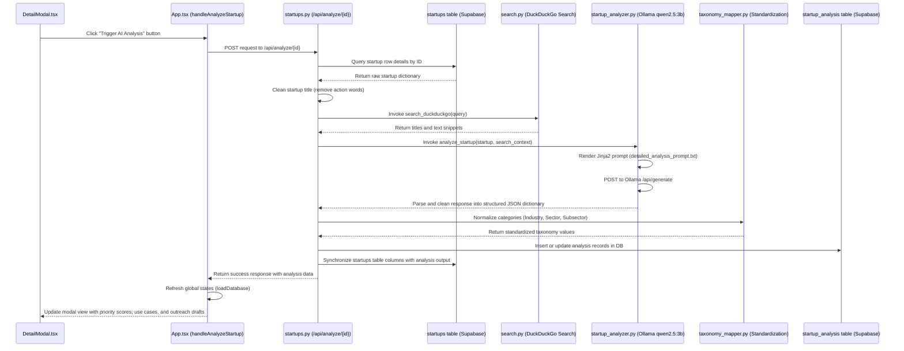

---

## 5. FRONTEND DEEP DIVE

### Frontend Architecture
* **Framework**: React 18 using Vite for HMR compilation and TypeScript for strict interfaces.
* **Routing**: React Router DOM (v6). Configured in `App.tsx` containing client routing to `/dashboard`, `/repository`, `/high-priority`, `/assignments`, `/insights`, `/database`, and `/chat`.
* **Layout System**: The app utilizes a premium sidebar architecture (`Sidebar.tsx`) combined with a header ribbon. Content loads inside a scrollable flex panel (`tab-scrolling-container`) featuring smooth animations (`animate-fade-in`).
* **Component Hierarchy**:
  * `App.tsx`
    * `Sidebar`
    * `main` (Dynamic Page Routing)
      * `Dashboard`
      * `Repository` -> Manual Add Forms / CSV parser
      * `HighPriority`
      * `Assignments`
      * `Insights`
      * `SupabaseConsole`
      * `Chat`
    * `DetailModal` (Activated globally as a drawer)
      * KPI Cards, Status Selectors, Activity Log Forms
* **State Management**: React Component States lifted to the parent `App.tsx` root:
  * `startups`: Active list of standardized ventures.
  * `assignments`: Relationship managers list.
  * `interactions`: activity log entries.
  * `selectedStartup`: Controls the drawer overlay active row.
  * `isLiveConnected`: Flag indicating active Supabase status vs mock offline mode.
* **API Communication**: Uses standard Javascript `fetch` API wrapping async endpoints with error boundaries and fallback handlers.
* **Error Handling**: Displays notifications ribbons (`globalError` / `globalSuccess` states) that render error and check circles at the top of the viewport.

### Component Dependency Map
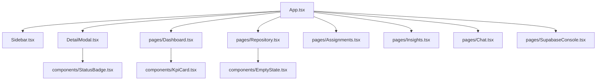

### Page Flow Diagram
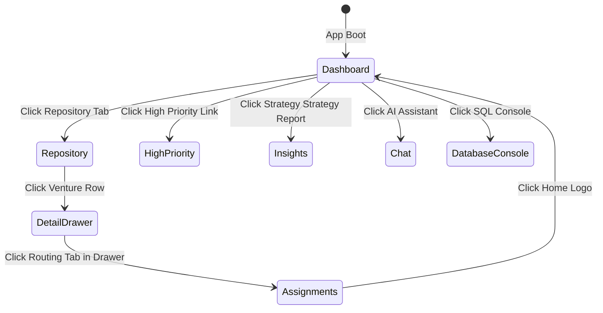

### State Management Flow
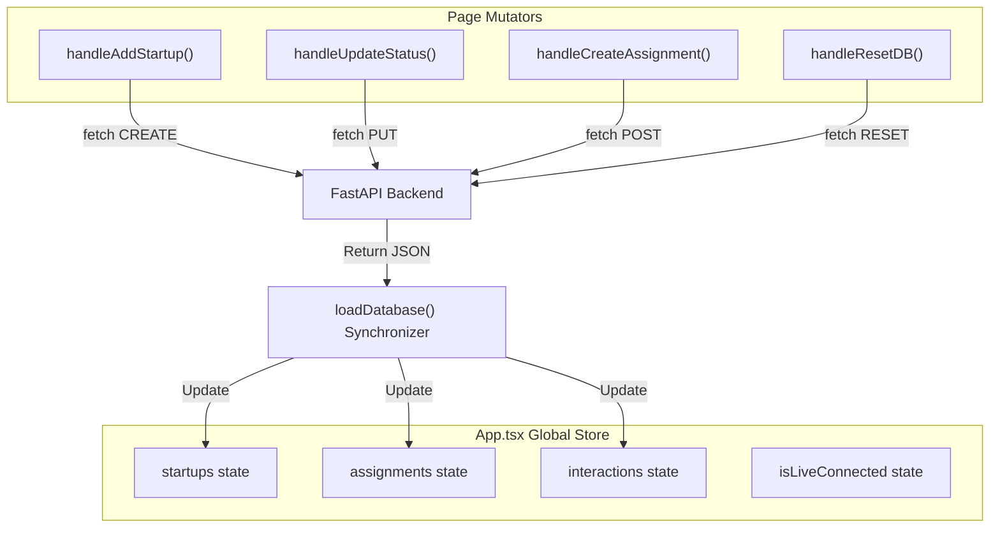

### Hooks Analysis
The application keeps state handling lean by using React core hooks directly:
1. **`useState`**:
   * *Purpose*: Manages local component rendering (e.g. active tabs, loaders, forms) and parent data tables list.
   * *Inputs*: Initial arrays/booleans.
   * *Outputs*: Reference states and dispatcher functions.
   * *Usage*: `const [startups, setStartups] = useState<Startup[]>([]);`
2. **`useEffect`**:
   * *Purpose*: Triggers data synchronization on component mount.
   * *Inputs*: Dependency array.
   * *Outputs*: Side-effect cleanup.
   * *Usage*: `useEffect(() => { loadDatabase(); }, []);`
3. **`useNavigate` & `useLocation`**:
   * *Purpose*: Programmatic page routing.
   * *Inputs*: Path string.
   * *Outputs*: Route modifications.
   * *Usage*: `const navigate = useNavigate();`

---

## 6. BACKEND DEEP DIVE

### Backend Architecture
The backend is a structured Python ASGI FastAPI application. It is organized into:
* **Routers / Controllers**: Located in `backend/api/routes/startups.py`, exposing REST routes.
* **Services**: 
  * `backend/services/supabase_service.py`: Encapsulates database CRUD.
  * `backend/ai/startup_analyzer.py`: Performs LLM operations.
* **Workflows**: `backend/workflows/startup_pipeline.py`: Orchestrates scraper runs and data enrichment.
* **Utilities**: Taxonomy mapping, configurations, and network searches.

### Request Lifecycle
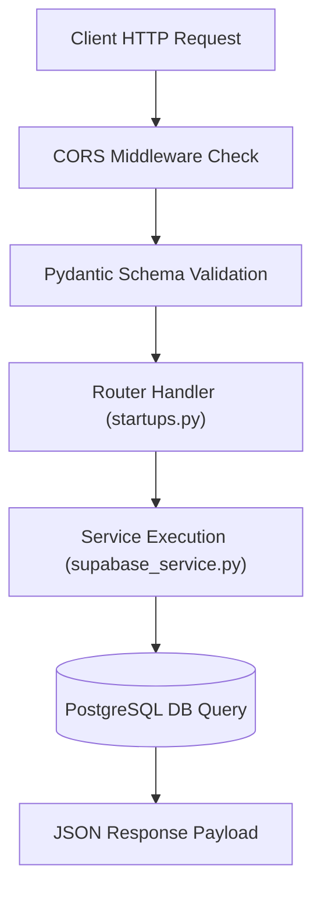

### Dependency Graph
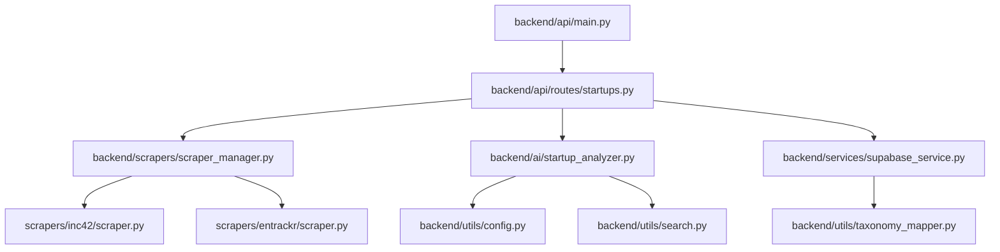

### Business Logic Mapping

| Business Feature | Router Endpoint | Service Function | Target Database Table |
| :--- | :--- | :--- | :--- |
| **Venture Scraper Discovery** | `/api/scrape` | `run_scraper` -> `process_startup` | `startups`, `startup_analysis` |
| **Manual Add Registry** | `/api/startups/create` | `upsert_startup` -> `assign_fprs` | `startups`, `startup_assignments` |
| **AI Evaluation Run** | `/api/analyze/{id}` | `analyze_startup` -> `save_analysis` | `startup_analysis`, `startups` |
| **Relationship Allocation** | `/api/assignments` | `create_assignment` | `startup_assignments` |
| **RM Progress Logs** | `/api/interactions` | `create_interaction` | `startup_activity_logs` |
| **Strategy Generation** | `/api/insights/generate` | Ollama context compilation | None (Read-only startups/analyses) |

---

## 7. DATABASE ANALYSIS

### Schema Definitions
The database schema consists of 4 main tables:
1. **`startups`**: Main registry table.
   * *Purpose*: Stores basic company profiles, standardized taxonomy categories, website URLs, and founder profiles.
   * *Key Columns*: `id` (BIGSERIAL PK), `startup_name` (TEXT Unique), `website` (TEXT), `founder_name` (TEXT), `founder_linkedin_url` (TEXT), `industry` (TEXT), `sector` (TEXT), `subsector` (TEXT), `business_models` (JSONB), `industry_relevance` (JSONB), `tags` (JSONB), `funding_stage` (TEXT), `description` (TEXT).
2. **`startup_analysis`**: Analytical parameters table.
   * *Purpose*: Stores LLM evaluations, BFSI relevance scores, enterprise readiness scores, use cases, and original raw JSON payloads.
   * *Key Columns*: `id` (PK), `startup_id` (FK referencing startups with ON DELETE CASCADE), `ai_summary` (TEXT), `bfsi_relevance_score` (INT), `enterprise_readiness_score` (INT), `icici_primary_entity` (TEXT), `use_cases` (JSONB), `co_creation_opportunities` (JSONB), `analysis_json` (JSONB).
3. **`startup_assignments`**: Operations routing table.
   * *Purpose*: Tracks Relationship Managers (FPRs) assigned to specific ventures, pilot statuses, and tailored outreach drafts.
   * *Key Columns*: `id` (PK), `startup_id` (FK referencing startups with ON DELETE CASCADE), `startup_name` (TEXT), `assigned_to_fpr1` (TEXT), `assigned_to_fpr2` (TEXT), `icici_entity` (TEXT default 'ICICI Bank'), `assignment_status` (TEXT default 'pending'), `linkedin_reachout_message` (TEXT), `email_reachout_message` (TEXT).
4. **`startup_activity_logs`**: Evaluation logs.
   * *Purpose*: Audits comments, next target actions, and progress updates recorded by FPRs.
   * *Key Columns*: `id` (PK), `startup_id` (FK referencing startups with ON DELETE CASCADE), `activity_type` (TEXT), `activity_notes` (TEXT).

### ER Diagram
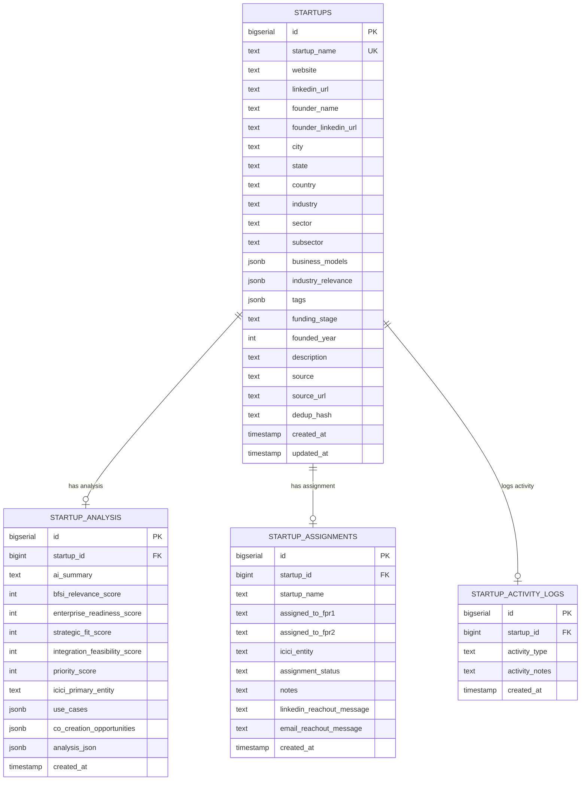

### Database Triggers & Functions
The database includes automated PL/pgSQL triggers to maintain data integrity:
1. **`trg_autofill_startup_name`**:
   * *Trigger Function*: `autofill_startup_name()`
   * *Execution*: Runs `BEFORE INSERT OR UPDATE` on `startup_assignments`.
   * *Logic*: Checks if `startup_name` is empty or null, retrieves the corresponding `startup_name` from the `startups` table using `startup_id`, and populates the field.
2. **`trg_set_assignment_status`**:
   * *Trigger Function*: `set_assignment_status()`
   * *Execution*: Runs `BEFORE INSERT OR UPDATE` on `startup_assignments`.
   * *Logic*: If `assigned_to_fpr1` is populated, automatically updates `assignment_status` to `"Assigned to " || NEW.assigned_to_fpr1` (unless a specific custom status is provided). Otherwise defaults to `"pending"`.

### Query Flow Analysis
* **`backend/services/supabase_service.py`**:
  * Reads `startups` (to verify duplicates via exact matching).
  * Writes to `startups` (inserting discovered records, updating taxonomy synchronizations).
  * Reads `startup_analysis` (to verify previous analysis records).
  * Writes to `startup_analysis` (inserts structured AI data).
  * Reads and Writes `startup_assignments` (updates outreach messages).
* **`backend/api/routes/startups.py`**:
  * Reads `startups` (fetches standard lists, semantic matching, manual creation validation).
  * Writes to `startups` (updates registry details).
  * Reads and Writes `startup_assignments` (allocations routing).
  * Reads and Writes `startup_activity_logs` (logs RM updates).
* **`frontend/src/lib/api.ts`**:
  * Direct client read on `startups` table for offline fallback check.

---

## 8. API DOCUMENTATION

### API Catalog

#### 1. Trigger Scraper
* **Method**: `POST`
* **Path**: `/api/scrape`
* **Purpose**: Activates a web scraper to discover newly funded startups.
* **Request Body**:
  ```json
  { "source": "entrackr" }
  ```
* **Response Body**:
  ```json
  { "message": "Scraping for entrackr initiated." }
  ```
* **Validation**: Source must match `"entrackr"` or `"inc42"`.

#### 2. Fetch Startups
* **Method**: `GET`
* **Path**: `/api/startups`
* **Purpose**: Retrieves all registry startups with their nested AI analyses.
* **Response Body**:
  ```json
  [
    {
      "id": 1,
      "startup_name": "Plum",
      "website": "https://www.plumhq.com",
      "description": "Digital health insurance platform...",
      "startup_analysis": [
        {
          "bfsi_relevance_score": 92,
          "ai_summary": "Digital group health provider..."
        }
      ]
    }
  ]
  ```

#### 3. Register Startup Manually
* **Method**: `POST`
* **Path**: `/api/startups/create`
* **Purpose**: Registers a new startup directly in the database.
* **Request Body**:
  ```json
  {
    "startup_name": "Riko AI",
    "website": "https://rikoai.com",
    "description": "Agentic workflow automation...",
    "sector": "Agentic AI",
    "funding_stage": "Seed"
  }
  ```
* **Response Body**:
  ```json
  { "status": "success", "data": [...] }
  ```
* **Validation**: Normalizes input names to check for duplicates.

#### 4. Trigger AI Analysis
* **Method**: `POST`
* **Path**: `/api/analyze/{id}`
* **Purpose**: Triggers DuckDuckGo search and LLM analysis for a startup.
* **Response Body**:
  ```json
  {
    "analysis_data": {
      "extracted_startup_name": "Riko AI",
      "founders": [...],
      "bfsi_relevance": { "relevance_score": 85 }
    }
  }
  ```

#### 5. Fetch Assignments
* **Method**: `GET`
* **Path**: `/api/assignments`
* **Purpose**: Retrieves Relationship Managers (FPRs) assignments.

#### 6. Route Venture to Team
* **Method**: `POST`
* **Path**: `/api/assignments`
* **Purpose**: Creates an assignment record.
* **Request Body**:
  ```json
  {
    "startup_id": 4,
    "assigned_to_fpr1": "Anurag",
    "assigned_to_fpr2": "Keroli",
    "notes": "Route for SME pilot check."
  }
  ```

#### 7. Log Activity Update
* **Method**: `POST`
* **Path**: `/api/interactions`
* **Purpose**: Saves progress updates.
* **Request Body**:
  ```json
  {
    "startup_id": 4,
    "type": "Introduction",
    "summary": "Met with founder to discuss APIs",
    "next_steps": "Setup technical security audit"
  }
  ```

#### 8. Generate Strategy Report
* **Method**: `GET`
* **Path**: `/api/insights/generate`
* **Purpose**: Compiles a market strategies strategy report.

#### 9. AI Chat assistant
* **Method**: `POST`
* **Path**: `/api/chat`
* **Purpose**: Natural language assistant using database context.
* **Request Body**:
  ```json
  {
    "history": [
      { "role": "user", "content": "Which Insurtech startups are registered?" }
    ]
  }
  ```

### API Dependency Diagram
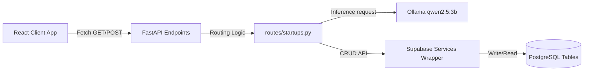

---

## 9. AUTHENTICATION & AUTHORIZATION

### Identity & Access Controls
* **User Identity Selector**: The application currently includes an identity switcher in the frontend sidebar allowing users to toggle between roles (e.g., **Admin** vs. **FPR1 (Anurag)**, etc.). The active user profile is stored in the React parent state (`currentUser`).
* **Supabase Client Authentication**: Database security relies on environment configurations. The backend uses the service role key (`SUPABASE_KEY`) to bypass Row Level Security (RLS) for server-side pipeline tasks. The frontend client uses the anonymous key (`VITE_SUPABASE_ANON_KEY`) for read-only fallbacks.
* **Read-only SQL Sandbox Validation**: To prevent SQL injection risks, the database SQL console route `/api/supabase/query` parses input strings and blocks queries that do not start with `select`.

### Session & Role Sequence Diagram
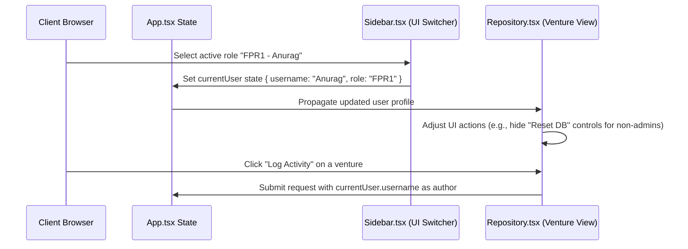

---

## 10. DATA FLOW ANALYSIS

### Process Pipeline Data Flow
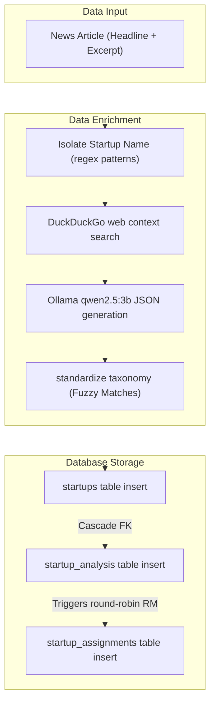

---

## 11. LLM / AI WORKFLOW ANALYSIS

The application features a local, zero-cost AI pipeline that evaluates startups and maps them onto the corporate taxonomy.

### Prompt Flow & Web Context Injection
1. **Search Context Acquisition**:
   * Takes the clean startup name (e.g., `"PhysicsWallah"`).
   * Runs a web search for details: `[Venture Name] founders founding year series funding amount investors revenue ebitda multiple`.
   * Returns search snippet strings.
2. **Jinja2 Template Rendering**:
   * Reads `backend/prompts/detailed_analysis_prompt.txt`.
   * Injects `taxonomy_context` (master sector mapping JSON), `search_context` (snippets), and `startup` details.
3. **Local Inference Execution**:
   * Compiles the payload and sends a request to Ollama `/api/generate` running `qwen2.5:3b`.
4. **JSON Output Extraction**:
   * Runs `clean_llm_response` to extract the JSON substring by searching for triple backticks (```json) or finding the outermost braces `{ ... }`.
5. **Taxonomy & Canonical Overloads Alignment**:
   * Evaluates the extracted startup name against `CANONICAL_OVERLOADS` in `taxonomy_mapper.py`.
   * If a match is found (e.g., `"rikoai"` or `"npci"`), it overrides fields with canonical values to ensure accuracy.
   * If no canonical overload exists, it runs fuzzy string matching against the master taxonomy schema to align the industry, sector, and subsector.

### AI Agent Flow
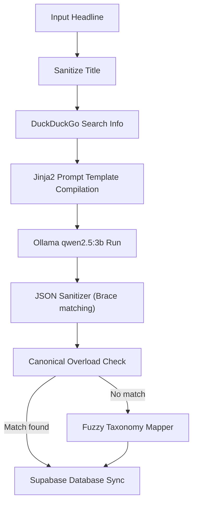

---

## 12. EXTERNAL INTEGRATIONS

### Integrations Map

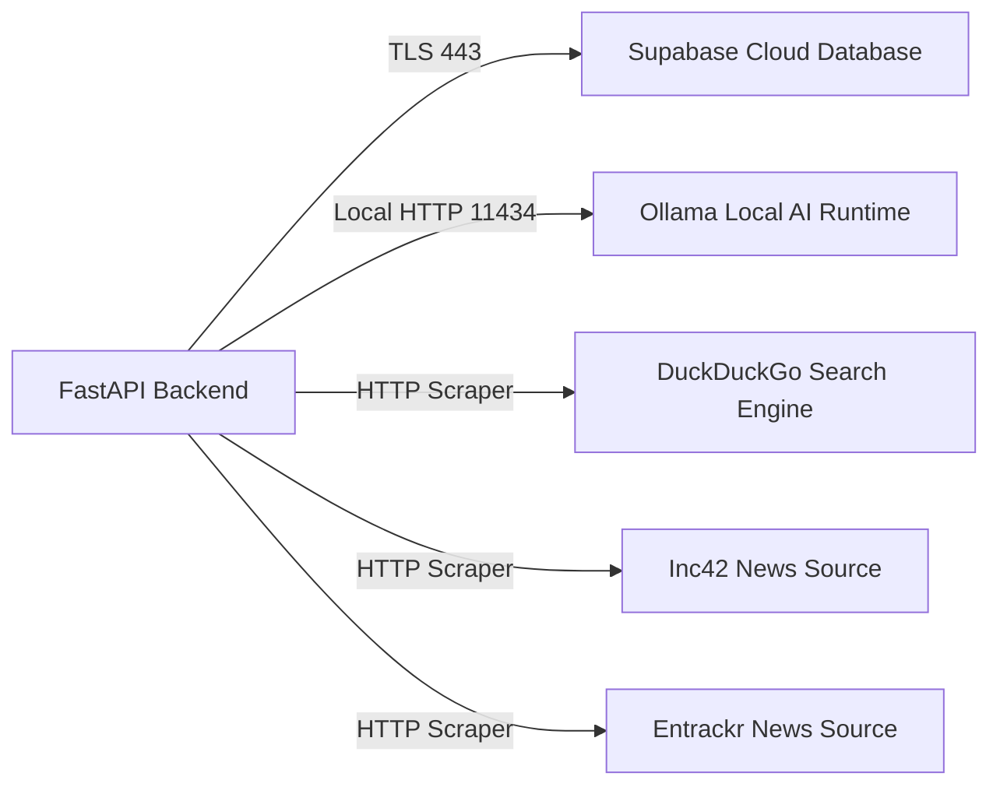

#### Integration Details
1. **Ollama Local AI API**:
   * *Purpose*: Runs local LLM inference for startup evaluations, стратеги reports, and chat assistant features.
   * *Auth*: Zero-key local execution on port `11434`.
2. **DuckDuckGo Web Search**:
   * *Purpose*: Fetches real-time web context (founders, funding, valuations) to enrich startup analyses.
   * *Auth*: Scrapes public HTML results.
3. **Supabase Cloud Database**:
   * *Purpose*: Core data storage and retrieval.
   * *Auth*: Authenticates via `SUPABASE_URL` and service role `SUPABASE_KEY` headers.

---

## 13. DEVOPS & INFRASTRUCTURE

### Deployment Architecture
* **Frontend**: Single Page Application built with Vite and deployed on Vercel. Static assets compile to JS/HTML/CSS and connect to the backend server via environment variables.
* **Backend Application**: Hosted on Railway in a Docker container running Uvicorn on port `8000`.
* **Database Service**: Hosted on Supabase Cloud.
* **LLM Engine**: Runs locally on a private server (or developer local loop) using Ollama.

### Infrastructure Diagram
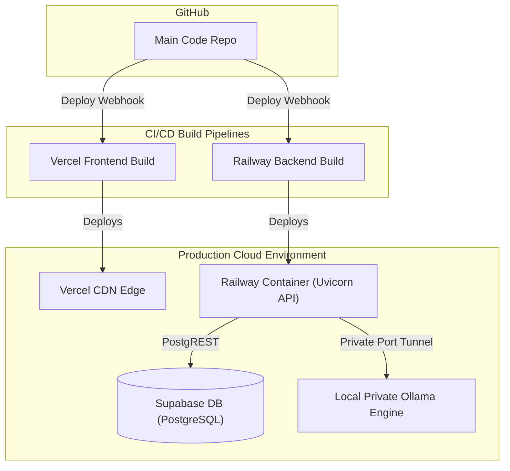

---

## 14. SECURITY REVIEW

### Security Controls & Mitigation

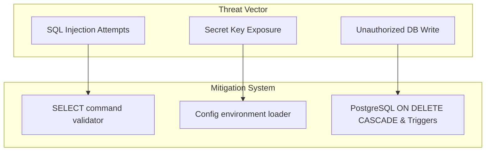

* **SQL Sandbox Security**: The terminal SQL route (`/api/supabase/query`) parses input strings and blocks queries that do not start with `select` to prevent unauthorized write or schema modification actions.
* **Environment Variables**: Sensitive credentials (e.g., DB API keys, LLM server URLs) are loaded into system memory via python-dotenv (`config.py`) and never exposed in the source code.
* **Supabase Cascade Delete**: Relationships use cascade deletes (`ON DELETE CASCADE`) to prevent orphaned rows when deleting or deduplicating records.
* **Data Sanitization**: The input sanitizer (`startup_pipeline.py`) cleans inputs via strict regex to prevent database pollution.

---

## 15. PERFORMANCE ANALYSIS

### Bottlenecks & Optimization Recommendations
1. **Synchronous Web Search**:
   * *Bottleneck*: Querying DuckDuckGo HTML pages inside the analysis pipeline takes 2-4 seconds per startup.
   * *Recommendation*: Use asynchronous requests (`httpx` or `aiohttp`) to perform searches concurrently.
2. **Local LLM Inference Overhead**:
   * *Bottleneck*: Ollama processing detailed evaluations with `qwen2.5:3b` can take 5-15 seconds per run depending on hardware.
   * *Recommendation*: Implement background task queues (e.g., Celery or FastAPI BackgroundTasks) to process analyses asynchronously.
3. **Database Client Pooling**:
   * *Bottleneck*: The Supabase client establishes a connection on every route request.
   * *Recommendation*: Implement database connection pooling to reuse active connections and reduce latency.

---

## 16. COMPLETE EXECUTION TRACE

### Trace: Discovery to Pipeline Insertion
The following sequence outlines exactly what happens when the Entrackr scraper runs:
1. **Trigger Scraper**: An administrator clicks the "Run Scraper" button for Entrackr.
2. **Scraper Execution**:
   * `run_scraper('entrackr')` calls `scrape_entrackr(num_startups=10)` in `scrapers/entrackr/scraper.py`.
   * The scraper fetches `https://entrackr.com` using `requests.get` with user-agent headers.
   * BeautifulSoup parses the HTML, finds `<h2>` tags inside clickable links, and extracts titles and URLs.
   * For each article, it makes an HTTP request to fetch the first two paragraphs for the description.
3. **Pipeline Processing (`process_startup` in `startup_pipeline.py`)**:
   * Sanitizes the title (e.g., `"PhysicsWallah raises $100M"`) using `clean_string` to extract the startup name (`"PhysicsWallah"`).
   * Verifies the startup website. If missing, it searches DuckDuckGo for `"{clean_name} official website"` and extracts the URL.
4. **AI Strategic Analysis**:
   * Calls `analyze_startup(startup)` to perform LLM analysis and returns a structured JSON payload.
5. **Database Standardization & Upsert**:
   * Calls `upsert_startup(data)` in `supabase_service.py` to insert the venture details.
   * Calls `save_startup_analysis(startup_id, analysis_json)` to save the AI evaluation.
   * Standardizes categories using the taxonomy mapper.
   * Fires the round-robin trigger in PostgreSQL to assign Relationship Managers (FPRs) and updates the assignments table.
6. **UI Refresh**: The frontend client updates the dashboard and repository lists with the newly synchronized venture profiles.

---

## 17. FEATURE-BY-FEATURE BREAKDOWN

### 1. Automated Web Scrapers
* **Purpose**: Discovers newly funded startups.
* **Files Used**: `backend/scrapers/scraper_manager.py`, `backend/scrapers/inc42/scraper.py`, `backend/scrapers/entrackr/scraper.py`.
* **API Endpoints**: `/api/scrape`
* **DB Tables**: None (Scrapes data for pipeline processing).

### 2. AI Startup Analyzer
* **Purpose**: Evaluates startups and generates structured analyses.
* **Files Used**: `backend/ai/startup_analyzer.py`, `backend/prompts/detailed_analysis_prompt.txt`.
* **API Endpoints**: `/api/analyze/{id}`
* **DB Tables**: `startups`, `startup_analysis`.

### 3. Taxonomy Mapper
* **Purpose**: Aligns raw category strings with the master taxonomy schema.
* **Files Used**: `backend/utils/taxonomy_mapper.py`, `docs/startup_sector_mappings.json`.
* **DB Tables**: `startups`.

### 4. Relationship Manager Assignments
* **Purpose**: Assigns Relationship Managers (FPRs) to startups.
* **Files Used**: `backend/api/routes/startups.py`, `database/migrations/update_schema_v4.sql`, `docs/fpr_assignment_mapping.json`.
* **API Endpoints**: `/api/assignments`
* **DB Tables**: `startup_assignments`.

### 5. Strategy Insights Generator
* **Purpose**: Compiles high-level strategic strategy reports.
* **Files Used**: `backend/api/routes/startups.py`.
* **API Endpoints**: `/api/insights/generate`
* **DB Tables**: `startups`, `startup_analysis`.

### 6. Interactive Chat Assistant
* **Purpose**: Natural language assistant using database context.
* **Files Used**: `backend/api/routes/startups.py`.
* **API Endpoints**: `/api/chat`
* **DB Tables**: `startups`, `startup_analysis`.

---

## 18. CODE RELATIONSHIP MAP

### Component Dependency Graph
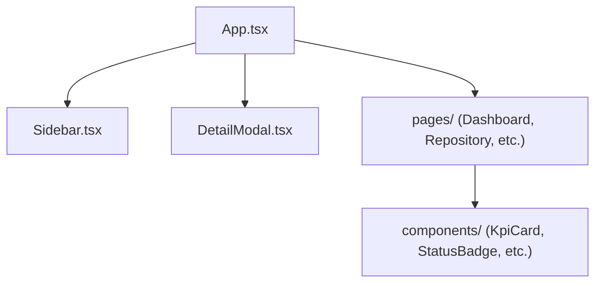

### Module Dependency Graph
```mermaid
graph TD
    FastAPI["FastAPI App (main.py)"] --> Router["Routes (routes/startups.py)"]
    Router --> Services["Services (supabase_service.py)"]
    Router --> Workflows["Workflows (startup_pipeline.py)"]
    Router --> AI["AI Core (startup_analyzer.py)"]
    Workflows --> AI
    Services --> Utils["Utils (taxonomy_mapper.py, config.py)"]
```

### Service Dependency Graph
```mermaid
graph TD
    FastAPI["FastAPI API Server"] -->|HTTP API calls| Ollama["Ollama Local AI service"]
    FastAPI -->|PostgREST TLS| Supabase["Supabase Cloud Database"]
```

### Database Dependency Graph
```mermaid
graph TD
    Startups["startups table"] -->|ON DELETE CASCADE| Analysis["startup_analysis table"]
    Startups -->|ON DELETE CASCADE| Assignments["startup_assignments table"]
    Startups -->|ON DELETE CASCADE| Logs["startup_activity_logs table"]
```

---

## 19. TECHNICAL DEBT & IMPROVEMENTS

### Code Smells & Architectural Risks
1. **Fallback Logic Duplication**:
   * *Issue*: `App.tsx` contains frontend fallback parsing logic (`map_startup_with_analysis`) that duplicates backend taxonomy mapping features.
   * *Risk*: Changes to backend taxonomy parameters might not align with frontend displays if both systems are not updated together.
   * *Solution*: Consolidate all mapping and validation logic in the backend.
2. **Missing Transaction Control**:
   * *Issue*: Multiple writes to `startups` and `startup_analysis` are executed as separate calls.
   * *Risk*: Network drops between database updates can lead to incomplete data.
   * *Solution*: Wrap database updates in a single PostgreSQL transaction or RPC function.
3. **Lack of User Authentication**:
   * *Issue*: The application uses a mock user role switcher in the UI without secure session validation.
   * *Risk*: Unauthorized users can access the database SQL console and run queries.
   * *Solution*: Integrate Firebase Authentication or Supabase Auth to secure the application.

---

## 20. KNOWLEDGE TRANSFER DOCUMENT

### How To Understand This Codebase As A New Engineer

#### 1. What to Read First
* **`README.md`**: Outlines installation steps, required environment variables, and how to boot the application components.
* **`database/schema.sql`**: Key to understanding how the database tables, fields, and relationships are structured.
* **`docs/startup_sector_mappings.json`**: Defines the master taxonomy schema used to classify all startup records.

#### 2. What to Read Second
* **`backend/api/routes/startups.py`**: Maps out the available API endpoints and database routing rules.
* **`backend/workflows/startup_pipeline.py`**: Explains how scraped news headlines are processed, cleaned, and enriched.
* **`frontend/src/App.tsx`**: Explains how the React frontend client coordinates state, routing, and API synchronizations.

#### 3. Debugging Guide
* **Backend Issues**:
  * Run the server locally using: `venv/bin/uvicorn backend.api.main:app --port 8000 --reload`
  * Access the automatic Swagger UI documentation at `http://localhost:8000/docs` to test endpoints.
* **AI Analysis Pipeline**:
  * Verify that Ollama is running locally: `ollama run qwen2.5:3b`
  * Use testing scripts in the `scratch/` directory to debug search and analysis pipelines:
    * `python backend/workflows/run_pipeline.py`
* **Frontend Issues**:
  * Run the Vite development server: `npm run dev`
  * Use the browser console to inspect network requests and verify API sync status.

#### 4. Local Setup Guide
1. **Clone the Repository**:
   ```bash
   git clone https://github.com/anuragbhayalprojects/startup-intelligence.git
   cd startup-intelligence
   ```
2. **Backend Setup**:
   * Create a virtual environment and install dependencies:
     ```bash
     python -m venv venv
     source venv/bin/activate
     pip install -r requirements.txt
     ```
   * Configure environment variables in a `.env` file in the root directory:
     ```env
     SUPABASE_URL=your_supabase_url
     SUPABASE_KEY=your_supabase_service_role_key
     OLLAMA_BASE_URL=http://localhost:11434
     OLLAMA_MODEL=qwen2.5:3b
     ```
   * Start the backend server:
     ```bash
     python backend/main.py
     ```
3. **Frontend Setup**:
   * Navigate to the frontend directory and install dependencies:
     ```bash
     cd frontend
     npm install
     ```
   * Configure environment variables in `frontend/.env`:
     ```env
     VITE_API_URL=http://localhost:8000/api
     VITE_SUPABASE_URL=your_supabase_url
     VITE_SUPABASE_ANON_KEY=your_supabase_anon_key
     ```
   * Start the development server:
     ```bash
     npm run dev
     ```
4. **Ollama Setup**:
   * Install Ollama on your machine.
   * Download the model: `ollama pull qwen2.5:3b`
   * Start the Ollama service: `ollama serve`
