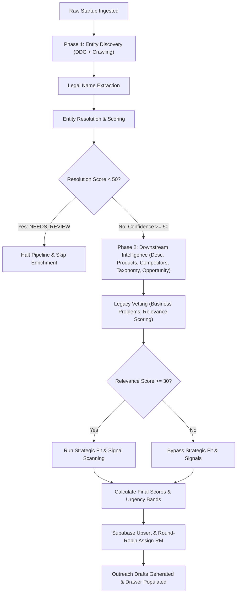
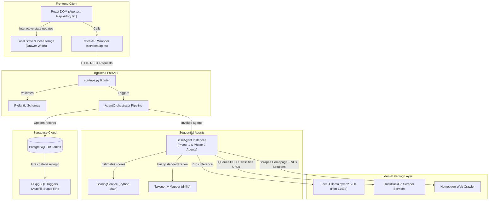
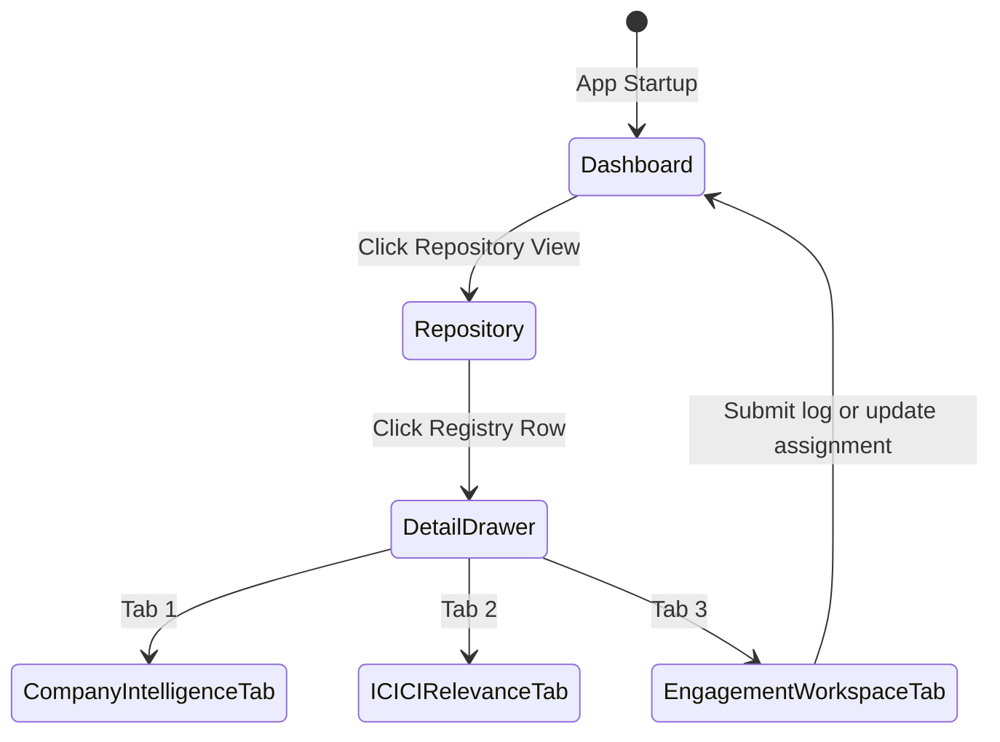
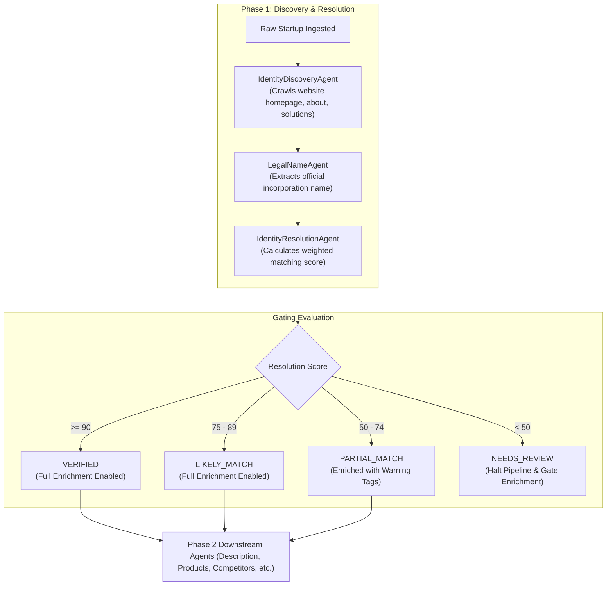
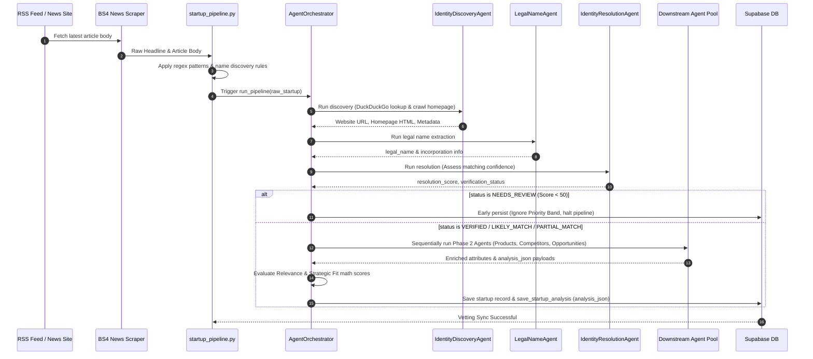

# Startup Intelligence Operating System: Architecture & Blueprint Document
**ICICI Group Enterprise Startup Vetting & Pilots Registry Platform (Entity-Resolution First)**

---

## SECTION 1 — EXECUTIVE OVERVIEW

### Problem Solved
The **ICICI Group Startup Intelligence OS** solves the critical challenge of unstructured, slow, and non-explainable startup vetting within a large banking enterprise. Traditionally, mapping fintech innovation onto specific corporate challenges was done via ad-hoc emails, word-of-mouth recommendations, and unvetted pitch decks. The registry automates discovery from open channels, performs programmatic and deterministic vetting, maps startup products to specific business problems across ICICI entities, and manages pilot pipelines.

### Business Purpose
* **Relate Startups to Business Problems**: Ensure no startup is entered without a specific business problem mapping.
* **Determine Group Relevance**: Route fintech opportunities directly to the correct internal business teams.
* **Maintain Zero-Budget Local Vetting**: Execute analysis pipelines using local AI models (Ollama/Qwen) to eliminate API costs.
* **Enforce Explainable Evaluations**: Provide deterministic scoring (priority, recommendation, confidence) so RMs can understand recommendations in 30 seconds.
* **Entity-Resolution First Vetting**: Gate all enrichment pipelines until a startup's digital presence (website, LinkedIn, legal entity names) has been discovered and resolved with high confidence.

### Target Users & Stakeholders
1. **Innovation COE Administrators**: Oversee crawler triggers, run database seeds, and manage taxonomies.
2. **First Points of Contact (FPR1 & FPR2)**: Relationship managers assigned to evaluate, engage, and pilot with startups.
3. **CTOs, CIOs, and Strategy Directors**: Track strategic alignment, market gap analyses, and pilot sandboxes.

### Key Capabilities
* **Crawling & Ingestion**: Inc42, Entrackr, YC, ProductHunt monitoring.
* **Entity Resolution Engine**: DuckDuckGo-first search mapping, legal name matching, and multi-source confidence evaluations.
* **Multi-Agent Evaluation**: Sequential agents processing state transitions for classification, relevance gating, and risk assessments.
* **Dynamic Details Drawer**: Drag-resizable drawer (50%-95% desktop width) with three focused intelligence tabs.
* **Strategic Fit Engine**: Mathematical weighting of strategic alignment, deployability, signals, and data confidence.

### Capability Map
```
┌────────────────────────────────────────────────────────────────────────────────────────┐
│                              STARTUP INTELLIGENCE OS CAPABILITIES                      │
├───────────────────────────┬───────────────────────────┬────────────────────────────────┤
│      DATA INGESTION       │    INTELLIGENCE & AI      │      ENGAGEMENT WORKSPACE      │
├───────────────────────────┼───────────────────────────┼────────────────────────────────┤
│ • News Scrapers (BS4)     │ • Entity Resolution Gate  │ • Draggable Resizable Drawer   │
│ • DuckDuckGo Search       │ • Multi-Agent Pipeline    │ • FPR Routing Assignments      │
│ • CSV Upload Parser       │ • Taxonomy Fuzzy Mapper   │ • Outreach Drafts Generator    │
│ • Manual Venture Forms    │ • Deterministic Scoring   │ • RM Activity Log Timeline     │
└───────────────────────────┴───────────────────────────┴────────────────────────────────┘
```

### Business Workflow Diagram



---

## SECTION 2 — COMPLETE REPOSITORY ANALYSIS

### Repository Tree
```
startup-intelligence/
├── backend/
│   ├── agents/                   # Multi-agent interface and implementations
│   │   ├── base.py
│   │   ├── identity_discovery_agent.py      # Phase 1: Resolves websites and socials
│   │   ├── legal_name_agent.py              # Phase 1: Resolves legal names/registrations
│   │   ├── identity_resolution_agent.py     # Phase 1: Resolves weighted score gating
│   │   ├── description_generator_agent.py   # Phase 2: Generates clean company summaries
│   │   ├── product_intelligence_agent.py    # Phase 2: Extracts products & features
│   │   ├── industry_classification_agent.py # Phase 2: Maps categories to taxonomy
│   │   ├── competitor_intelligence_agent.py # Phase 2: Compiles competitor matrix
│   │   ├── funding_intelligence_agent.py    # Phase 2: Extracts financial rounds (non-blocking)
│   │   ├── opportunity_mapping_agent.py     # Phase 2: Maps co-creation pilots
│   │   ├── business_problem_agent.py        # Maps startup features onto ICICI problems
│   │   ├── relevance_agent.py               # Computes strategic relevance
│   │   ├── strategic_fit_agent.py           # Evaluates integration feasibility
│   │   ├── signal_agent.py                  # Scans positive/negative momentum signals
│   │   └── recommendation_agent.py          # Suggests action & drafts emails
│   ├── ai/                       # Legacy LLM parser routines
│   ├── api/                      # FastAPI routes and server config
│   │   ├── main.py
│   │   └── routes/
│   │       └── startups.py
│   ├── config/                   # Externalized configurations and JSON rules
│   ├── models/                   # Pydantic states and schemas
│   │   ├── startup_state.py
│   │   └── startup_features.py
│   ├── prompts/                  # Jinja2 prompt text files
│   ├── scrapers/                 # Web scraper BeautifulSoup modules
│   ├── services/                 # Supabase operations and Scoring math
│   │   ├── supabase_service.py
│   │   └── scoring_service.py
│   └── workflows/                # Orchestration execution scripts
│       ├── agent_orchestrator.py
│       └── startup_pipeline.py
├── database/                     # Migration files and base SQL scripts
├── docs/                         # Documentation and architectural guides
└── frontend/                     # React + Vite Client Application
```

### Complete Code File Analysis

| File Path | Purpose / Responsibility | Key Exports / Methods | Execution Context |
| :--- | :--- | :--- | :--- |
| `backend/agents/base.py` | Declares common `BaseAgent` and logs audit events to state. | `BaseAgent`, `log_audit` | Main process |
| `backend/agents/identity_discovery_agent.py` | Runs multi-query DDG-first discovery and homepage crawlers. | `IdentityDiscoveryAgent.run` | Phase 1 Discovery |
| `backend/agents/legal_name_agent.py` | Extracts official registration legal entities using scrapers. | `LegalNameAgent.run` | Phase 1 Legal Name |
| `backend/agents/identity_resolution_agent.py` | Evaluates weighted matching configs and gates pipeline. | `IdentityResolutionAgent.run` | Phase 1 Gating |
| `backend/agents/product_intelligence_agent.py` | Compiles structured products with evidence links and target audience. | `ProductIntelligenceAgent.run` | Phase 2 Downstream |
| `backend/agents/competitor_intelligence_agent.py` | Maps structural competitors with reasons, confidence, and links. | `CompetitorIntelligenceAgent.run` | Phase 2 Downstream |
| `backend/agents/opportunity_mapping_agent.py` | Generates co-creation use-cases across ICICI entities. | `OpportunityMappingAgent.run` | Phase 2 Downstream |
| `backend/workflows/agent_orchestrator.py` | Manages state initialization, sequential execution, and DB sync. | `AgentOrchestrator.run_pipeline` | FastAPI routing / script |
| `backend/services/scoring_service.py` | Mathematical calculations for Priority, Confidence, and Rec scores. | `ScoringService` math statics | Orchestrator/API |
| `backend/services/supabase_service.py` | Direct wrapper database connectivity for CRUD transactions. | `upsert_startup`, `save_startup_analysis` | DB layers |

---

## SECTION 3 — SYSTEM ARCHITECTURE & DIAGRAMS OF LINKAGES

This section provides the complete architectural link map, demonstrating how data and requests route across tiers.

### 1. Logical Architecture Diagram
Shows the system layer separation:


### 2. Service Interaction Architecture Diagram
This diagram shows the complete linkage flow across all layers requested:
$$\text{User} \longrightarrow \text{Frontend} \longrightarrow \text{API} \longrightarrow \text{Services} \longrightarrow \text{Database} \longrightarrow \text{AI Layer} \longrightarrow \text{Response}$$

```mermaid
graph TD
    User["User (Relationship Manager)"] -->|1. Clicks Row / Triggers Analysis| FE["Frontend Client (DetailModal.tsx)"]
    FE -->|2. POST /api/analyze/{id}| API["API Gateway (startups.py Router)"]
    API -->|3. run_pipeline(state)| Services["Services (agent_orchestrator.py / scoring_service.py)"]
    Services -->|4. Fetch context metadata| Database["Database (supabase_service.py / Supabase)"]
    Database -- 5. Returns raw row metadata --> Services
    Services -->|6. Run Phase 1 Gated Agents| AILayer["AI Layer (Discovery, Legal, Resolution)"]
    AILayer -- 7. Evaluates Resolution Confidence --> Services
    alt Resolution Confidence < 50
        Services ->> Database: 8. Persist gated "NEEDS_REVIEW" state
        Services -- 9. Early return to API --> API
    else Resolution Confidence >= 50
        Services ->> AILayer: 8. Run Downstream Phase 2 & Legacy Agents
        AILayer -- 9. Decodes extracted JSON parameters --> Services
        Services -->|10. Recalculate priority math scores| Services
        Services -->|11. Persist finalized analysis_json payload| Database
    end
    Database -- 12. Confirm upsert successful --> Services
    Services -- 13. Returns updated StartupState --> API
    API -- 14. HTTP 200 JSON Response payload --> FE
    FE -->|15. Re-render drawer panels & KPI widgets| User
```

---

## SECTION 4 — FRONTEND ARCHITECTURE

### Framework & Layout Strategy
* **Framework**: React 18, Vite HMR build engine, Tailwind CSS utility styling, TypeScript types.
* **Width Resizing Persistence**: Persistent drawer layout stored in `localStorage.detail_drawer_width` ranging between 50% and 95% on desktop viewports.

### Page Flow Breakdown


---

## SECTION 5 — BACKEND CONFIGURATION ARCHITECTURE

To maximize modularity and maintainability, all system parameters, heuristics, and weights have been externalized and are dynamically loaded from `/backend/config`.

### Config Schema Catalog

| Configuration File | Path | Key Settings & Parameters |
| :--- | :--- | :--- |
| **Entity Resolution Rules** | [entity_resolution_rules.json](file:///Users/anurag/Projects/startup-intelligence/backend/config/entity_resolution_rules.json) | Sets weights for website and LinkedIn matches, thresholds for `VERIFIED`, `LIKELY_MATCH`, and `PARTIAL_MATCH`. |
| **Search Sources Config** | [search_sources_config.json](file:///Users/anurag/Projects/startup-intelligence/backend/config/search_sources_config.json) | High-priority domains list (e.g. Tracxn, PitchBook, Crunchbase, LinkedIn). |
| **Custom Scrapers Config** | [custom_scrapers_config.json](file:///Users/anurag/Projects/startup-intelligence/backend/config/custom_scrapers_config.json) | Standard and custom RSS/HTML scraping targets (Inc42, Entrackr, etc.). |
| **Funding Sources** | [funding_sources.json](file:///Users/anurag/Projects/startup-intelligence/backend/config/funding_sources.json) | Prioritized search domains and query keywords for funding extraction. |
| **Startup Taxonomy** | [startup_taxonomy.json](file:///Users/anurag/Projects/startup-intelligence/backend/config/startup_taxonomy.json) | Allowed master Industry, Sector, and Subsector lists. |
| **Business Problems** | [business_problems.json](file:///Users/anurag/Projects/startup-intelligence/backend/config/business_problems.json) | Standard mapping definitions and targets for ICICI business challenges. |

---

## SECTION 6 — ENTITY RESOLUTION & DECI-SCORING ENGINE

The operating system enforces a strict **Entity-Resolution First Vetting** pattern.

### Phase 1: Entity Resolution Weights & Gating
Weights are configurable inside [entity_resolution_rules.json](file:///Users/anurag/Projects/startup-intelligence/backend/config/entity_resolution_rules.json):
* **Website Name Match**: 25%
* **LinkedIn Name Match**: 25%
* **Website & LinkedIn Description Similarity**: 20%
* **LinkedIn/Website Domain Match**: 15%
* **Industry Alignment Match**: 10%
* **Founder Verification**: 5%



### Downstream Analysis JSON Structure
Enriched data is stored in the `analysis_json` column of the `startup_analysis` table following a structured schema that includes confidence ratings and evidence URLs:

```json
{
  "enrichment_version": "2.0",
  "last_enriched_at": "ISO-TIMESTAMP",
  "last_verified_at": "ISO-TIMESTAMP",
  "products": {
    "value": [
      {
        "name": "Product Name",
        "type": "Software/Service",
        "description": "Product Description",
        "evidence_url": "Website URL / Homepage",
        "target_audience": "Target Audience details"
      }
    ],
    "confidence": 90
  },
  "competitors": {
    "value": [
      {
        "name": "Competitor Name",
        "reason": "Competitive overlap explanation",
        "website": "Competitor Website URL",
        "confidence": 85,
        "evidence_url": "Source URL"
      }
    ],
    "confidence": 80
  },
  "opportunity_mapping": {
    "value": [
      {
        "use_case": "Integration use-case description",
        "icici_entity": "ICICI Bank / Lombard / etc.",
        "relevance_score": 85,
        "potential_impact": "High / Medium / Low"
      }
    ],
    "confidence": 90
  },
  "industry_classification": {
    "value": {
      "sector": "Enterprise Software",
      "industry": "Enterprise",
      "subsector": "Productivity"
    },
    "confidence": 95
  }
}
```

---

## SECTION 7 — PROGRAMMATIC SCORING FORMULAS

### 1. Priority Score ($P$)
Defines operational priority for CoE review. If relevance is gated ($Relevance < 30$), the Priority score is capped at the relevance score:
$$P = \begin{cases} Relevance & \text{if } Relevance < 30 \\ \text{Round}\left(0.40 \cdot Relevance + 0.30 \cdot Fit + 0.20 \cdot Deployability + 0.10 \cdot Signal\right) & \text{if } Relevance \ge 30 \end{cases}$$

### 2. Confidence Score ($C$)
Combines completeness of records, business problem matching, source reliability, and classification certainty:
* **Data Completeness (Max 40 points)**: Checks presence of website, description, founders, sectors, and funding.
* **Business Problem Match (Max 30 points)**: Incremental points based on the number of corporate challenges matched.
* **Source Reliability (Max 20 points)**: Verifies website domains and founder LinkedIn urls.
* **Classification Certainty (Max 10 points)**: Reflects taxonomy classification match confidence.

### 3. Recommendation Score ($R$)
Weighted average of priority review score and data reliability confidence:
$$R = \text{Round}\left(0.70 \cdot P + 0.30 \cdot C\right)$$

---

## SECTION 8 — DETAILED CODE FLOW (INGESTION TO PERSISTENCE)


