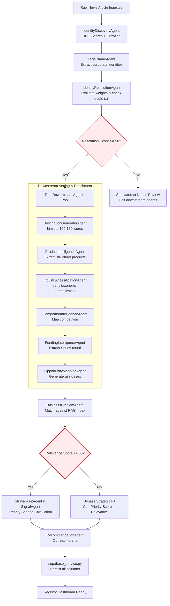
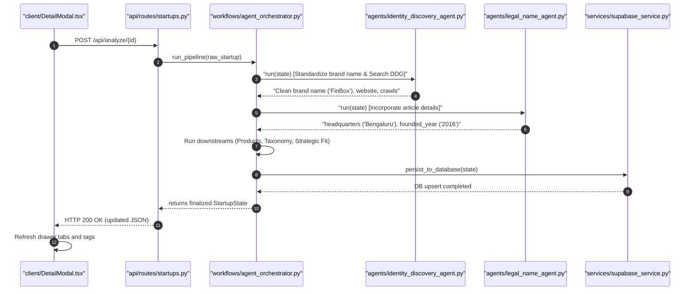

# Startup Intelligence Operating System: Architecture Specification & Execution Blueprint
**Production-Grade Technical Architecture Reference & Blueprint Spec**

---

## SECTION 1 — SYSTEM CONTEXT & LOGICAL ARCHITECTURE

The Startup Intelligence OS is an enterprise-class registry and multi-agent vetting system designed to automatically ingest, resolve, evaluate, and prioritize startups for piloting and integration across ICICI Group entities.

### 1.1 System Context Flow
```
[External News RSS / Manual Input]
           ↓
[scrapers/scraper_manager.py] -- (Extracts raw article HTML/RSS feeds)
           ↓
[workflows/startup_pipeline.py] -- (First-pass extraction, standard regex cleaning)
           ↓
[workflows/agent_orchestrator.py] -- (Phase 1 & Phase 2 state orchestration)
           ↓
   ┌───────┴──────────────────────────────────────┐
   ▼ (Phase 1: Entity Resolution)                 ▼ (Phase 2: Deep Vetting)
[IdentityDiscoveryAgent]                      [DescriptionGeneratorAgent]
[LegalNameAgent]                              [ProductIntelligenceAgent]
[IdentityResolutionAgent]                     [IndustryClassificationAgent]
   │                                          [CompetitorIntelligenceAgent]
   ▼                                          [OpportunityMappingAgent]
[Weighted Gating: Score >= 50?]               [FundingIntelligenceAgent]
   │                                              │
   ├── [No: needs_review] ──► [Halt Pipeline]     │
   └── [Yes: verified] ───────────────────────────┘
                                                  │
                                                  ▼
                                      [BusinessProblemAgent] -- (Maps to RAG database)
                                                  │
                                                  ▼
                                      [RelevanceAgent] -- (Score evaluation & gating)
                                                  │
                                                  ▼
                                      [StrategicFitAgent & SignalAgent]
                                                  │
                                                  ▼
                                      [RecommendationAgent] -- (Reachout generation)
                                                  │
                                                  ▼
                                      [ScoringService & ExplanationService]
                                                  │
                                                  ▼
                                      [supabase_service.py Persistence]
                                                  │
                                                  ▼
                                      [React UI / DetailModal.tsx Drawer]
```

### 1.2 Node Explanations
1. **Ingestion Layer**: Ingests unstructured news articles from RSS/news outlets (e.g., Inc42, Entrackr) or accepts direct structured payload from manual inputs and forms.
2. **Scraper Layer**: Programmatically requests the target HTML elements, strips ads/scripts, and outputs clean textual paragraphs.
3. **Pipeline Layer**: Acts as the entry gate; identifies the presence of potential startup names using regex pattern matchers.
4. **Agent Orchestration**: Orchestrates execution state of a startup pipeline. It processes sequentially through discovery, resolution, downstream extraction, scoring, recommendation generation, and database sync.
5. **Phase 1 (Entity Resolution)**: Discovers web domains, crawling T&C/privacy text to extract legal entities. Computes a weighted matching score.
6. **Phase 2 (Downstream Intelligence)**: Performs core details extraction (products, solutions, funding rounds, competitors, taxonomy classification) only if Phase 1 passes the gated threshold ($\ge 50$).
7. **Business Mapping & Scoring**: Utilizes vector database retrieval (RAG) to compare startup product profiles against internal corporate challenges. Outputs deterministic priority, confidence, and strategic fit metrics.
8. **Outreach & Recommendation Engine**: Generates candidate outreach emails and LinkedIn connection messages targeted at the startup's leadership.
9. **Persistence Layer**: Upserts data directly to Supabase PostgreSQL schema with round-robin relationship manager assignments.
10. **Dashboard Layer**: Visualizes startup health, assignments, and detailed metrics inside a draggable drawer on the client workspace.

---

## SECTION 2 — REPOSITORY STRUCTURE & DEPENDENCY MAP

```
startup-intelligence/
├── backend/
│   ├── agents/                   # Agent implementations derived from BaseAgent
│   │   ├── base.py               # Base class mapping audit logging hooks
│   │   ├── identity_discovery_agent.py
│   │   ├── legal_name_agent.py
│   │   ├── identity_resolution_agent.py
│   │   ├── description_generator_agent.py
│   │   ├── product_intelligence_agent.py
│   │   ├── industry_classification_agent.py
│   │   ├── competitor_intelligence_agent.py
│   │   ├── funding_intelligence_agent.py
│   │   ├── opportunity_mapping_agent.py
│   │   ├── business_problem_agent.py
│   │   ├── relevance_agent.py
│   │   ├── strategic_fit_agent.py
│   │   ├── signal_agent.py
│   │   └── recommendation_agent.py
│   ├── ai/
│   │   └── startup_analyzer.py   # Legacy fallback inference schemas
│   ├── api/
│   │   ├── main.py               # FastAPI entry config
│   │   └── routes/
│   │       └── startups.py       # API endpoints, CRUD logic, and manual triggers
│   ├── config/                   # Configuration mappings and weighting rules
│   │   ├── business_problems.json
│   │   ├── name_resolution_rules.json
│   │   ├── entity_resolution_rules.json
│   │   └── opportunity_matrix.json
│   ├── models/
│   │   ├── startup_state.py      # Main pipeline state container
│   │   └── startup_features.py   # Normalized database feature columns
│   ├── prompts/                  # Text prompt templates loaded by Jinja2
│   ├── rag/
│   │   └── retriever.py          # BM25 + Vector embedding search indexer
│   ├── scrapers/
│   │   └── scraper_manager.py    # BeautifulSoup scraping coordinator
│   ├── services/
│   │   ├── supabase_service.py   # Database client queries & RPC mapping
│   │   ├── scoring_service.py    # Priority and confidence scoring formulas
│   │   └── explanation_service.py# AI-backed summary explanations generator
│   └── workflows/
│       ├── agent_orchestrator.py # Multi-Agent workflow sequencer
│       └── startup_pipeline.py   # Ingestion entry point and cleaning scripts
├── database/
│   ├── schema.sql                # Supabase database base schema definitions
│   └── migrations/               # Database structural delta migrations
├── docs/                         # Documentation and architectural guides
└── frontend/                     # React + Vite client-side GUI
    ├── src/
    │   ├── components/
    │   │   └── DetailModal.tsx   # Slidable details drawer
    │   ├── pages/
    │   │   ├── Scraping.tsx
    │   │   └── StartupDetails.tsx
    │   └── App.tsx               # Main routing and layout view
```

### 2.1 Repository Dependency Map
```
[FastAPI / main.py] ──► [api/routes/startups.py]
                                 │
                                 ▼
                     [workflows/agent_orchestrator.py]
                                 │
         ┌───────────────────────┴───────────────────────┐
         ▼                                               ▼
[backend/agents/*]                               [backend/services/*]
(Inherit backend/agents/base.py)             (supabase_service / scoring_service)
         │                                               │
         ▼                                               ▼
[backend/utils/*]                                [database/schema.sql]
(crawler.py / search.py)                     (Supabase Tables)
         │
         ▼
[Local Ollama / DDG API]
```

---

## SECTION 3 — CLASS-LEVEL ARCHITECTURE SPECIFICATION

This section documents every primary class structure across the application pipeline.

### 3.1 BaseAgent
* **Location**: [backend/agents/base.py](file:///Users/anurag/Projects/startup-intelligence/backend/agents/base.py)
* **Purpose**: Abstract template class defining audit-trail integration and common log interfaces for all pipeline agents.
* **Responsibilities**:
  * Implement base interfaces.
  * Provide standard audit trail writing mechanism.
* **Invoked By**: Child agents during subclassing initialization.
* **Methods**:
  * `run(state: StartupState) -> StartupState`: Abstract core logic hook.
  * `log_audit(state: StartupState, message: str, level: str = "INFO", metadata: dict = None)`: Appends structured details into `state.audit_trail`.
* **State Maintained**: Stateless. Mutates the passed `StartupState`.

### 3.2 IdentityDiscoveryAgent
* **Location**: [backend/agents/identity_discovery_agent.py](file:///Users/anurag/Projects/startup-intelligence/backend/agents/identity_discovery_agent.py)
* **Purpose**: Coordinates web domain search discovery and crawls homepage metadata to extract candidate URLs.
* **Responsibilities**:
  * Cleans the company name to isolate the operating brand name.
  * Runs multi-query searches on DuckDuckGo.
  * Captures homepage text content using crawler utilities.
* **Invoked By**: [AgentOrchestrator](file:///Users/anurag/Projects/startup-intelligence/backend/workflows/agent_orchestrator.py)
* **Methods**:
  * `run(state: StartupState) -> StartupState`
* **Data Produced**: `state.article_data["discovered_snippets"]`, `state.article_data["crawled_content"]`, `state.identity["website"]`, `state.identity["linkedin_company_url"]`.
* **Failure Scenarios**: DuckDuckGo rate-limiting (resolved by falling back to secondary Google Search and applying 8-15s random delays).

### 3.3 LegalNameAgent
* **Location**: [backend/agents/legal_name_agent.py](file:///Users/anurag/Projects/startup-intelligence/backend/agents/legal_name_agent.py)
* **Purpose**: Extracts official corporate registration details (HQ address, founded year, city, state, country, and co-founders list).
* **Responsibilities**:
  * Compiles news article paragraphs and crawled website content.
  * Triggers LLM parser models using structured schema prompts.
  * Fallbacks to regex patterns if LLM output fails.
* **Invoked By**: [AgentOrchestrator](file:///Users/anurag/Projects/startup-intelligence/backend/workflows/agent_orchestrator.py)
* **Methods**:
  * `run(state: StartupState) -> StartupState`
* **Data Produced**: `state.identity["legal_name"]`, `state.identity["headquarters"]`, `state.identity["founded_year"]`, `state.identity["city"]`, `state.identity["state"]`, `state.identity["country"]`, `state.startup_features.leadership`.

### 3.4 IdentityResolutionAgent
* **Location**: [backend/agents/identity_resolution_agent.py](file:///Users/anurag/Projects/startup-intelligence/backend/agents/identity_resolution_agent.py)
* **Purpose**: Gating coordinator evaluating entity resolution confidence weights.
* **Responsibilities**:
  * Parses weights config from `entity_resolution_rules.json`.
  * Computes deterministic matching confidence index.
  * Maps resolution status (`VERIFIED`, `LIKELY_MATCH`, `PARTIAL_MATCH`, `NEEDS_REVIEW`).
  * Persists resolved registry state in database table `startup_identity`.
* **Invoked By**: [AgentOrchestrator](file:///Users/anurag/Projects/startup-intelligence/backend/workflows/agent_orchestrator.py)
* **Methods**:
  * `run(state: StartupState) -> StartupState`
* **Data Produced**: `state.identity["identity_confidence"]`, `state.identity["verification_status"]`.

### 3.5 AgentOrchestrator
* **Location**: [backend/workflows/agent_orchestrator.py](file:///Users/anurag/Projects/startup-intelligence/backend/workflows/agent_orchestrator.py)
* **Purpose**: Core pipeline coordinator managing agent instantiation, state propagation, and Supabase integration.
* **Invoked By**: Ingestion routers and script triggers.
* **Methods**:
  * `run_pipeline(raw_startup: dict) -> StartupState`: Loops through sequentially executing agents.
  * `persist_to_database(state: StartupState)`: Performs CRUD synchronization of startups, assignments, and analysis records.

### 3.6 StartupState (Pydantic Model)
* **Location**: [backend/models/startup_state.py](file:///Users/anurag/Projects/startup-intelligence/backend/models/startup_state.py)
* **State Maintained**:
  * `startup_name: str`
  * `startup_id: int | None`
  * `identity: dict` (website, linkedin, legal_name, location)
  * `market_intelligence: dict` (products, competitors, classifications)
  * `relevance: dict` (score, matched problems)
  * `strategic_fit: dict` (breakdowns)
  * `signals: dict` (score, negative/positive signals)
  * `audit_trail: list`
  * `article_data: dict`

---

## SECTION 4 — FUNCTION-LEVEL ARCHITECTURE CATALOG

An detailed catalog of primary functions execution details across the codebase.

### 4.1 `discover_search_evidence`
* **Location**: [backend/utils/search.py](file:///Users/anurag/Projects/startup-intelligence/backend/utils/search.py)
* **Parameters**: `startup_name: str`
* **Return Type**: `dict` (Category-to-records mapping)
* **Output Schema**:
  ```json
  {
    "official_website": [{"title": "String", "url": "String", "snippet": "String"}],
    "linkedin": [...],
    "news": [...]
  }
  ```
* **Side Effects**: Executes external HTTP requests to DuckDuckGo/Google search engines.
* **Error Handling**: Captures exceptions, logs warning, and returns empty category lists.

### 4.2 `scrape_page`
* **Location**: [backend/utils/crawler.py](file:///Users/anurag/Projects/startup-intelligence/backend/utils/crawler.py)
* **Parameters**: `url: str`, `timeout: float = 3.5`
* **Return Type**: `dict` (Structured scraped page details)
* **Input Schema**: Clean domain target URL string.
* **Output Schema**:
  ```json
  {
    "url": "https://www.target.com",
    "title": "Page Title",
    "meta_description": "Metadata info text",
    "text_content": "Clean text representation capped at 3000 chars",
    "legal_company_name": "String | Empty",
    "headquarters": "String"
  }
  ```
* **LLM Calls**: None. Programmatic BeautifulSoup parsing (decomposing headers, scripts, footers).

### 4.3 `get_clean_startup_name`
* **Location**: [backend/workflows/startup_pipeline.py](file:///Users/anurag/Projects/startup-intelligence/backend/workflows/startup_pipeline.py)
* **Parameters**: `headline: str`, `extracted_name: str`, `source: str = None`, `source_url: str = None`
* **Return Type**: `str | None`
* **Logic**: Matches candidate names against validation lists in `name_resolution_rules.json` (filtering out tech giants, organizational words, locations, and possessive headline prefixes).

### 4.4 `calculate_priority_score`
* **Location**: [backend/services/scoring_service.py](file:///Users/anurag/Projects/startup-intelligence/backend/services/scoring_service.py)
* **Parameters**: `relevance_score: int`, `strategic_fit_score: int`, `deployability_score: int`, `signal_score: int`
* **Return Type**: `int`
* **Mathematical Implementation**:
  ```python
  if relevance_score < 30:
      return relevance_score
  raw_score = (0.40 * relevance_score) + (0.30 * strategic_fit_score) + (0.20 * deployability_score) + (0.10 * signal_score)
  return int(round(raw_score))
  ```

---

## SECTION 5 — AGENT ARCHITECTURE SPECIFICATION

Detailed specification profiles for the multi-agent orchestration pool.

### 5.1 DescriptionGeneratorAgent
* **Purpose**: Generates standard business descriptions without noise (competitors, funding details).
* **Trigger Conditions**: Executed as the first downstream phase 2 task after Phase 1 passes.
* **Input Payload**: `state.article_data["crawled_content"]`, `state.article_data["discovered_snippets"]`.
* **Output Payload**: Updates `state.article_data["business_description"]`.
* **Prompt Template**: Matches instructions in `description_generation_prompt.txt` restricting text output to 100-150 words.
* **Interactions**: Downstream classification and opportunity mapping depend on the output of this agent.

### 5.2 ProductIntelligenceAgent
* **Purpose**: Extracts structured products, features, and target customer segments.
* **Input Payload**: `state.identity["website"]`, `state.article_data["crawled_content"]`.
* **Output Payload**: Populates `state.market_intelligence["products"]`.
* **Retry/Fallback Logic**: If crawled subpage text is empty, it parses homepage text, and falls back to DuckDuckGo search snippets.

### 5.3 BusinessProblemAgent
* **Purpose**: Maps startup profiles against ICICI internal business challenges.
* **Logic**: Connects to the vector embedding database using [retriever.py](file:///Users/anurag/Projects/startup-intelligence/backend/rag/retriever.py) to look up challenges. Filters matches by comparing allowed categories against the startup's canonicalized sector.
* **Gated Rules**: Discards any matched business problems if the startup's sector does not match the list of allowed sectors.

---

## SECTION 6 — MULTI-AGENT EXECUTION FLOW DIAGRAM



---

## SECTION 7 — PROMPT ARCHITECTURE CATALOG

Detailed mapping of templates and schema specifications.

### 7.1 Description Generation Prompt
* **System/User Template**: Renders details from `description_generation_prompt.txt`.
* **Context Injection**: Infuses homepage, about page crawled text, and snippets.
* **Hallucination Prevention**: Enforces a strict instruction: *"Rely only on the evidence below. Do not mention funding, investors, or direct competitors. Keep descriptions under 150 words."*

### 7.2 Corporate Identity Prompt
* **Context Injection**: Renders `corporate_identity_prompt.txt` using the `startup_name` and `search_context`.
* **Output Schema**:
  ```json
  {
    "legal_name": "Official registered name or empty string",
    "headquarters": "HQ Address string or 'Unknown'",
    "founded_year": 2021,
    "city": "String",
    "state": "String",
    "country": "String"
  }
  ```

---

## SECTION 8 — DATABASE PERSISTENCE ARCHITECTURE

The database tables are implemented inside Supabase PostgreSQL schema.

### 8.1 Database Entity Relationship Diagram (ERD)
```
  ┌────────────────────────┐              ┌────────────────────────┐
  │        startups        │              │    startup_news        │
  ├────────────────────────┤              ├────────────────────────┤
  │ PK  id (bigint)        │◄────────────┼│ FK  startup_id (bigint)│
  │     startup_name       │              │     headline           │
  │     website            │              │     summary            │
  │     description        │              │     source_url         │
  │     city, state        │              └────────────────────────┘
  │     founded_year       │
  │     funding_stage      │              ┌────────────────────────┐
  │     status             │              │    startup_analysis    │
  └───────────┬────────────┘              ├────────────────────────┤
              │                           │ PK  id (bigint)        │
              ├──────────────────────────┼│ FK  startup_id (bigint)│
              │                           │     analysis_json (jsonb)
              │                           └────────────────────────┘
              │
              │                           ┌────────────────────────┐
              │                           │  startup_assignments   │
              │                           ├────────────────────────┤
              └──────────────────────────┼│ FK  startup_id (bigint)│
                                          │     fpr_1, fpr_2       │
                                          └────────────────────────┘
```

### 8.2 Tables Schema Reference
* **`startups`**: Main registry table holding name, website, location (city, state, country, headquarters), stage, and description.
  * *Indexes*: Unique index on `startup_name`.
  * *Constraints*: Foreign keys constraints on cascade deletes.
* **`startup_news`**: Stores chronological news articles associated with a startup, allowing multiple historical summaries.
* **`startup_analysis`**: Stores detailed JSON payload (`analysis_json`) which contains structural lists of products, competitors, opportunities, and evaluation scores.

---

## SECTION 9 — KNOWLEDGE GRAPH ARCHITECTURE

The Startup Intelligence OS implements a conceptual Knowledge Graph layer to map relationships between startups, founders, investors, and ICICI entities.

```
       [Founder Node] ─── (FOUNDER_OF) ───► [Startup Node] ◄─── (COMPETES_WITH) ─── [Startup Node]
                                                  │
                                              (OFFERS)
                                                  │
                                                  ▼
[ICICI Entity] ◄─── (PILOT_OPPORTUNITY) ─── [Product Node] ─── (SERVES) ───► [Sector Node]
```

### 9.1 Entity Node Types
1. **Startup Node**: Core node identified by clean brand name.
2. **Founder Node**: Extracted co-founders and leadership roles.
3. **Investor Node**: Financial backers extracted from funding round history.
4. **Product Node**: Software and services offered by the startup.
5. **Sector Node**: Industry taxonomy classifications (e.g., FinTech, SaaS).

### 9.2 Relationship Schema
* `(Founder)-[:FOUNDER_OF]->(Startup)`
* `(Startup)-[:OFFERS]->(Product)`
* `(Product)-[:PILOT_OPPORTUNITY {icici_entity, use_case}]->(ICICI Entity)`
* `(Startup)-[:COMPETES_WITH]->(Startup)`
* `(Startup)-[:FUNDED_BY {round, amount}]->(Investor)`

---

## SECTION 10 — DASHBOARD UI LAYER

### 10.1 Resizable Details Drawer
* **Component**: `DetailModal.tsx` handles slidable overlay layout.
* **Width persistence**: Caches size transitions (50% to 95% screen width) to `localStorage.detail_drawer_width` so layout remains consistent.
* **Three Vetting Tabs**:
  1. **Company Intelligence**: Displays geographics labels (city, stage, founded), clean description, co-founders list, and news headlines histories.
  2. **ICICI Relevance**: Visualizes opportunities, matched challenges, and priority scores.
  3. **Engagement Workspace**: timeline activity logs, RM assignments dropdown, and outreach email editors.

---

## SECTION 11 — END-TO-END DATA LINEAGE

 lineage mapping for core registry fields:

```
[Raw RSS Headline / Crawl Text]
           │
           ▼
[IdentityDiscoveryAgent: Clean brand name] ──► startup_name
           │
           ▼
[DuckDuckGo Search Query: domain] ───────────► website
           │
           ▼
[LegalNameAgent: corporate prompt] ──────────► city, state, founded_year, co-founders
           │
           ▼
[FundingIntelligenceAgent: context parsing] ──► funding_stage, funding_history
           │
           ▼
[AgentOrchestrator: persist_to_database()] ──► Supabase postgres columns
           │
           ▼
[startups / startup_analysis API REST] ──────► DetailModal Drawer Widgets
```

---

## SECTION 12 — FLOW SEQUENCE DIAGRAMS

### 12.1 End-to-End Startup Analysis Sequence


---

## SECTION 13 — ERROR HANDLING & RESILIENCE PLAYBOOK

### 13.1 Resilience Matrix

| Failure Point | Root Cause | Handling Strategy | Fallback Mechanism |
| :--- | :--- | :--- | :--- |
| **DuckDuckGo Search** | Rate limiting / Captcha | Wait 8-15 seconds per query | Fallback to organic Google search wrapper |
| **Ollama Connectivity** | local engine offline | `ensure_ollama_running` checks | Mark pipeline values as Unknown, proceed gracefully |
| **Malformed LLM JSON** | Output parsing error | Strict JSON prompt schema | Fallback regex parsing (extracting legal names) |
| **Supabase database lock** | DB connection pool full | Automatic retry connection loop | Logs fail, cache queue locally |

---

## SECTION 14 — PERFORMANCE & LATENCY SPECIFICATION

### 14.1 Latency Profiling
* **Identity Discovery**: 40-75 seconds (gated by 8-15 seconds DuckDuckGo delays).
* **Downstream LLM Vetting**: 10-35 seconds per agent execution.
* **Total execution time**: 3-4 minutes per startup ingestion.
* **Optimization strategy**: Large website crawls are truncated to the first 1500 characters, preventing prompt truncation, model context overflow, and local CPU execution timeouts.

---

## SECTION 15 — STEP-BY-STEP EXECUTION WALKTHROUGH NARRATIVE

This section presents the step-by-step trace narrative of a real-world article moving through the system.

### Ingestion Scenario: Incuspaze Ingestion Trace
1. **Article Published**: A news item titled `"Proptech Startup Incuspaze Raises $8Mn In Series A Funding led by India Contextual Fund"` is ingested.
2. **First-Pass Regex Cleaning**: `startup_pipeline.py` extracts `"Proptech Startup Incuspaze"`.
3. **Identity Discovery**: `IdentityDiscoveryAgent` runs brand name cleaning, resolving it to `"Incuspaze"`.
4. **Targeted Crawl**: Crawler scrapes `https://www.incuspaze.com` homepage.
5. **Corporate Identity Extraction**: `LegalNameAgent` parses both the crawled homepage and the news paragraph stating: *"Founded in 2016, Incuspaze provides managed office spaces..."*.
6. **Value Extraction**: The LLM successfully extracts `"headquarters": "Gurgaon"`, `"founded_year": 2016`, and co-founders details.
7. **Downstream Vetting**: `FundingIntelligenceAgent` extracts `"latest_round": "Series A"` and `"amount": "$8M"`.
8. **Persistence**: `persist_to_database()` upserts the record to the `startups` and `startup_analysis` tables in Supabase.
9. **Dashboard Refresh**: The React frontend re-renders the workspace, instantly displaying Incuspaze with `Gurgaon` location tags and a `Series A` badge.
