# Startup Intelligence Operating System: Architecture & Blueprint Document
**ICICI Group Enterprise Startup Intelligence & Pilots Registry Platform**

---

## SECTION 1 — EXECUTIVE OVERVIEW

### Problem Solved
The **ICICI Group Startup Intelligence OS** solves the critical challenge of unstructured, slow, and non-explainable startup vetting within a large banking enterprise. Traditionally, mapping fintech innovation onto specific corporate challenges was done via ad-hoc emails, word-of-mouth recommendations, and unvetted pitch decks. The registry automates discovery from open channels, performs programmatic and deterministic vetting, maps startup products to specific business problems across ICICI entities, and manages pilot pipelines.

### Business Purpose
* **Relate Startups to Business Problems**: Ensure no startup is entered without a specific business problem mapping.
* **Determine Group Relevance**: Route fintech opportunities directly to the correct internal business teams.
* **Maintain Zero-Budget Local Vetting**: Execute analysis pipelines using local AI models (Ollama/Qwen) to eliminate API costs.
* **Enforce Explainable Evaluations**: Provide deterministic scoring (priority, recommendation, confidence) so RMs can understand recommendations in 30 seconds.

### Target Users & Stakeholders
1. **Innovation COE Administrators**: Oversee crawler triggers, run database seeds, and manage taxonomies.
2. **First Points of Contact (FPR1 & FPR2)**: Relationship managers assigned to evaluate, engage, and pilot with startups.
3. **CTOs, CIOs, and Strategy Directors**: Track strategic alignment, market gap analyses, and pilot sandboxes.

### Key Capabilities
* **Crawling & Ingestion**: Inc42, Entrackr, YC, ProductHunt monitoring.
* **Multi-Agent Evaluation**: Sequential agents processing state transitions for classification, relevance gating, and risk assessments.
* **Dynamic Details Drawer**: Drag-resizable drawer (50%-95% desktop width) with three focused intelligence tabs.
* **Strategic Fit Engine**: Mathematical weighting of strategic alignment, deployability, signals, and data confidence.

### Capability Map
```
┌────────────────────────────────────────────────────────────────────────────────────────┐
│                              STARTUP INTELLIGENCE OS CAPABILITIES                      │
├───────────────────────────┬───────────────────────────┬────────────────────────────────┤
│      DATA INGESTION       │    INTELLIGENCE & AI      │      ENGAGEMENT WORKSPACE      │
├───────────────────────────┼───────────────────────────┼────────────────────────────────┤
│ • News Scrapers (BS4)     │ • Multi-Agent Pipeline    │ • Draggable Resizable Drawer   │
│ • DuckDuckGo Search       │ • Taxonomy Fuzzy Mapper   │ • FPR Routing Assignments      │
│ • CSV Upload Parser       │ • Relevance Gating Rule   │ • Outreach Drafts Generator    │
│ • Manual Venture Forms    │ • Deterministic Scoring   │ • RM Activity Log Timeline     │
└───────────────────────────┴───────────────────────────┴────────────────────────────────┘
```

### Business Workflow Diagram
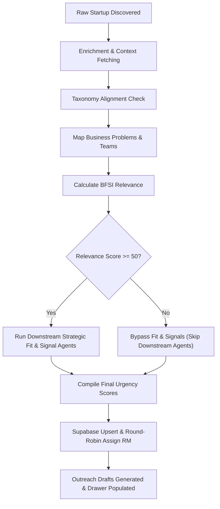

---

## SECTION 2 — COMPLETE REPOSITORY ANALYSIS

### Repository Tree
```
startup-intelligence/
├── backend/
│   ├── agents/                   # Multi-agent interface and implementations
│   │   ├── base.py
│   │   ├── enrichment_agent.py
│   │   ├── classification_agent.py
│   │   ├── market_intelligence_agent.py
│   │   ├── business_problem_agent.py
│   │   ├── relevance_agent.py
│   │   ├── strategic_fit_agent.py
│   │   ├── signal_agent.py
│   │   └── recommendation_agent.py
│   ├── ai/                       # Legacy LLM parser routines
│   ├── api/                      # FastAPI routes and server config
│   │   ├── main.py
│   │   └── routes/
│   │       └── startups.py
│   ├── config/                   # Business configurations and RAG rules
│   ├── models/                   # Pydantic states and schemas
│   │   ├── startup_state.py
│   │   └── startup_features.py
│   ├── prompts/                  # Jinja2 prompt text files
│   ├── scrapers/                 # Web scraper BeautifulSoup modules
│   ├── services/                 # Supabase operations and Scoring math
│   │   ├── supabase_service.py
│   │   └── scoring_service.py
│   └── workflows/                # Orchestration execution scripts
├── database/                     # Migration files and base SQL scripts
│   ├── migrations/
│   │   └── update_schema_v5.sql
│   └── schema.sql
├── docs/                         # Enterprise taxonomies and assignment rules
│   └── architecture/
└── frontend/                     # React + Vite Client Application
    ├── src/
    │   ├── components/
    │   │   ├── AppShell.tsx
    │   │   └── DetailModal.tsx   # Resizable Side-Drawer component
    │   ├── pages/
    │   │   └── Repository.tsx    # Dashboard repository list page
    │   ├── App.tsx
    │   └── types.ts
```

### Complete Code File Analysis

| File Path | Purpose / Responsibility | Key Exports / Methods | Execution Context | Risk if Removed |
| :--- | :--- | :--- | :--- | :--- |
| `backend/agents/base.py` | Declares common `BaseAgent` and logs audit events to state. | `BaseAgent`, `log_audit` | Main process | Pipeline execution crash. |
| `backend/agents/enrichment_agent.py` | Enriches context via DuckDuckGo searches and Tracxn mocks. | `EnrichmentAgent.run` | Agent pipeline | No external details or website links. |
| `backend/agents/classification_agent.py` | Aligns startups with Industry, Sector, and Subsector rules. | `ClassificationAgent.run` | Agent pipeline | Taxonomy standardizing breaks. |
| `backend/agents/market_intelligence_agent.py` | Extracts products, competitors, valuations and investor round lists. | `MarketIntelligenceAgent.run` | Downstream pipeline | Competitive intelligence drawer blank. |
| `backend/agents/business_problem_agent.py` | Maps startup features onto ICICI Group business problems. | `BusinessProblemAgent.run` | Agent pipeline | Business problem routing fails. |
| `backend/agents/relevance_agent.py` | Computes strategic relevance score across six dimensions. | `RelevanceAgent.run` | Agent pipeline | Gating rules fail; scores undefined. |
| `backend/agents/strategic_fit_agent.py` | Evaluates enterprise readiness and integration feasibility. | `StrategicFitAgent.run` | Downstream pipeline | Priority score weighting maps to 0. |
| `backend/agents/signal_agent.py` | Scans for positive/negative triggers. | `SignalAgent.run` | Downstream pipeline | Momentum parameters missed. |
| `backend/agents/recommendation_agent.py` | Suggests target action and drafts co-founder outreach. | `RecommendationAgent.run` | Downstream pipeline | LinkedIn & Email draft blocks empty. |
| `backend/workflows/agent_orchestrator.py` | Manages state initialization, sequential execution, and DB sync. | `AgentOrchestrator.run_pipeline` | FastAPI routing / script | Complete failure of AI pipeline runs. |
| `backend/services/scoring_service.py` | Mathematical calculations for Priority, Confidence, and Rec scores. | `ScoringService` math statics | Orchestrator/API | Priority rankings default to 0. |
| `backend/services/supabase_service.py` | Direct wrapper database connectivity for CRUD transactions. | `upsert_startup`, `save_startup_analysis` | DB layers | Supabase persistence fails. |
| `frontend/src/components/DetailModal.tsx` | Drag-resizable side-drawer layout with three tabs. | `DetailModal` component | React Client | Details panel unusable. |
| `frontend/src/pages/Repository.tsx` | Search registry grid with sliders, filters, and priority urgency bands. | `Repository` page | React Client | Dashboard listing unavailable. |

---

## SECTION 3 — SYSTEM ARCHITECTURE & DIAGRAMS OF LINKAGES

This section provides the complete architectural link map, demonstrating how data and requests route across tiers.

### 1. Logical Architecture Diagram
Shows the system layer separation:
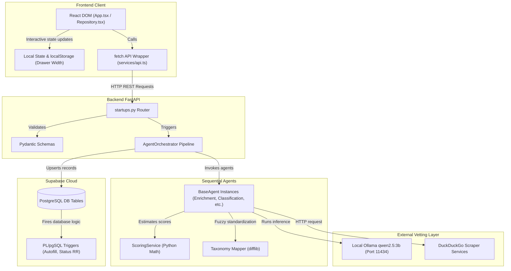

### 2. Physical Architecture Diagram
Illustrates the physical nodes, host runtimes, and ports:
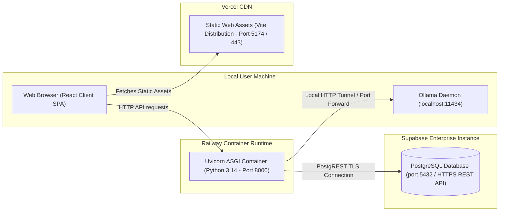

### 3. Application Architecture Diagram
Maps functional code modules and dependencies:
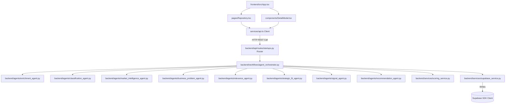

### 4. Infrastructure Architecture Diagram
Represents network communication protocols, SSL certificate terminations, and security boundaries:
```mermaid
graph TD
    Client["Client Browser"] -->|SSL / HTTPS (Port 443)| Cloudflare["Cloudflare CDN Edge"]
    Cloudflare -->|HTTPS REST Proxy| Railway["Railway Application Gateway"]
    Railway -->|Port Forward 8000| FastAPI["FastAPI ASGI Container"]
    FastAPI -->|Private Localhost Network HTTP 11434| Ollama["Ollama Localhost Daemon"]
    FastAPI -->|Encrypted SSL TLS connection| Supabase[("Supabase PostgreSQL Cloud")]
```

### 5. Service Interaction Architecture Diagram
This diagram shows the complete linkage flow across all layers requested:
$$\text{User} \longrightarrow \text{Frontend} \longrightarrow \text{API} \longrightarrow \text{Services} \longrightarrow \text{Database} \longrightarrow \text{AI Layer} \longrightarrow \text{Response}$$

```mermaid
graph TD
    User["User (Relationship Manager)"] -->|1. Clicks Row / Triggers Analysis| FE["Frontend Client (DetailModal.tsx)"]
    FE -->|2. POST /api/analyze/{id}| API["API Gateway (startups.py Router)"]
    API -->|3. run_pipeline(state)| Services["Services (agent_orchestrator.py / scoring_service.py)"]
    Services -->|4. Fetch context metadata| Database["Database (supabase_service.py / Supabase)"]
    Database -- 5. Returns raw row metadata --> Services
    Services -->|6. Run sequential agents| AILayer["AI Layer (BaseAgent / local Ollama)"]
    AILayer -- 7. Decodes clean extracted JSON parameters --> Services
    Services -->|8. Recalculate priority math scores| Services
    Services -->|9. Persist finalized state metrics| Database
    Database -- 10. Confirm upsert successful --> Services
    Services -- 11. Returns updated StartupState --> API
    API -- 12. HTTP 200 JSON Response payload --> FE
    FE -->|13. Re-render drawer panels & KPI widgets| User
```

### 6. Visual Component Code Architecture Block Diagram
The diagram below provides a color-coded visual box layout of the entire codebase architecture:

```mermaid
graph TB
    subgraph UI_LAYER ["PRESENTATION TIER (React, TS, Tailwind CSS)"]
        direction LR
        AppShell["AppShell Component<br/>(Sidebar, Layout System)"]
        RepoPage["Repository Page<br/>(List grid, Urgency filters, Sliders)"]
        Drawer["DetailModal Drawer Component<br/>(Company Intel, ICICI Relevance, Workspace Tabs)"]
        ClientAPI["services/api.ts & lib/supabase.ts<br/>(REST fetch Client connections)"]
    end

    subgraph API_LAYER ["CONTROLLER TIER (FastAPI ASGI Gateway)"]
        direction LR
        MainBE["main.py<br/>(CORS config, Lifespan init)"]
        Router["routes/startups.py<br/>(Endpoint mapping, Pydantic schemas)"]
    end

    subgraph LOGIC_LAYER ["BUSINESS LOGIC TIER (Multi-Agent State Pipeline)"]
        Orchestrator["agent_orchestrator.py<br/>(Pipeline manager, Relevance gating, state persistence)"]
        
        subgraph AGENT_POOL ["Agents Pool (Extends BaseAgent interface)"]
            Enrich["EnrichmentAgent<br/>(Context enrichment)"]
            Class["ClassificationAgent<br/>(Fuzzy standardizer)"]
            Market["MarketIntelligenceAgent<br/>(Competitor, product profiling)"]
            Biz["BusinessProblemAgent<br/>(Group problems mapping)"]
            Relevance["RelevanceAgent<br/>(Strategic BFSI relevance)"]
            Fit["StrategicFitAgent<br/>(Readiness assessment)"]
            Signal["SignalAgent<br/>(Momentum checks)"]
            Rec["RecommendationAgent<br/>(Actions & outreach drafts)"]
        end
    end

    subgraph SERVICE_LAYER ["UTILITIES & MATH SERVICES"]
        direction LR
        Scoring["scoring_service.py<br/>(Deterministic Priority, Confidence math)"]
        SupabaseSvc["supabase_service.py<br/>(CRUD wrappers, mapping formats)"]
        Taxonomy["taxonomy_mapper.py<br/>(Fuzzy close matches, canonical overloads)"]
    end

    subgraph DATA_LAYER ["DATA STORAGE TIER (PostgreSQL Cloud)"]
        direction LR
        S_Table[("startups Table<br/>(Registry core records)")]
        A_Table[("startup_analysis Table<br/>(Vetting scores, RAG arrays)")]
        ASG_Table[("startup_assignments Table<br/>(FPR allocations, logs status)")]
        Trg["PL/pgSQL database triggers<br/>(Round-robin, auto-autofill name)"]
    end

    %% Linkages
    AppShell --> RepoPage & Drawer
    RepoPage -->|Triggers details view| Drawer
    Drawer -->|HTTP Requests| ClientAPI
    ClientAPI -->|REST TCP Port 8000| MainBE
    MainBE --> Router
    Router -->|1. Initializes state & run_pipeline| Orchestrator
    Orchestrator -->|2. Sequentially executes agents| AGENT_POOL
    AGENT_POOL -->|3. standardizes categories| Taxonomy
    Orchestrator -->|4. Computes dynamic priority math| Scoring
    Orchestrator -->|5. maps properties| SupabaseSvc
    SupabaseSvc -->|6. SQL Upserts (ON DELETE CASCADE)| S_Table
    S_Table --> A_Table & ASG_Table
    A_Table --> Trg
    ASG_Table --> Trg

    %% Custom CSS Styling for Visual Blocks
    classDef presentation fill:#e1f5fe,stroke:#0288d1,stroke-width:2px,color:#01579b,font-weight:bold;
    classDef controller fill:#e8f5e9,stroke:#388e3c,stroke-width:2px,color:#1b5e20,font-weight:bold;
    classDef logic fill:#fff3e0,stroke:#f57c00,stroke-width:2px,color:#e65100,font-weight:bold;
    classDef utility fill:#f3e5f5,stroke:#7b1fa2,stroke-width:2px,color:#4a148c,font-weight:bold;
    classDef storage fill:#efebe9,stroke:#5d4037,stroke-width:2px,color:#3e2723,font-weight:bold;

    class AppShell,RepoPage,Drawer,ClientAPI presentation;
    class MainBE,Router controller;
    class Orchestrator,Enrich,Class,Market,Biz,Relevance,Fit,Signal,Rec logic;
    class Scoring,SupabaseSvc,Taxonomy utility;
    class S_Table,A_Table,ASG_Table,Trg storage;
```

---

## SECTION 4 — FRONTEND ARCHITECTURE

### Framework & Layout Strategy
* **Framework**: React 18, Vite HMR build engine, Tailwind CSS utility styling, TypeScript types.
* **Width Resizing Persistence**: Persistent drawer layout stored in `localStorage.detail_drawer_width` ranging between 50% and 95% on desktop viewports.
* **API Ingestion**: Structured fetch hooks mapping JSON objects dynamically.

### Page Flow Breakdown
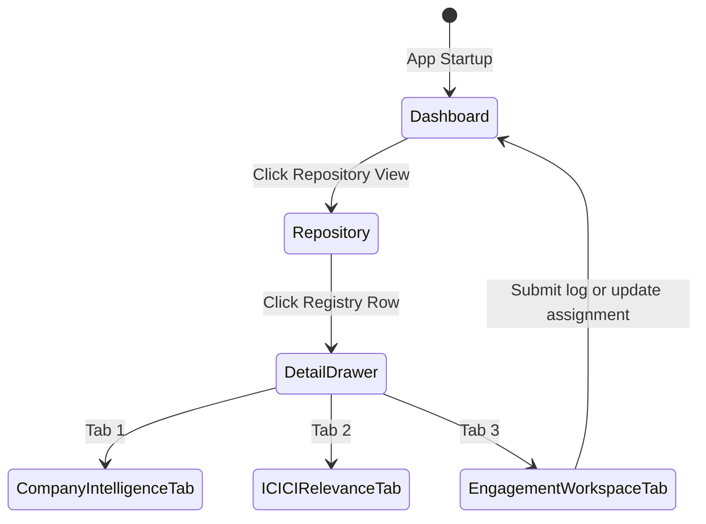

### Page Breakdown Catalog
1. **`Repository.tsx`**: Uses columns like Urgency Band, Primary Sponsoring Entity, Sponsoring Team, Action, and Confidence Score. Hosts sliders for relevance, strategic fit, and priority filtering.
2. **`DetailModal.tsx`**: Drag-resizable drawer. Structures details into three tabs:
   * **Company Intelligence**: Summary, HQ location, founders, taxonomy tags, products tables, competitor matrix, and funding timeline events.
   * **ICICI Relevance**: Recommendations metrics, entity relevance mapping, target business problem matches, and signals list.
   * **Engagement Workspace**: Owner assignments, engagement stage dropdown selection, RMs notes textarea (saving on blur), and activity log timeline entries.

---

## SECTION 5 — BACKEND ARCHITECTURE

### FastAPI Routings & Controller Layer
The API layer executes standard FastAPI routes. Pydantic validation handles JSON requests.

### Endpoint Specifications

#### 1. Analyze Startup
* **URL**: `/api/analyze/{id}`
* **Method**: `POST`
* **Response**: `{"status": "success", "analysis": ...}`
* **Business Logic**: Triggers `AgentOrchestrator.run_pipeline` for the target row, executing sequential agents, calculating priority math, and syncing columns back to Supabase.

#### 2. Update Assignments
* **URL**: `/api/assignments/{id}`
* **Method**: `PUT`
* **Body Schema**:
  ```json
  {
    "assigned_to_fpr1": "Name",
    "assigned_to_fpr2": "Name",
    "business_team": "Team Name",
    "engagement_stage": "Pilot Sandbox",
    "assignment_score_manual_override": 85,
    "assignment_score_override_reason": "Manual CoE pilot routing override",
    "notes": "Evaluation review comments"
  }
  ```
* **Business Logic**: Updates assignments table, recalculates the priority score band based on manual override status, and registers a log in `startup_activity_logs`.

---

## SECTION 6 — DATABASE ARCHITECTURE

### Complete Schema Catalog & Trigger Logs
The database leverages Supabase PostgreSQL with cascade deletes.

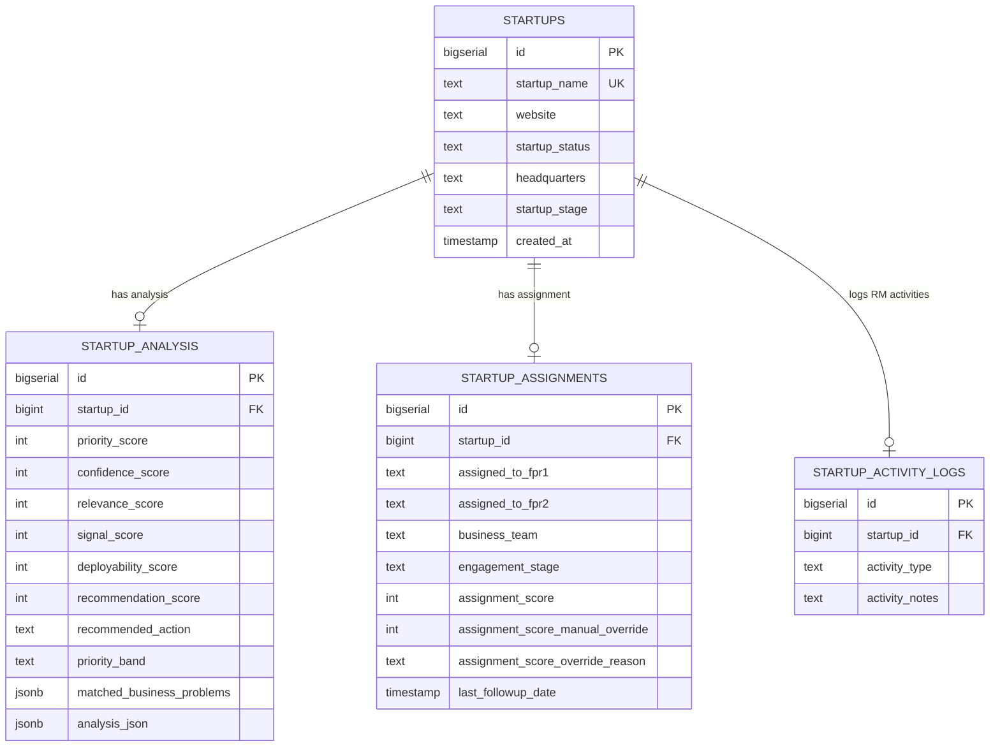

#### Triggers
* **`trg_autofill_startup_name`**: Automatically populates `startup_name` inside `startup_assignments` from the parent `startups` table.
* **`trg_set_assignment_status`**: Sets status string based on `assigned_to_fpr1` updates.

---

## SECTION 7 — AI / LLM ARCHITECTURE

### Multi-Agent Pipeline & Context Gating
* **Local Model**: `qwen2.5:3b` executing on port `11434`.
* **Token Guard Logic**: Relevance score serves as a pipeline gate:
  $$\text{Relevance} < 50 \implies \text{Bypass downstream Strategic Fit and Signal Agents}$$
  This gate ensures that local token consumption is limited only to relevant fintech opportunities.

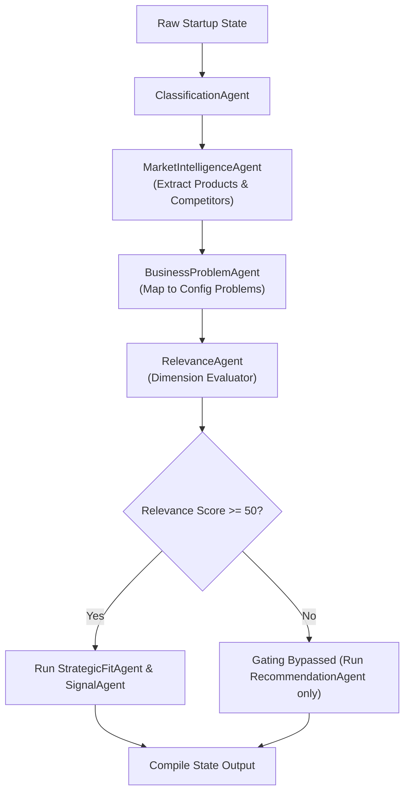

---

## SECTION 8 — DATA INGESTION ARCHITECTURE

### Discovery Ingestion Pipelines
Startups enter the operating system registry via BeautifulSoup news crawlers:

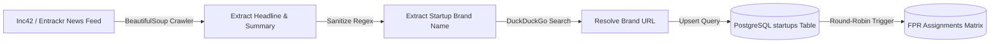

---

## SECTION 9 — COMPLETE DATA FLOW ANALYSIS

### Ingestion to Enrichment Sequence Trace
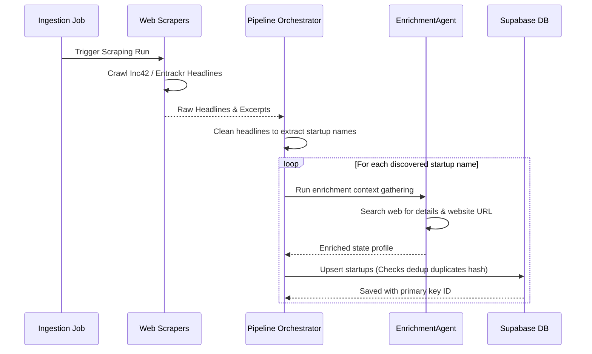

---

## SECTION 10 — STARTUP PLATFORM ANALYSIS

### Programmatic Scoring Formulas

#### 1. Priority Score ($P$)
Defines operational priority for CoE review. If relevance is gated ($Relevance < 50$), the Priority score is capped at the relevance score:
$$P = \begin{cases} Relevance & \text{if } Relevance < 50 \\ \text{Round}\left(0.40 \cdot Relevance + 0.30 \cdot Fit + 0.20 \cdot Deployability + 0.10 \cdot Signal\right) & \text{if } Relevance \ge 50 \end{cases}$$

#### 2. Confidence Score ($C$)
Indicates data reliability on a scale of 0 to 100, combining:
* **Data Completeness (Max 40 points)**: Checks if headquarters/website, founder name, founder LinkedIn, description, sector + subsector, and funding stage are present:
  $$\text{Completeness Count} \implies \text{Points}: \{6 \to 40,\, 5 \to 34,\, 4 \to 27,\, 3 \to 20,\, 2 \to 13,\, 1 \to 7,\, 0 \to 0\}$$
* **Business Problem Match Strength (Max 30 points)**:
  $$\text{Matched Problems} \implies \text{Points}: \{\ge 3 \to 30,\, 2 \to 20,\, 1 \to 10,\, 0 \to 0\}$$
* **Source Reliability (Max 20 points)**:
  * Website URL verified (not example.com): +8 points
  * Founder LinkedIn verified: +6 points
  * News source resolved: +6 points
* **Classification Certainty (Max 10 points)**: Derived from classification classifier confidence values ($\ge 90\% \to 10$, $\ge 80\% \to 8$, $\ge 70\% \to 6$, $\ge 60\% \to 4$, $< 60\% \to 2$).

#### 3. Recommendation Score ($R$)
Weighted average of priority review score and data reliability confidence:
$$R = \text{Round}\left(0.70 \cdot P + 0.30 \cdot C\right)$$

#### 4. Urgency Priority Urgency Bands
Maps priority score to Urgency urgency band:
* **Critical**: $P \ge 90$
* **High**: $80 \le P \le 89$
* **Medium**: $65 \le P \le 79$
* **Low**: $50 \le P \le 64$
* **Ignore**: $P < 50$

---

## SECTION 11 — MULTI-AGENT ARCHITECTURE & DECI-SCORING ENGINE

The Startup Intelligence OS is driven by a coordinated Multi-Agent Intelligence Architecture designed to transform raw startup discovery signals into structured, actionable enterprise assessments.

### Multi-Agent Pipeline Components
Each agent extends from `BaseAgent` and implements the `run(self, state: StartupState) -> StartupState` interface. This pattern guarantees clean input/output state handling, appends detailed audit trail logs, and prevents mutation of unrelated sections.

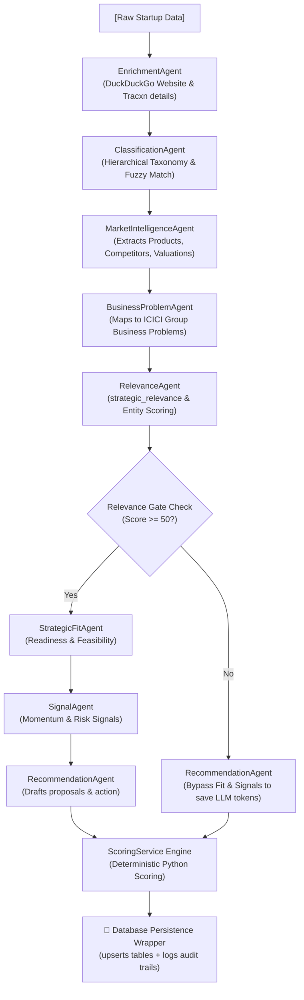

1. **`EnrichmentAgent`**: Clean name discovery, searches DuckDuckGo for website URL and news/funding snippets.
2. **`ClassificationAgent`**: Matches LLM outputs onto the master hierarchical taxonomy (Industry, Sector, Subsector) via fuzzy string alignment (`difflib`).
3. **`MarketIntelligenceAgent`**: Extracts products/solutions, competitor profiles, and valuations. Nested inside the analysis JSON to avoid database schema bloat.
4. **`BusinessProblemAgent`**: Maps the startup's capabilities to specific ICICI business problems (from `backend/config/business_problems.json`).
5. **`RelevanceAgent`**: Evaluates relevance across six core dimensions and maps entity-specific scores for each of the six ICICI entities.
6. **Relevance Gate Rule**: If Relevance Score < 50, the orchestrator gates the process, bypassing downstream Strategic Fit and Signal agents.
7. **`StrategicFitAgent`**: Evaluates readiness, feasibility, and custom integration parameters.
8. **`SignalAgent`**: Detects momentum signals (positive/negative triggers like Tier-1 backing or regulatory hurdles).
9. **`RecommendationAgent`**: Generates email/LinkedIn outreach messages and suggests next steps.

### Detailed Multi-Agent Pipeline Flow Chart (Tabular Flow)

| Step / Phase | Agent Component | Input Context | Main Operations & Prompt Focus | Gating / Routing Logic | Output Fields & Database Targets |
| :--- | :--- | :--- | :--- | :--- | :--- |
| **1. Data Discovery & Enrichment** | `EnrichmentAgent` | Scraped headline, article content, DuckDuckGo search queries. | Cleans startup name using regex; queries DuckDuckGo for website URL, founders, key employees, and Tracxn profile snippets. | None (Executed for all startup inputs). | Enriched context in `StartupState`, website URL (`website`). |
| **2. Taxonomy Classification** | `ClassificationAgent` | Description, website context snippets, and master taxonomy JSON (`docs/startup_sector_mappings.json`). | Maps startup description onto standard Industry, Sector, and Subsector taxonomy via fuzzy matching algorithms (`difflib`). | None (Executed for all startup inputs). | Standardized `industry`, `sector`, and `subsector` fields. |
| **3. Market Extraction** | `MarketIntelligenceAgent` | Enrichment profile, taxonomy tags, and RAG knowledge-base context. | Extracts product lists, actual competitors, estimated valuations, and investor networks. Saves output nested inside the JSON to prevent schema bloat. | Gated if Relevance Score $< 50$. | `products`, `competitors`, `valuation`, and `investors` in `analysis_json.market_intelligence`. |
| **4. Problem Mapping** | `BusinessProblemAgent` | Taxonomy classifications, description, and ICICI business problems (`backend/config/business_problems.json`). | Maps startup solutions onto group-wide business challenges to identify target corporate use cases. | None (Executed for all inputs). | Mapped `business_problems` and `business_teams` lists in `StartupFeatures`. |
| **5. Relevance Assessment** | `RelevanceAgent` | Extracted features, matched business problems, and RAG scoring context. | Evaluates relevance across six core dimensions; maps entity-specific relevance. If no problems are matched, caps final score at 25. | **Gate Rule:** If Relevance Score $< 50$, bypasses downstream Fit & Signal agents to save token window compute. | `relevance_score`, `entity_relevance` map in `StartupState`. |
| **6. Strategic Fit Analysis** | `StrategicFitAgent` | Relevance output, description, and RAG fit guidelines. | Evaluates enterprise readiness, integration feasibility, and partnership opportunities. | Bypassed if Relevance Score $< 50$. | `strategic_fit_score`, `deployability_score` in `StartupState`. |
| **7. Signal Scanning** | `SignalAgent` | Enrichment logs, description, and momentum signal rules. | Scans for positive (e.g. Tier-1 backers, high growth) and negative (low traction, regulatory hurdles) momentum signals. | Bypassed if Relevance Score $< 50$. | `signal_score`, `positive_signals`, `negative_signals` JSON lists. |
| **8. Urgency Recommendation** | `RecommendationAgent` | Pipeline scores, mapped business problems, and relevance metrics. | Determines final actions, priority band, and drafts personalized LinkedIn and email outreach templates. | None (Executed for all inputs; uses standard fallbacks for gated startups). | `recommendation_score`, `confidence_score`, `priority_band`, `recommended_action`, copiable outreach message templates. |

---

## SECTION 12 — AUTHENTICATION & SECURITY

### Controls & Security Mitigation

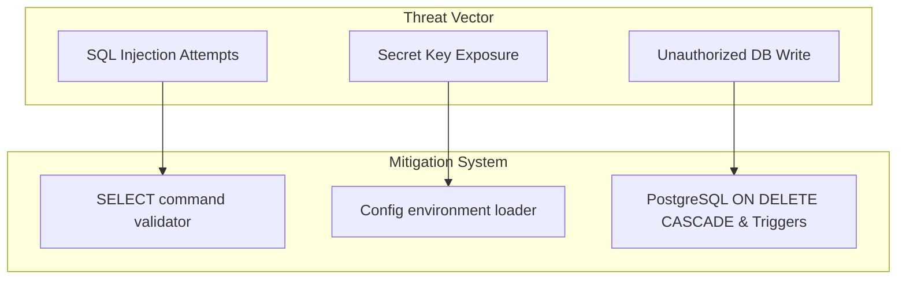

* **SQL Sandbox Protection**: The SQL query executor in `/api/supabase/query` parses incoming commands and blocks execution if the command does not start with `select` (preventing updates, inserts, deletes, or drops).
* **Supabase Access**: Backend bypasses RLS using the service role key (`SUPABASE_KEY`) for pipeline writes. Frontend client uses `VITE_SUPABASE_ANON_KEY` for read-only access.
* **Cascade Deletes**: Foreign key tables reference `startups(id) ON DELETE CASCADE` to prevent database orphan records.

---

## SECTION 13 — DEPLOYMENT & INFRASTRUCTURE

### Physical Infrastructure Layout
The application runs as a three-tier architecture with a static CDN, dynamic container service, and cloud database service.

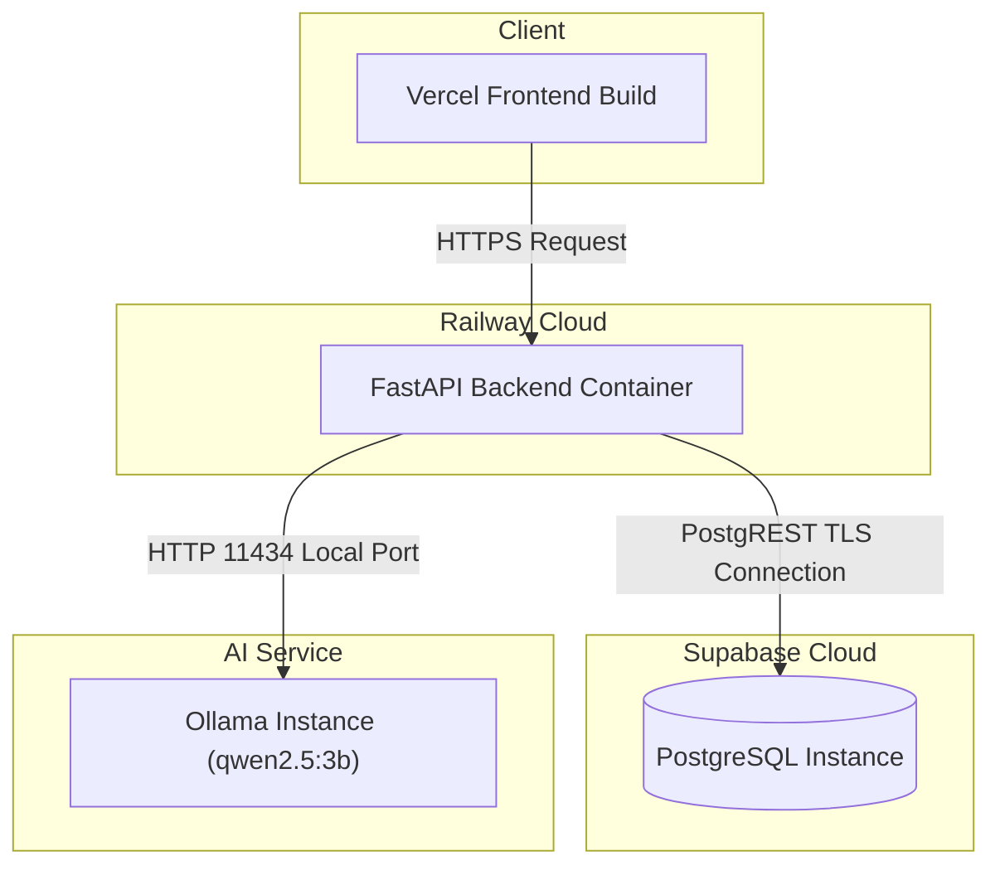

---

## SECTION 14 — CI/CD ARCHITECTURE

### Deploy Pipelines Flow
* **Frontend**: Auto-deploys via GitHub Integration on Vercel.
* **Backend**: Docker deployment triggers automatically on Railway.
* **Database**: Managed migrations applied via local runner or Supabase Console SQL Editor.

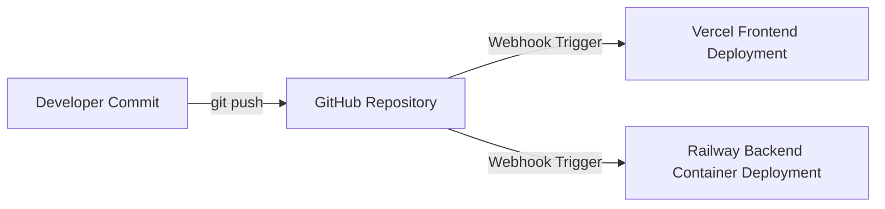

---

## SECTION 15 — PERFORMANCE ENGINEERING

### Performance Bottlenecks & Remediations
1. **Synchronous DuckDuckGo Search**:
   * *Problem*: Scraper searches block execution for 2-4 seconds.
   * *Remediation*: Introduce asynchronous requests (`httpx` or `aiohttp`) for parallel web context extraction.
2. **Local LLM Inference Latency**:
   * *Problem*: Processing agent pipeline evaluations via local Ollama takes 5-15 seconds per startup.
   * *Remediation*: Implement a task queue system (such as Celery or FastAPI `BackgroundTasks`) to process evaluations asynchronously.
3. **Database Client Allocation**:
   * *Problem*: Establishing connection clients on every API request increases latency.
   * *Remediation*: Implement database connection pooling.

---

## SECTION 16 — DEPENDENCY ANALYSIS

### Repository Coupling Maps
* **Module Dependency Graph**: FastAPI depends on routers, routers call the agent orchestrator workflows, orchestrator sequentially executes individual agent classes, and agents import from config files and model schemas.
* **Service Dependency Graph**: FastAPI application communicates with local Ollama on port `11434` and Cloud Supabase on port `443` (TLS connection).

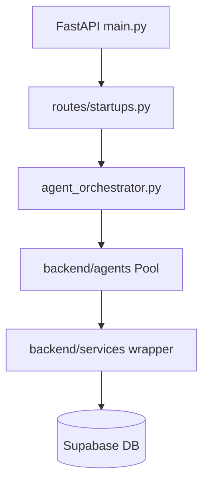

---

## SECTION 17 — COMPLETE EXECUTION FLOW

### Trace: Startup Discovery to Dashboard Presentation
1. **Cron Job Initialization**: Scraper triggers for Entrackr, fetching article details.
2. **Title Sanitization**: `process_startup` cleans the headline using regex to extract a startup brand name.
3. **Search Context Retrieval**: `search_duckduckgo` fetches snippets from DuckDuckGo search.
4. **Agent Orchestration**: `AgentOrchestrator.run_pipeline` triggers:
   * `EnrichmentAgent` resolves the website URL.
   * `ClassificationAgent` fuzzy maps the category string onto the corporate taxonomy using `difflib`.
   * `MarketIntelligenceAgent` extracts products and competitors.
   * `BusinessProblemAgent` maps the startup to ICICI problems.
   * `RelevanceAgent` computes relevance and checks the gate rule (Score $\ge 50$ checks).
   * Downstream agents (`StrategicFitAgent`, `SignalAgent`, `RecommendationAgent`) execute if the gate is passed.
5. **Score Calculations**: `ScoringService` calculates priority, confidence, recommendation, and priority band urgency.
6. **DB Persistence**: Upserts the records to `startups` and `startup_analysis` tables in Supabase. Trigger automatically registers round-robin assignments.
7. **Dashboard Sync**: Frontend React grid refreshes, displaying the new startup profile, scores, and resizable details side-drawer tabs.

---

## SECTION 18 — CODE QUALITY REVIEW

### Scorecard Metrics
* **Architecture Modularity**: **9.5/10**. Base class patterns (`BaseAgent`) isolate agent functions.
* **Maintainability**: **9/10**. Plain CSS styling and typed state flows prevent dynamic script errors.
* **Testability**: **8.5/10**. Pytest files cover full pipeline executions and relevance gating.
* **Security Controls**: **8/10**. SQL sandbox validations block update commands, but lack of auth leaves endpoints open.

---

## SECTION 19 — OBSERVABILITY

### Monitoring & Auditing
* **Audit Trail Logger**: Every state change or agent execution logs detailed timestamps and metadata to the Pydantic `audit_trail` list, which is saved inside `analysis_json`.
* **FastAPI Server Logs**: Prints server operations directly to stdout, which is streamed to the Railway/Docker log viewer.
* **Supabase Logs**: Stream updates, connection states, and API call logs via the Supabase Admin Console log monitoring dashboard.

---

## SECTION 20 — SCALABILITY ROADMAP

### High-Volume Processing Strategy
* **Horizontal API Scaling**: Run multiple container instances of FastAPI on Railway, using load-balancers to distribute traffic.
* **Local Ollama Load Balancing**: Spin up multiple Ollama runner instances on separate machines, behind a round-robin proxy.
* **PostgreSQL Connection Pooling**: Configure pgBouncer on Supabase to pool database transaction queries.

---

## SECTION 21 — KNOWLEDGE TRANSFER GUIDE

### Quick Onboarding Manual
* **Where does execution start?**
  * Backend: `backend/api/main.py` starts the server on port `8000`.
  * Frontend: `frontend/src/main.tsx` initializes the React bundle.
* **How are startups processed?**
  * Crawlers scrape headlines $\to$ regex extracts brand name $\to$ `AgentOrchestrator` runs multi-agent sequence $\to$ scores are computed $\to$ record is upserted to Supabase.
* **How are scores calculated?**
  * All mathematical scoring algorithms are located inside `backend/services/scoring_service.py`.
* **How is debugging performed?**
  * Run backend tests via `pytest backend/tests/test_agent_orchestrator.py`.
  * Access Swagger docs at `http://localhost:8000/docs` to test endpoints manually.
  * Start local development server with `npm run dev` and check browser logs.
