# Startup Intelligence OS — Consolidated System Architecture Manual> [!NOTE]> This is the single, self-contained system architecture manual for the Startup Intelligence OS. It consolidates all technical modules, request sequences, AI routing configurations, database schemas, and developer guide blueprints into a single reference document.---

# SECTION 1 — README
---

## 1. Overview
This is the master entry point and technical architecture documentation suite for **Startup Intelligence OS**, a retrieval-first, AI-powered intelligence platform built for the **Startup Engagement & Investments team at ICICI Group**. 

Rather than a generic database client, this platform implements a modular, high-volume pipeline that aggregates real-time startup news feeds, groups duplicate coverage, isolates relevant startup entities, resolves their company details, enriches their corporate profile, and computes a multi-dimensional strategic relevance score to match them with business teams and Relationship Managers.

---

### Core Visualizations


---

## 2. Business Objectives & Vision
*   **Venture Discovery**: Automatically surface and track fast-growing startups in target sectors (FinTech, InsurTech, WealthTech, SaaS, DeepTech) long before they reach mature public fundraising rounds.
*   **ICICI Business Alignment**: Automatically match discovered startups to specific corporate business units (e.g. Retail Banking, Wealth Management, ICICI Prudential, ICICI Securities) and strategic focus areas based on a deterministic evaluation rubric.
*   **Investment & Partnership Pipeline**: Shorten the discovery-to-engagement lifecycle for Relationship Managers (RMs) and investment analyst teams by providing rich, pre-vetted corporate intelligence profiles.

---

## 3. Core Architectural Principles
*   **Retrieval-First AI Architecture**: Rather than feeding raw, unformatted web dumps directly to expensive LLMs, the platform runs a structured scraping and cleaning process first. Text is segmented and retrieved via keyword/vector similarity matches, keeping LLM prompts tight, focused, and low-cost.
*   **Deterministic Logic Preference**: AI is reserved strictly for tasks requiring cognitive reasoning (e.g. classification alignment, unstructured name extraction, and strategic synthesis). Computations, scoring formulas, Jaccard deduplication, and relationship assignments are calculated deterministically in code.
*   **Externalized Prompts & Rules**: Prompts, scoring weights, relationship mappings, and scraping filters are completely decoupled from code into `.txt` and `.json` files for hot-reloading and modular optimization.
*   **Local-First Execution**: The platform routes reasoning tasks to a local Ollama model (e.g., `qwen2.5:3b`) by default, with automatic failover to cloud models (e.g. OpenRouter/Claude) when local latency thresholds are exceeded.

---

## 4. Technology Stack
*   **Frontend**: React (Vite, TypeScript, Tailwind CSS, Lucide icons, Recharts).
*   **Backend**: Python (FastAPI, BeautifulSoup4, Requests, Pydantic, HTTPX).
*   **Database & Telemetry**: Supabase (PostgreSQL, Real-Time tables, RLS policies, JSONB storage schemas).
*   **AI Gateway & Model Engine**: Local Ollama Server (`qwen2.5:3b` default model) + OpenRouter Client (cloud fallbacks).

---

## 5. System Block Diagram

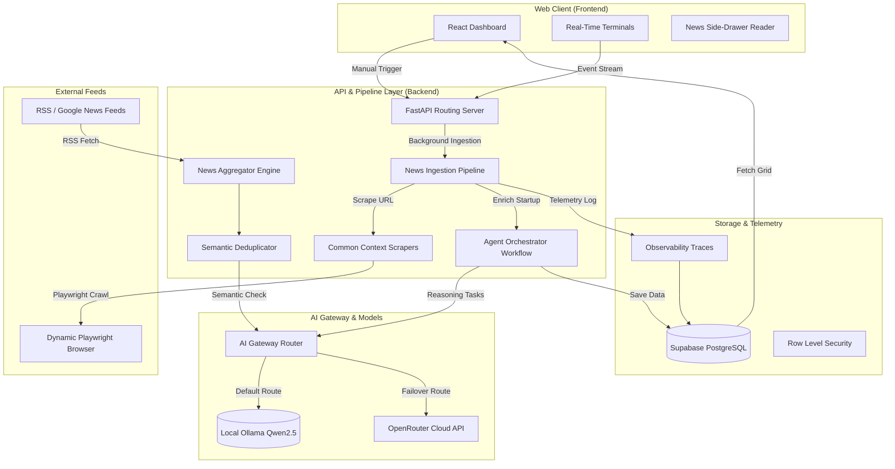
```mermaid
graph TD
    subgraph WebClient ["Web Client (Frontend)"]
        UI[React Dashboard]
        Logs[Real-Time Terminals]
        Drawer[News Side-Drawer Reader]
    end

    subgraph APIPipeline ["API & Pipeline Layer (Backend)"]
        Router[FastAPI Routing Server]
        Aggregator[News Aggregator Engine]
        Deduplicator[Semantic Deduplicator]
        Processor[News Ingestion Pipeline]
        Orchestrator[Agent Orchestrator Workflow]
        Scraper[Common Context Scrapers]
    end

    subgraph AIEngine ["AI Gateway & Models"]
        Gateway[AI Gateway Router]
        LocalOllama[("Local Ollama Qwen2.5")]
        CloudOR[OpenRouter Cloud API]
    end

    subgraph StorageTelemetry ["Storage & Telemetry"]
        DB[("Supabase PostgreSQL")]
        RLS[Row Level Security]
        Obs[Observability Traces]
    end

    subgraph ExternalFeeds ["External Feeds"]
        RSS[RSS / Google News Feeds]
        Playwright[Dynamic Playwright Browser]
    end

    %% Flow Connections %%
    RSS -->|RSS Fetch| Aggregator
    UI -->|Manual Trigger| Router
    Router -->|Background Ingestion| Processor
    Aggregator --> Deduplicator
    Deduplicator -->|Semantic Check| Gateway
    Processor -->|Scrape URL| Scraper
    Scraper -->|Playwright Crawl| Playwright
    Processor -->|Enrich Startup| Orchestrator
    Orchestrator -->|Reasoning Tasks| Gateway
    Gateway -->|Default Route| LocalOllama
    Gateway -->|Failover Route| CloudOR
    Orchestrator -->|Save Data| DB
    Processor -->|Telemetry Log| Obs
    Obs --> DB
    DB -->|Fetch Grid| UI
    Logs -->|Event Stream| Router
```

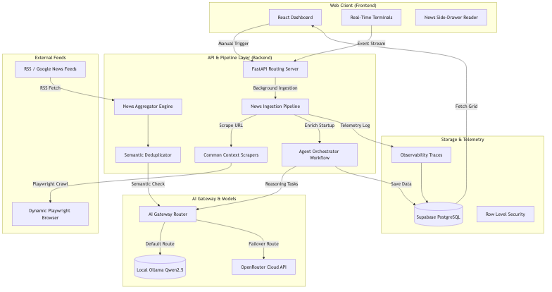


---

## 6. Technical Documentation Catalog

Follow the detailed structural logs of each sub-module using the links below:

1.  ****Repository Architecture****: Repository folder layout, class responsibilities, dependencies, and code boundaries.
2.  ****Startup Intelligence Lifecycle****: Visual mapping of the end-to-end 20-stage business lifecycle from raw news RSS feed to resolved, vetted registry records.
3.  ****Request Lifecycle & Sequences****: Sequence execution loops tracing client requests, background async threads, and database telemetry mutations.
4.  ****AI Layer & Prompt Engineering****: Gateway model routing, failover thresholds, prompt configurations, and vector embeddings cache mechanics.
5.  ****Processing Pipeline Deep-Dive****: Discovery, Resolution, and Enrichment phases, Jaccard headlines deduplication, and the strategic evaluation scoring rubric.
6.  ****Database Architecture & Schema****: ER diagram representation, table constraints, RLS policies, and structured JSONB schemas.
7.  ****Configuration Registry****: Complete catalog of environment variables, scoring weights, time scheduling rates, and hot-reloading boundaries.
8.  ****Trigger Event Catalog****: Events matrix detailing startup checks, scheduled cron ingestion loops, manual resolution inputs, and UI button actions.
9.  ****Local Development Setup Guide****: Setup instructions for Python venv, Node packages, Ollama model pulling, and Supabase migrations.
10. ****Future Extension Guide****: Blueprints for developers adding new scoring rubrics, AI agents, scraping sources, or dashboard pages.
11. ****Build & Run Tools Registry****: Catalog of all rimes, databases, packages, scraping libraries, and dev utilities.


# SECTION 2 — REPOSITORY ARCHITECTURE
---

## 1. Directory Tree Overview

Below is the structured layout of the Startup Intelligence OS repository:

```text
startup-intelligence/
├── backend/                             # FASTAPI Backend Application
│   ├── agents/                          # V1 Legacy Agent definitions (preserved)
│   ├── ai/                              # Gateway layer & Model Routing rules
│   │   ├── gateway/                     # AI Gateway client and response validator
│   │   ├── providers/                   # Ollama / OpenRouter client interfaces
│   │   └── registry/                    # Model registry and capabilities map
│   ├── api/                             # REST API Router endpoints
│   │   └── routes/                      # News, Startups, Observability, Scraping routers
│   ├── config/                          # Configuration registries (.json)
│   ├── enrichment/                      # V2 Modular Enrichment components
│   ├── knowledge/                       # Vector DB local store index files
│   ├── models/                          # Pydantic states and features declarations
│   ├── pipeline/                        # News sync pipelines & Deduplication checks
│   ├── prompts/                         # System LLM instruction templates (.txt)
│   ├── rag/                             # Knowledge base retriever and embedding tools
│   ├── scrapers/                        # Target content scrapers (Inc42, YC, etc.)
│   ├── services/                        # DB Repositories, scoring, & external services
│   ├── tests/                           # Unit and integration test suites
│   ├── utils/                           # Core utilities (tracing, crawling, taxonomy)
│   └── workflows/                       # High-level pipeline choreographers
├── database/                            # Database setup files
│   └── migrations/                      # PostgreSQL migrations (.sql)
├── frontend/                            # React Client Single Page Application (SPA)
│   ├── src/
│   │   ├── components/                  # Custom UI elements (drawer, modals)
│   │   ├── pages/                       # Master page views (News, Observability)
│   │   ├── types/                       # TypeScript model schemas
│   │   ├── App.tsx                      # App navigation routes
│   │   └── main.tsx                     # React client renderer
│   ├── index.html                       # HTML main template
│   ├── vite.config.ts                   # Vite bundler parameters
│   └── package.json                     # NodeJS module definitions
```

---

## 2. Directory Responsibilities & Code Boundaries

### A. Backend Package Modules (`backend/`)

| Directory | Responsibility | Key Classes / Functions | Dependencies | Consumers |
|---|---|---|---|---|
| `backend/ai` | Standardizes all LLM interactions, payload validation, model routing. | `AiGateway`, `ModelRegistry`, `OllamaProvider`, `OpenRouterProvider` | `openai`, `httpx` | `backend/agents`, `backend/enrichment` |
| `backend/api` | Declares REST routers for dashboard grids, manual sync controls, and status polls. | `resolve_startup_from_news()`, `get_prompt_ledger()`, `list_traces()` | `fastapi`, `pydantic` | Frontend Client |
| `backend/enrichment` | Modular intelligence extraction (v2 pipeline parallel layers). | `IdentityEnricher`, `ProductEnricher`, `FundingEnricher`, `CompetitorEnricher` | `backend/ai`, `backend/utils` | `AgentOrchestrator` |
| `backend/pipeline` | Orchestrates the hourly background feed aggregations, syntactic/semantic deduplication. | `NewsProcessor`, `Deduplicator`, `NewsAggregator`, `scheduler_loop()` | `beautifulsoup4`, `feedparser` | FastAPI startup hook |
| `backend/scrapers` | Crawls target websites, parsing body text and matching headline context. | `extract_clean_paragraphs()`, `crawl_startup_targets()` | `playwright`, `beautifulsoup4` | `NewsProcessor`, `IdentityDiscoveryAgent` |
| `backend/services` | Direct database interface (read/write wrappers), scoring rules, and outreach email tools. | `supabase_service.py`, `ScoringService`, `dispatch_gmail_digest()` | `supabase`, `jinja2` | `backend/api`, `backend/workflows` |
| `backend/utils` | Cross-module helper functions (telemetry tracking, name taxonomy normalization). | `log_trace()`, `wrap_supabase_client()`, `normalize_taxonomy()` | `contextvars` | Repository-wide |
| `backend/workflows`| Coordinates high-level process flows (e.g. discovery, resolving, and enrichment). | `AgentOrchestrator`, `run_pipeline()` | `backend/enrichment`, `backend/agents` | `backend/api`, `backend/pipeline` |

---

## 3. Major Abstractions & Relationships

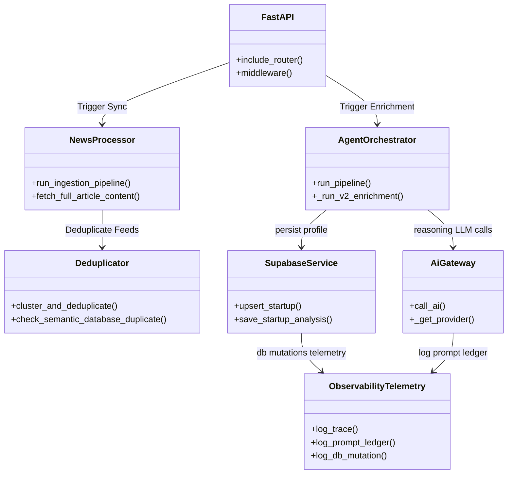
```mermaid
classDiagram
    class FastAPI {
        +include_router()
        +middleware()
    }
    class NewsProcessor {
        +run_ingestion_pipeline()
        +fetch_full_article_content()
    }
    class Deduplicator {
        +cluster_and_deduplicate()
        +check_semantic_database_duplicate()
    }
    class AgentOrchestrator {
        +run_pipeline()
        +_run_v2_enrichment()
    }
    class AiGateway {
        +call_ai()
        +_get_provider()
    }
    class SupabaseService {
        +upsert_startup()
        +save_startup_analysis()
    }
    class ObservabilityTelemetry {
        +log_trace()
        +log_prompt_ledger()
        +log_db_mutation()
    }

    FastAPI --> NewsProcessor : Trigger Sync
    FastAPI --> AgentOrchestrator : Trigger Enrichment
    NewsProcessor --> Deduplicator : Deduplicate Feeds
    AgentOrchestrator --> AiGateway : reasoning LLM calls
    AgentOrchestrator --> SupabaseService : persist profile
    SupabaseService --> ObservabilityTelemetry : db mutations telemetry
    AiGateway --> ObservabilityTelemetry : log prompt ledger
```

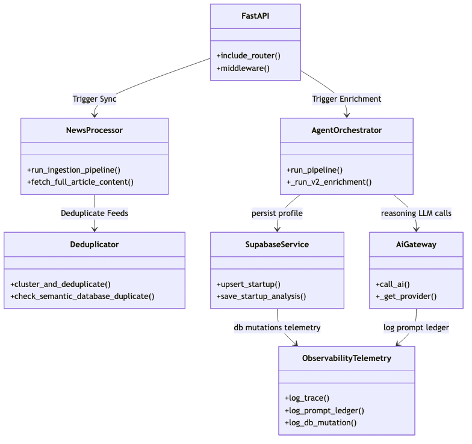


*   **`AgentOrchestrator`** acts as the core dispatcher for the intelligence engine. It initializes a clean `StartupState` object, coordinates calls to the `IdentityDiscovery` and `IdentityResolution` agents (Phase 2), and executes the 5 parallel `Enricher` threads (Phase 3) before calculating metrics and writing to database tables.
*   **`AiGateway`** acts as a proxy for all LLM calls. It wraps prompt loading, rate-limiting, and error-handling. It manages dynamic fallback routing, shifting execution to the local Ollama instance or external OpenRouter targets based on health configuration variables.
*   **`ObservabilityTelemetry`** (`backend/utils/tracing.py`) intercepts call-flows repo-wide. It wraps the Supabase PostgreSQL connector to intercept query latency, logs execution logs in `obs_prompt_ledger`, and maintains trace-state propagation across background threads using `ContextVar` namespaces.

---

## 4. Code References & Cross-Links
*   For request flows, see ****Request Lifecycle****.
*   For data mapping details, see ****Database Architecture****.


# SECTION 3 — INTELLIGENCE LIFECYCLE
---

This document explains the end-to-end processing pipeline of the **Startup Intelligence OS**, detailing how raw, unstructured news articles are parsed, vetted, resolved, enriched, and stored as high-fidelity company records.

---

## 1. 20-Stage Processing Lifecycle

Below is the structured execution flow for raw data ingestion to database storage and dashboard rendering:


```mermaid
flowchart TB
    subgraph Ingestion["Phase 1: Ingestion & Deduplication"]
        A["1. News Sources"] -->|Crawl Feeds| B["2. RSS / Search Feeds"]
        B -->|Parse XML| C["3. Feed Parser"]
        C -->|Identify Link| D["4. Lazy Article Fetch"]
        D -->|HTML Parsing| E["5. 9-Layer Paragraph Filter"]
        E -->|Clean Text| F["6. Headline Jaccard Filter"]
        F -->|Syntactic Check| G["7. Semantic LLM Deduplication"]
    end

    subgraph Discovery["Phase 2: Entity Discovery & Vetting"]
        G -->|Unique Event| H["8. Content Segmentation"]
        H -->|Isolate Sections| I["9. Startup Name Discovery"]
        I -->|Identify Mentions| J["10. Unresolved Mentions Registry"]
    end

    subgraph Enrichment["Phase 3: Identity Resolution & Enrichment"]
        J -->|Synchronous Link| K["11. Identity Discovery Search"]
        K -->|Candidate List| L["12. Website & Domain Resolution"]
        L -->|Validate URL| M["13. Playwright Dynamic Crawl"]
        M -->|Extract HTML Text| N["14. Identity Resolution Verification"]
        N -->|Calculate Confidence| O["15. Parallel Modular Enrichment"]
    end

    subgraph Storage["Phase 4: Evaluation & Storage"]
        O -->|Group Results| P["16. Taxonomy & Industry Mapping"]
        P -->|Canonical Classification| Q["17. Deterministic Scoring Rubric"]
        Q -->|Compute Scores| R["18. News/Digest Linkage"]
        R -->|Dual-Write Tables| S["19. Supabase Storage"]
        S -->|Real-Time Channel| T["20. Frontend Dashboard UI"]
    end
```

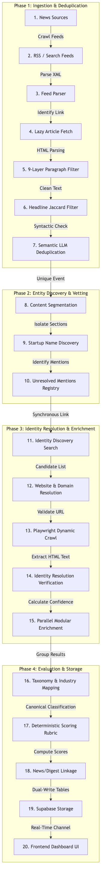


---

## 2. Phase-by-Phase Execution Specifications

### Phase A: News Ingestion & Deduplication

#### 1. News Sources & Feed Parser
*   **Purpose**: Track emerging venture news stories from configured Indian and global business publications.
*   **Input**: JSON configuration profiles of feeds in `sources.json`.
*   **Output**: Stream of raw, unparsed article elements (title, link, published time).
*   **Failure Handling**: Bypasses offline feeds gracefully and registers errors to the backend system logger.

#### 2. Lazy Article Fetch & 9-Layer Paragraph Filter
*   **Purpose**: Download the full web content from the article link, stripping legal disclaimers, author bios, and subscription CTAs.
*   **Input**: Target webpage URL.
*   **Output**: Capped list of up to 10 substantive editorial text paragraphs.
*   **Validation**: Paragraphs matching regular expression rules in `content_filters.json` are discarded.
*   **Fallback**: If the scraper is blocked by paywalls or fails to load, it falls back to the short RSS synopsis body text.

#### 3. Jaccard & Semantic Deduplication
*   **Purpose**: Identify if the story has already been covered by another source in the DB to avoid repeating articles.
*   **Input**: Raw headline and description text.
*   **Output**: A clean canonical cluster list (duplicates are merged as secondary references under the primary news card).
*   **Verification**: 
    *   If headline Jaccard token overlap is $\ge 0.60$, they are directly merged.
    *   If overlap is between $0.30$ and $0.60$, the local LLM checks if they represent the same event context.
    *   If overlap is $< 0.30$, they are kept as separate news items.

---

### Phase B: Entity Discovery & Vetting

#### 4. Startup Name Discovery
*   **Purpose**: Extract unstructured startup mentions from the sanitized headline and leading paragraphs.
*   **Input**: Capped news body paragraphs.
*   **Output**: A list of cleaned startup name candidates (e.g. `["Zepto", "Lenskart"]`) and a 150-word AI summary.
*   **Validation**: Candidate names are normalized to lowercase and run against the prompt schema filters (skipping generic templates like `ExampleStartup`).

#### 5. Unresolved Mentions Registry & Sync Linkage
*   **Purpose**: Link startup mentions in `news_articles.startups_mentioned` immediately in the DB, so unlinked companies render instantly in the UI with a dashed border option.
*   **Input**: Discovered startup name.
*   **Output**: A basic, placeholder record in the `startups` table with `status: "Screening"` (or `"Enriching"` if enrichment is launched), providing a unique `startup_id` that is mapped instantly to the news article.
*   **Recovery**: Restores pre-existing validated startup IDs to avoid duplicate entity creation.

---

### Phase C: Identity Resolution & Enrichment

#### 6. Identity Discovery (Search & Domain Resolution)
*   **Purpose**: Resolve candidate company websites and LinkedIn profiles using Web Search.
*   **Input**: Discovered startup name.
*   **Output**: Target website URL (e.g. `https://www.zepto.com`) and target LinkedIn company URL.
*   **Fallback**: If search queries fail, the pipeline falls back to querying the local domain cache database using normalized brand synonyms.

#### 7. Playwright Dynamic Crawl
*   **Purpose**: Bypass client-side Javascript renders to scrape the core company website pages (homepage, about, products).
*   **Input**: Resolved website URL.
*   **Output**: Raw text dumps from candidate subpages.
*   **Failure Handling**: If standard HTTP requests fail (timeouts, blocklists), launches a headless Chromium browser instance via Playwright to fetch content.

#### 8. Verification & Resolution scoring
*   **Purpose**: Verify if the scraped website actually matches the context of the originating news article, preventing wrong domain matches (e.g. matching a local store name).
*   **Input**: Scraped website paragraphs vs. headline keywords.
*   **Output**: A confidence score ($0$ to $100$) and verification status (`VERIFIED`, `NEEDS_REVIEW`, `MISMATCHED`).
*   **Aborts**: If confidence is $< 20\%$ or status resolves to `MISMATCHED`, the pipeline aborts further processing to save tokens.

#### 9. Parallel Modular Enrichment
*   **Purpose**: Crawl deep corporate, product, funding, and competitor metrics using parallel agent threads.
*   **Input**: Sanitized website pages + search snippets.
*   **Output**: Bucketed JSON structures.
*   **Concurrency**: Spawns a ThreadPoolExecutor with 5 workers, executing `CorporateEnricher`, `IdentityEnricher`, `ProductEnricher`, `FundingEnricher`, and `CompetitorEnricher` in parallel.

---

### Phase D: Strategic Evaluation & Persistance

#### 10. Taxonomy Mapping & Scoring
*   **Purpose**: Categorize the startup into canonical sectors, business models, and compute strategic priority scores.
*   **Input**: Enriched JSON payload.
*   **Output**: Sector/industry tag mappings, and a calculated final priority score ($0$ to $100$).
*   **Rules**: Run through `ScoringService` based on strategic relevance, deployability, funding metrics, and negative flags.

#### 11. Dual-Write Storage
*   **Purpose**: Persist high-fidelity records to Supabase.
*   **Input**: Completed `StartupState` object.
*   **Output**: Database row updates in `startups` (dual-writing `company_intelligence` JSONB and raw columns) and `startup_analysis`.

---

## 3. Startup Entity State Transitions

The state diagram below maps how a startup entity status transitions in the database:

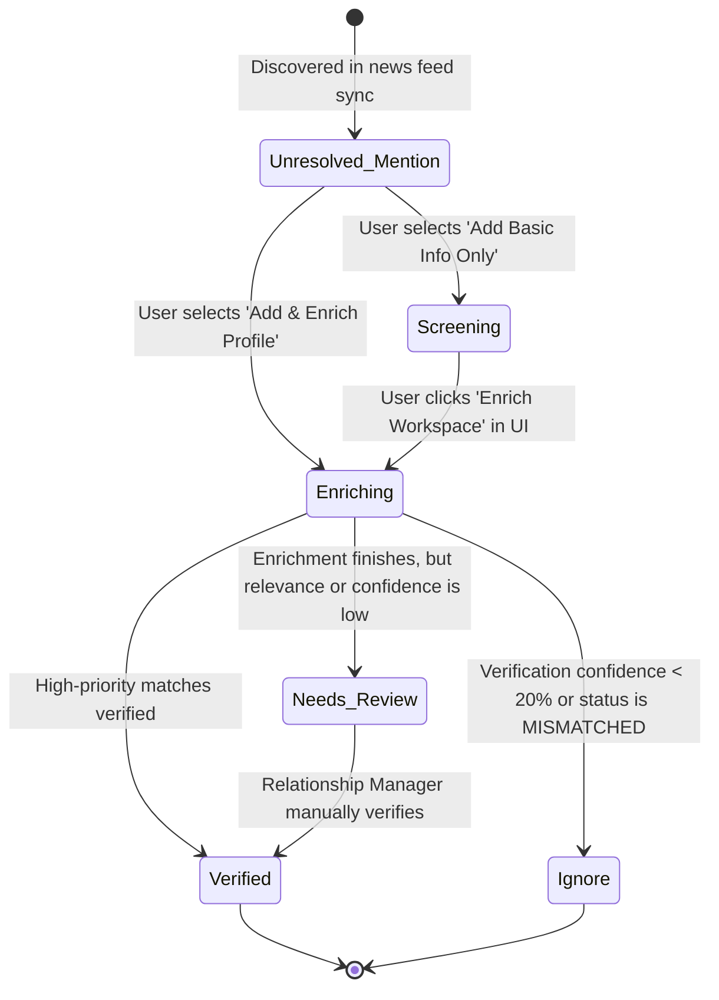
```mermaid
stateDiagram-v2
    [*] --> Unresolved_Mention : Discovered in news feed sync
    Unresolved_Mention --> Screening : User selects 'Add Basic Info Only'
    Unresolved_Mention --> Enriching : User selects 'Add & Enrich Profile'
    Screening --> Enriching : User clicks 'Enrich Workspace' in UI
    Enriching --> Needs_Review : Enrichment finishes, but relevance or confidence is low
    Enriching --> Verified : High-priority matches verified
    Enriching --> Ignore : Verification confidence < 20% or status is MISMATCHED
    Needs_Review --> Verified : Relationship Manager manually verifies
    Verified --> [*]
    Ignore --> [*]
```

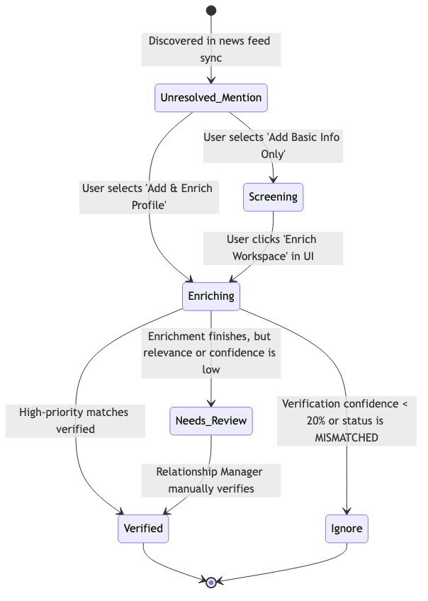


---

## 4. Code References & Cross-Links
*   For table fields and column consumers, see ****Database Architecture****.
*   For the scoring formulas, see ****Processing Pipeline Deep-Dive****.


# SECTION 4 — NEWS LIFECYCLE DIAGRAM
---

This document provides a comprehensive blueprint of the end-to-end News Lifecycle within the **Startup Intelligence OS**, tracking an article from external publication to final database persistence and React UI display.

---

## 1. End-to-End News Lifecycle Flowchart


```mermaid
flowchart TD
    %% Phase 1: Ingestion Trigger & Fetching
    subgraph Phase1 ["Phase 1: Ingestion Trigger & Fetching"]
        Cron["Cron Scheduler (Scheduled News Sync)"] -->|Trigger| Fetch["Fetch RSS Raw XML feeds"]
        UI_Sync["UI Dashboard 'Sync News' Button"] -->|Trigger| Fetch
        UI_Manual["UI Side-Drawer 'Add & Enrich' Button"] -->|Trigger Manual URL| Fetch
    end

    %% Phase 2: URL Duplication Pre-Filter
    subgraph Phase2 ["Phase 2: URL Duplication Pre-Filter"]
        Fetch --> QueryDB{"Query Supabase: URL Exists?"}
        QueryDB -->|Yes| SkipIngest["Discard (Already Processed)"]
        QueryDB -->|No| CleanText["Clean HTML tags & normalize text fields"]
    end

    %% Phase 3: Syntactic & Semantic Deduplication
    subgraph Phase3 ["Phase 3: Syntactic & Semantic Deduplication"]
        CleanText --> CalcJaccard["Calculate Jaccard Token Overlap with active headlines"]
        CalcJaccard --> JaccardCheck{"Jaccard Overlap Score?"}
        
        JaccardCheck -->|Jaccard >= 0.60| MergeSource["Merge: Link URL to Existing Canonical Card"]
        JaccardCheck -->|Jaccard < 0.30| SaveNewCanonical["Register as New Canonical Card"]
        
        JaccardCheck -->|Jaccard between 0.30 and 0.60| CallLLMDedup["Call Ollama: Semantic Comparison Prompt"]
        CallLLMDedup --> LLMMatch{"Is Same Event?"}
        LLMMatch -->|Yes| MergeSource
        LLMMatch -->|No| SaveNewCanonical
    end

    %% Phase 4: Entity Discovery (Ollama)
    subgraph Phase4 ["Phase 4: Entity Discovery"]
        SaveNewCanonical --> ScrapeBody["Scrape Article Content (BeautifulSoup/HTTPX)"]
        ScrapeBody --> ScrapeSuccess{"Scrape Successful?"}
        ScrapeSuccess -->|Blocked| Playwright["Trigger Headless Playwright Browser Scraper"]
        ScrapeSuccess -->|Yes| DiscoveryPrompt["Execute Ollama Pass 1: Brand Discovery Prompt"]
        Playwright --> DiscoveryPrompt
        
        DiscoveryPrompt --> DiscoveryCheck{"Operating Startups Discovered?"}
        DiscoveryCheck -->|No| MarkProcessed["Mark Ingestion Processed (Idle)"]
        DiscoveryCheck -->|Yes| ResolveStartup["Trigger Mention Linkage & Status In-Progress"]
    end

    %% Phase 5: Identity Resolution & Vetting
    subgraph Phase5 ["Phase 5: Identity Resolution & Vetting"]
        ResolveStartup --> CheckRegistry{"Check Supabase 'startups' Table"}
        CheckRegistry --> RegistryMatch{"Registry Match Score >= 50?"}
        
        RegistryMatch -->|Yes| LinkExist["Link Article Mention to existing Startup ID"]
        RegistryMatch -->|No| CreateRegistry["Create New Startup Record & Set Status 'Enriching'"]
        
        LinkExist --> SaveStartupNews["Save to 'startup_news' Table"]
        CreateRegistry --> SaveStartupNews
    end

    %% Phase 6: Multi-Agent Enrichment & Scoring
    subgraph Phase6 ["Phase 6: Multi-Agent Enrichment & Scoring"]
        CreateRegistry --> TriggerOrch["FastAPI BackgroundTask: Orchestrator ThreadPool"]
        TriggerOrch --> ParallelAgents["Run Parallel Agents (Discovery, Legal, Product, Competitor, Funding)"]
        ParallelAgents --> RAGLookup["Query local challenges RAG index (retriever.py)"]
        RAGLookup --> PriorityScore["Calculate Strategic Fit & Priority Score weights"]
        PriorityScore --> SaveRegistry["Upsert to 'startups' & 'startup_analysis' tables"]
    end

    %% Phase 7: Real-Time Event Display
    subgraph Phase7 ["Phase 7: Real-Time Event Display"]
        SaveRegistry --> PushEvent["Supabase Postgres Real-Time Channel Event"]
        PushEvent --> UI_Listener["React Dashboard Event Listener"]
        UI_Listener --> UI_Grid["Update News Feed Grid (Status: Active, badge changes dashed -> solid)"]
    end

    %% Styling
    style JaccardCheck fill:#ffebee,stroke:#c62828,stroke-width:2px
    style RegistryMatch fill:#ffebee,stroke:#c62828,stroke-width:2px
    style QueryDB fill:#ffebee,stroke:#c62828,stroke-width:2px
    style LLMMatch fill:#ffebee,stroke:#c62828,stroke-width:2px
    style DiscoveryCheck fill:#ffebee,stroke:#c62828,stroke-width:2px
    style ScrapeSuccess fill:#ffebee,stroke:#c62828,stroke-width:2px
```


# SECTION 5 — PROCESSING PIPELINE
---

This document explains the processing pipeline, covering headline deduplication formulas, the verification scoring matrices, and the BFSI priority assignments.

---

## 1. Hybrid Deduplication Workflow

To prevent duplicate stories from polluting the dashboard, the pipeline runs a hybrid (syntactic + semantic) deduplication process inside `backend/pipeline/deduplicator.py`:

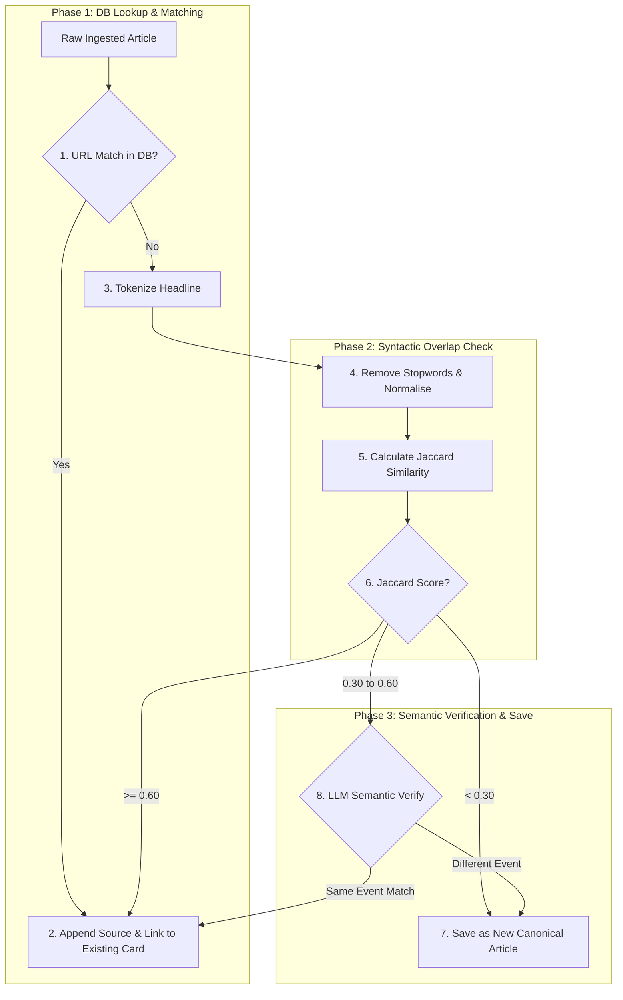
```mermaid
flowchart TB
    subgraph Verification["Phase 1: DB Lookup & Matching"]
        Raw["Raw Ingested Article"] --> CheckDB{1. URL Match in DB?}
        CheckDB -->|Yes| Merge["2. Append Source & Link to Existing Card"]
        CheckDB -->|No| Tokenizer["3. Tokenize Headline"]
    end
    
    subgraph JaccardCheck["Phase 2: Syntactic Overlap Check"]
        Tokenizer --> RemoveStop["4. Remove Stopwords & Normalise"]
        RemoveStop --> CalcJaccard["5. Calculate Jaccard Similarity"]
        CalcJaccard --> Threshold{6. Jaccard Score?}
    end
    
    subgraph SemanticCheck["Phase 3: Semantic Verification & Save"]
        Threshold -->|">= 0.60"| Merge
        Threshold -->|"< 0.30"| SaveNew["7. Save as New Canonical Article"]
        Threshold -->|"0.30 to 0.60"| LLMCheck{8. LLM Semantic Verify}
        
        LLMCheck -->|Same Event Match| Merge
        LLMCheck -->|Different Event| SaveNew
    end
```

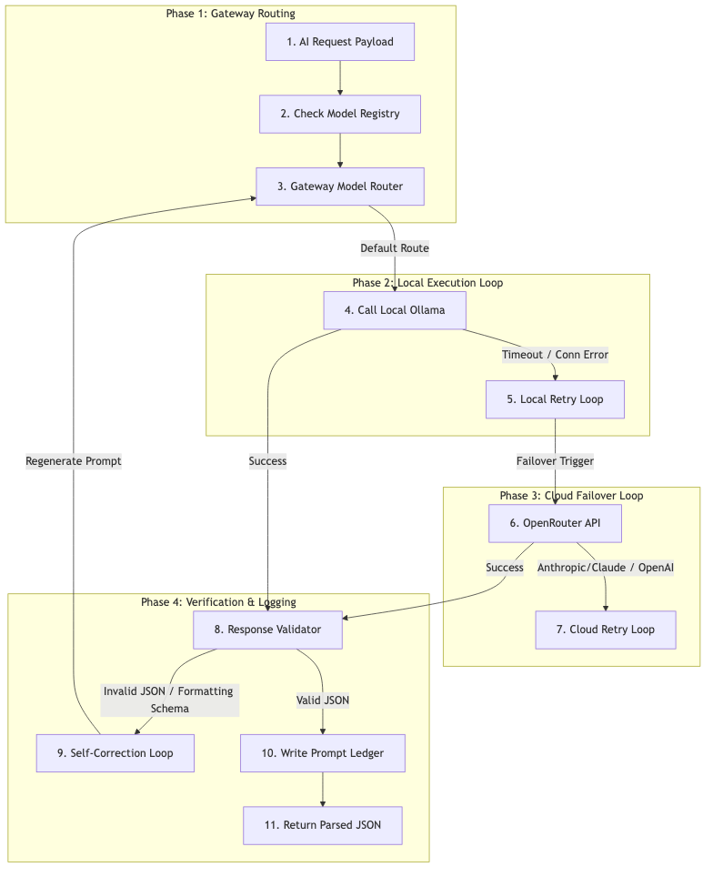


### Jaccard Syntactic Deduplication Formula
We compute Jaccard similarity by dividing the intersection of unique words by the union of unique words in both headlines:

$$\text{Jaccard}(A, B) = \frac{|A \cap B|}{|A \cup B|}$$

*   **Expanded Stopword Tokenizer**: Common words, prepositions, and pronouns (e.g. `and`, `of`, `for`, `the`, `is`, `a`) are stripped before calculation.
*   **Merge Threshold ($\ge 0.60$)**: Directly groups rewrites (e.g. *"DPIIT Issues Guidelines for Startup Fund"* vs *"DPIIT Sets Rules for Startup Fund"*).
*   **LLM Verification Threshold ($0.30$ to $0.60$)**: Passes the headline and short body snippet to the local LLM (`are_contexts_describing_same_event`) to confirm if the stories describe the exact same event.

---

## 2. In-Progress Startup Matching & Resolution

When an article mention is resolved:

1.  **Instant placeholder link**: The backend `/resolve-startup` endpoint creates a basic startup record in the DB and links the ID to the news article immediately, updating the card badge in the UI.
2.  **Website Candidate Crawl**: Gathers candidate websites via Web Search, validating and scoring them inside `IdentityResolutionAgent`.
3.  **Verification Scoring**:
    *   Computes a matching confidence score ($0$ to $100$) based on entity overlap.
    *   Assigns a status: `VERIFIED`, `NEEDS_REVIEW`, or `MISMATCHED`.
    *   If confidence is $< 20\%$ or status is `MISMATCHED`, it aborts further enrichment processing.

---

## 3. Modular Enrichment Layer (Phase 3 Parallel Run)

If verified, `AgentOrchestrator` launches parallel modular enrichment threads via a `ThreadPoolExecutor` (5 workers):

*   **`CorporateEnricher`**: Extracts headquarters location, founded year, legal name, and basic metadata.
*   **`IdentityEnricher`**: Extracts founders, leadership teams, and profiles.
*   **`ProductEnricher`**: Maps product catalog lists, use-cases, and value propositions.
*   **`FundingEnricher`**: Resolves total funding capital raised and latest round stage.
*   **`CompetitorEnricher`**: Extracts direct and indirect market competitors.
*   **`IntelligenceEnricher`** (Runs sequentially after): Synthesizes strategic fit, BFSI use-cases, and co-creation opportunities.

---

## 4. Priority Scoring Framework (`ScoringService`)

Once enrichment is complete, `ScoringService` computes the final priority score ($0$ to $100$) based on four weight vectors:

$$\text{Priority Score} = (\text{Relevance} \times 0.35) + (\text{Strategic Fit} \times 0.25) + (\text{Deployability} \times 0.25) + (\text{Signal Score} \times 0.15)$$

### Weighted Scores

1.  **Relevance Score ($0$ to $100$)**:
    *   Evaluates how closely the startup aligns with financial services (BFSI).
    *   Higher scores are given for FinTech, InsurTech, RegTech, and WealthTech.
2.  **Strategic Fit ($0$ to $100$)**:
    *   Vets alignment with ICICI Group focus areas.
    *   Higher scores for enterprise readiness and integration feasibility.
3.  **Deployability Score ($0$ to $100$)**:
    *   Assesses integration ease.
    *   If the startup uses legacy architectures or lacks APIs, the score is penalized.
4.  **Signal Score ($0$ to $100$)**:
    *   Tracks positive momentum signals (e.g. funding rounds, expansion) and negative flags (e.g. layoffs, legal issues).

### Priority Bands
Based on the final score, the startup is placed in a priority band:
*   **High** (Score $\ge 75$)
*   **Medium** ($50 \le \text{Score} < 75$)
*   **Low** ($30 \le \text{Score} < 50$)
*   **Ignore** (Score $< 30$)

---

## 5. Relationship Manager (FPR) Assignments

Startups are matched with a Relationship Manager (FPR) in `backend/api/routes/startups.py` based on their sector classification:
*   **FinTech / Payments**: Routed to the Payments Team.
*   **WealthTech / Asset Management**: Routed to the Wealth Management Team.
*   **InsurTech / Claims**: Routed to the Insurance Team.
*   **DeepTech / SaaS**: Routed to the Corporate Technologies Team.

If a startup cannot be classified, it is assigned to a default triage queue.

---

## 6. Code References & Cross-Links
*   For the data models, see ****Database Architecture****.
*   For config mappings, see ****Configuration Registry****.


# SECTION 6 — AI ARCHITECTURE
---

This document explains the AI Layer of the **Startup Intelligence OS**, detailing the AI Gateway client design, local-first routing rules, prompt templates, and the retrieval-first RAG embedding cache mechanism.

---

## 1. AI Execution Flow

Below is the execution flow for any AI reasoning call:

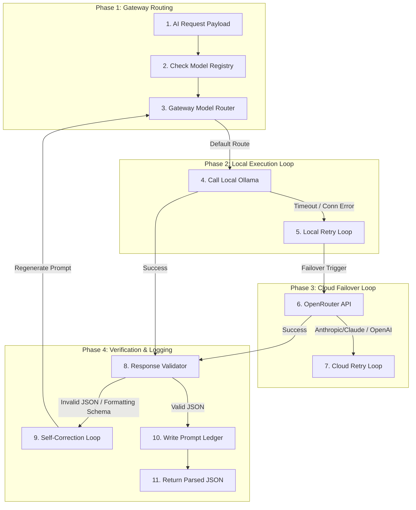
```mermaid
flowchart TB
    subgraph Routing["Phase 1: Gateway Routing"]
        Req["1. AI Request Payload"] --> Registry["2. Check Model Registry"]
        Registry --> Router["3. Gateway Model Router"]
    end
    
    subgraph Local["Phase 2: Local Execution Loop"]
        Router -->|Default Route| Ollama["4. Call Local Ollama"]
        Ollama -->|Timeout / Conn Error| LocalRetry["5. Local Retry Loop"]
    end
    
    subgraph Cloud["Phase 3: Cloud Failover Loop"]
        LocalRetry -->|Failover Trigger| CloudAPI["6. OpenRouter API"]
        CloudAPI -->|"Anthropic/Claude / OpenAI"| CloudRetry["7. Cloud Retry Loop"]
    end
    
    subgraph Verification["Phase 4: Verification & Logging"]
        Ollama -->|Success| Verify["8. Response Validator"]
        CloudAPI -->|Success| Verify
        
        Verify -->|"Invalid JSON / Formatting Schema"| RetryGen["9. Self-Correction Loop"]
        RetryGen -->|Regenerate Prompt| Router
        
        Verify -->|Valid JSON| Persist["10. Write Prompt Ledger"]
        Persist --> Return["11. Return Parsed JSON"]
    end
```

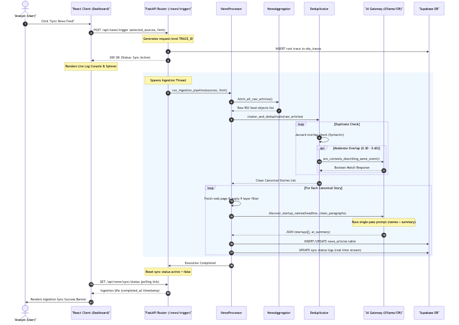


---

## 2. Gateway Client & Failover Routing (`backend/ai/gateway/ai_gateway.py`)

The `AiGateway` class acts as the centralized manager for all LLM transactions:

*   **Local-First Default**: Incoming tasks default to the local Ollama provider, running the `qwen2.5:3b` model.
*   **Failover Policies**: If the local Ollama server fails to respond (connection timeouts, process crash, missing local model), the gateway automatically captures the error, instantiates the `OpenRouter` provider client, and forwards the payload to a configured cloud model (e.g., `mistralai/mistral-7b-instruct` or `google/gemini-2.5-flash`).
*   **Token Optimizer**: The gateway includes context-pruning algorithms that scan the prompt and truncate redundant spacing and long paragraph structures if they approach the input token cap.

---

## 3. Prompts & LLM Interactions

The platform isolates system instructions into external files under `backend/prompts/` to separate engineering rules from database logic.

### Ingest-Time: Name Discovery & Ingestion Summary
*   **Prompt File**: [name_discovery_prompt.txt](file:///Users/anurag/Projects/startup-intelligence/backend/prompts/name_discovery_prompt.txt)
*   **Purpose**: Extracts startup name mentions and compile a 150-word summary from raw article paragraphs.
*   **Context Structure**: Injects the headline and first 3 clean paragraphs of the scraped article.
*   **Output JSON Schema**:
    ```json
    {
      "startups": ["string"],
      "ai_summary": "string"
    }
    ```
*   **Sanitization Filters**:
    *   Replaces realistic mock startup placeholders in templates with abstract tag indicators (`<STARTUP_NAME>`) to prevent hallucinated leakages.
    *   Cleans raw LLM text using regex filters to strip markdown markdown dashes (`- `) or asterisks (`**`) from summaries.

### Resolution-Time: Entity Vetting & Website Verification
*   **Agent File**: `backend/agents/identity_resolution_agent.py`
*   **Purpose**: Vets if a discovered target website matches the context of the news story headline.
*   **Output JSON Schema**:
    ```json
    {
      "is_match": "boolean",
      "confidence": "integer",
      "verification_notes": "string"
    }
    ```

---

## 4. Retrieval-First RAG Cache & Embeddings

To prevent repeating heavy search index scraping and expensive vector embeddings calls, the platform uses a local RAG cache layer:

*   **Embedding File**: [rag_embeddings.json](file:///Users/anurag/Projects/startup-intelligence/backend/knowledge/vector_index/rag_embeddings.json)
*   **Storage Structure**: Maps normalized query strings to cached vector matrices and text chunks:
    ```json
    {
      "query_hash_string": {
        "text_content": "Extracted website metadata chunk...",
        "embeddings": [0.012, -0.045, 0.981, "..."]
      }
    }
    ```
*   **Pruning & Reuse**: When a crawler requests search context for a startup, `backend/rag/retriever.py` queries `rag_embeddings.json` first. If a match exists (cache hit), the system pulls the cached text chunks immediately. If missing (cache miss), it generates new embeddings and stores them in the JSON registry.

---

## 5. Graphify Context Optimization

Startup Intelligence OS integrates **Graphify** to minimize input tokens. Rather than reading raw code files or documentation folders in bulk, the AI agent uses Graphify's query tool to isolate targeted context blocks:

*   **Targeted Context Extraction**: Runs `graphify query` commands with a strict `--budget` token ceiling:
    ```bash
    graphify query "Identify Jaccard deduplication logic" --budget 1000
    ```
*   **Impact Tracing**: Uses `graphify path` and `graphify affected` to check file dependencies, showing the exact scope of code impacts before making modifications.

---

## 6. Code References & Cross-Links
*   For details on the Jaccard check logic, see ****Processing Pipeline Deep-Dive****.
*   For the telemetry log schema, see ****Database Architecture****.


# SECTION 7 — REQUEST LIFECYCLE
---

This document traces the request, processing, and database execution lifecycle for the two primary operations in the **Startup Intelligence OS**: Manual News Feed Ingestion and Single Startup Enrichment.

---

## 1. News Ingestion Workflow (Manual Sync Feed)

This workflow traces the sequence of operations when a user triggers a manual sync of news feeds from the React dashboard.

### sequence Diagram

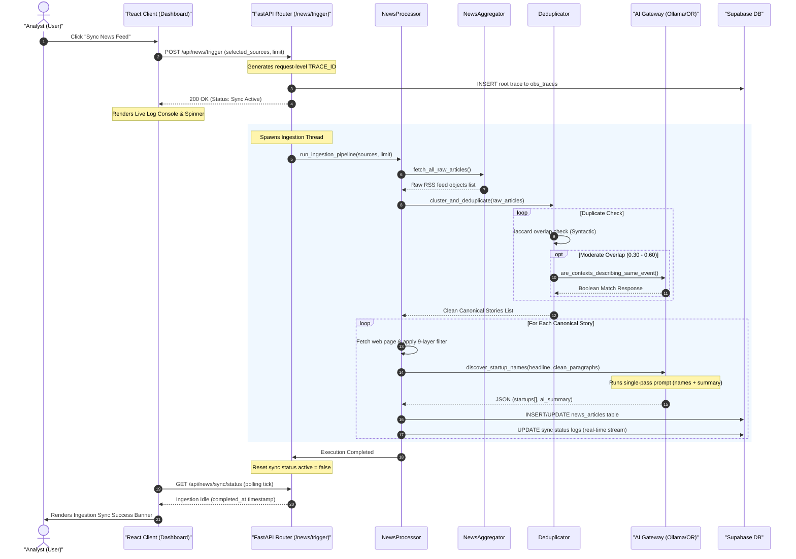
```mermaid
sequenceDiagram
    autonumber
    actor User as "Analyst (User)"
    participant UI as "React Client (Dashboard)"
    participant API as "FastAPI Router (/news/trigger)"
    participant Proc as NewsProcessor
    participant Agg as NewsAggregator
    participant Dedup as Deduplicator
    participant GW as "AI Gateway (Ollama/OR)"
    participant DB as "Supabase DB"

    User->>UI: Click "Sync News Feed"
    UI->>API: POST /api/news/trigger (selected_sources, limit)
    Note over API: Generates request-level TRACE_ID
    API->>DB: INSERT root trace to obs_traces
    API-->>UI: 200 OK (Status: Sync Active)
    Note over UI: Renders Live Log Console & Spinner
    
    rect rgb(240, 248, 255)
        Note over API: Spawns Ingestion Thread
        API->>Proc: run_ingestion_pipeline(sources, limit)
        Proc->>Agg: fetch_all_raw_articles()
        Agg-->>Proc: Raw RSS feed objects list
        Proc->>Dedup: cluster_and_deduplicate(raw_articles)
        
        loop Duplicate Check
            Dedup->>Dedup: Jaccard overlap check (Syntactic)
            opt Moderate Overlap (0.30 - 0.60)
                Dedup->>GW: are_contexts_describing_same_event()
                GW-->>Dedup: Boolean Match Response
            end
        end
        Dedup-->>Proc: Clean Canonical Stories List
        
        loop For Each Canonical Story
            Proc->>Proc: Fetch web page & apply 9-layer filter
            Proc->>GW: discover_startup_names(headline, clean_paragraphs)
            Note over GW: Runs single-pass prompt (names + summary)
            GW-->>Proc: JSON (startups[], ai_summary)
            Proc->>DB: INSERT/UPDATE news_articles table
            Proc->>DB: UPDATE sync status logs (real-time stream)
        end
    end
    
    Proc->>API: Execution Completed
    Note over API: Reset sync status active = false
    UI->>API: GET /api/news/sync/status (polling tick)
    API-->>UI: Ingestion Idle (completed_at timestamp)
    UI->>User: Renders Ingestion Sync Success Banner
```

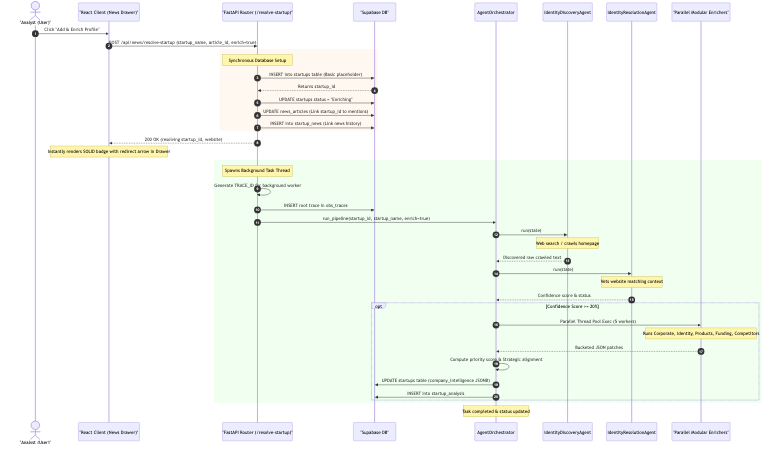


---

## 2. Startup Resolution & Enrichment Workflow ("Add & Enrich Profile")

This workflow traces the sequence of operations when an analyst clicks **"Add & Enrich Profile"** for a discovered startup mention inside an article drawer.

### sequence Diagram

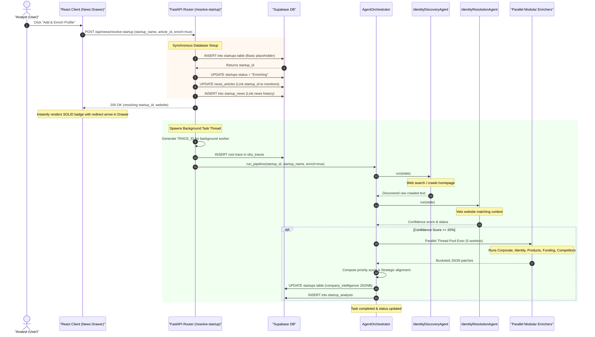
```mermaid
sequenceDiagram
    autonumber
    actor User as "Analyst (User)"
    participant UI as "React Client (News Drawer)"
    participant API as "FastAPI Router (/resolve-startup)"
    participant DB as "Supabase DB"
    participant Orch as AgentOrchestrator
    participant Discovery as IdentityDiscoveryAgent
    participant Resolution as IdentityResolutionAgent
    participant Enricher as "Parallel Modular Enrichers"

    User->>UI: Click "Add & Enrich Profile"
    UI->>API: POST /api/news/resolve-startup (startup_name, article_id, enrich=true)
    
    rect rgb(255, 248, 240)
        Note over API: Synchronous Database Setup
        API->>DB: INSERT into startups table (Basic placeholder)
        DB-->>API: Returns startup_id
        API->>DB: UPDATE startups status = "Enriching"
        API->>DB: UPDATE news_articles (Link startup_id to mentions)
        API->>DB: INSERT into startup_news (Link news history)
    end
    
    API-->>UI: 200 OK (resolving startup_id, website)
    Note over UI: Instantly renders SOLID badge with redirect arrow in Drawer
    
    rect rgb(240, 255, 240)
        Note over API: Spawns Background Task Thread
        API->>API: Generate TRACE_ID for background worker
        API->>DB: INSERT root trace in obs_traces
        API->>Orch: run_pipeline(startup_id, startup_name, enrich=true)
        
        Orch->>Discovery: run(state)
        Note over Discovery: Web search / crawls homepage
        Discovery-->>Orch: Discovered raw crawled text
        
        Orch->>Resolution: run(state)
        Note over Resolution: Vets website matching context
        Resolution-->>Orch: Confidence score & status
        
        opt Confidence Score >= 20%
            Orch->>Enricher: Parallel Thread Pool Exec (5 workers)
            Note over Enricher: Runs Corporate, Identity, Products, Funding, Competitors
            Enricher-->>Orch: Bucketed JSON patches
            Orch->>Orch: Compute priority score & Strategic alignment
            Orch->>DB: UPDATE startups table (company_intelligence JSONB)
            Orch->>DB: INSERT into startup_analysis
        end
    end
    
    Note over Orch: Task completed & status updated
```

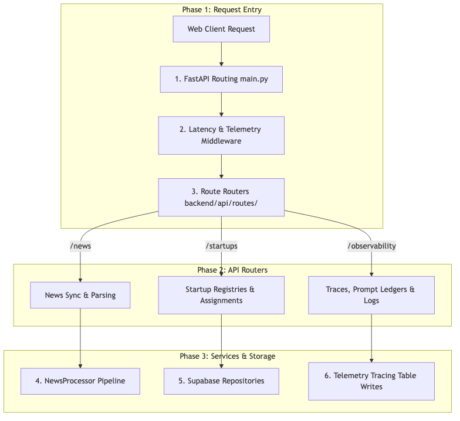


---

## 3. Observability & Database Mutation Telemetry

Every write transaction executed during these lifecycles is intercepted by the backend tracing utility class:
1.  **Intercepted Execute**: When a repository script invokes `.execute()` on the Supabase client builder, the wrapper `wrap_supabase_client` intercepts the method call.
2.  **Generate transaction ID**: Generates a random transaction ID prefix `TXN_[a-z0-9]{16}`.
3.  **Trace context binding**: Fetches the active `trace_id` from the thread's `ContextVar` namespace.
4.  **Telemetry log**: Inserts a log record into the `obs_db_mutations` table capturing:
    *   Target database table name (e.g. `startups`).
    *   Operation action type (`INSERT`, `UPDATE`, `DELETE`, `SELECT`).
    *   Count of database rows affected.
    *   Query transaction execution duration (latency in milliseconds).
5.  **Failure tolerance**: DB logging operations are wrapped in safe try-except blocks. If the observability log fails, the primary database transaction execution continues unaffected.

---

## 4. Code References & Cross-Links
*   For API routes registration, see ****Backend Architecture****.
*   For DB schemas, see ****Database Architecture****.


# SECTION 8 — BACKEND ARCHITECTURE
---

This document details the backend engineering layer of the **Startup Intelligence OS**, explaining the FastAPI routers, service dependencies, scheduling threads, and logging middleware.

---

## 1. Request Dispatch & Routing Layers

Requests flow through a structured controller-service architecture:

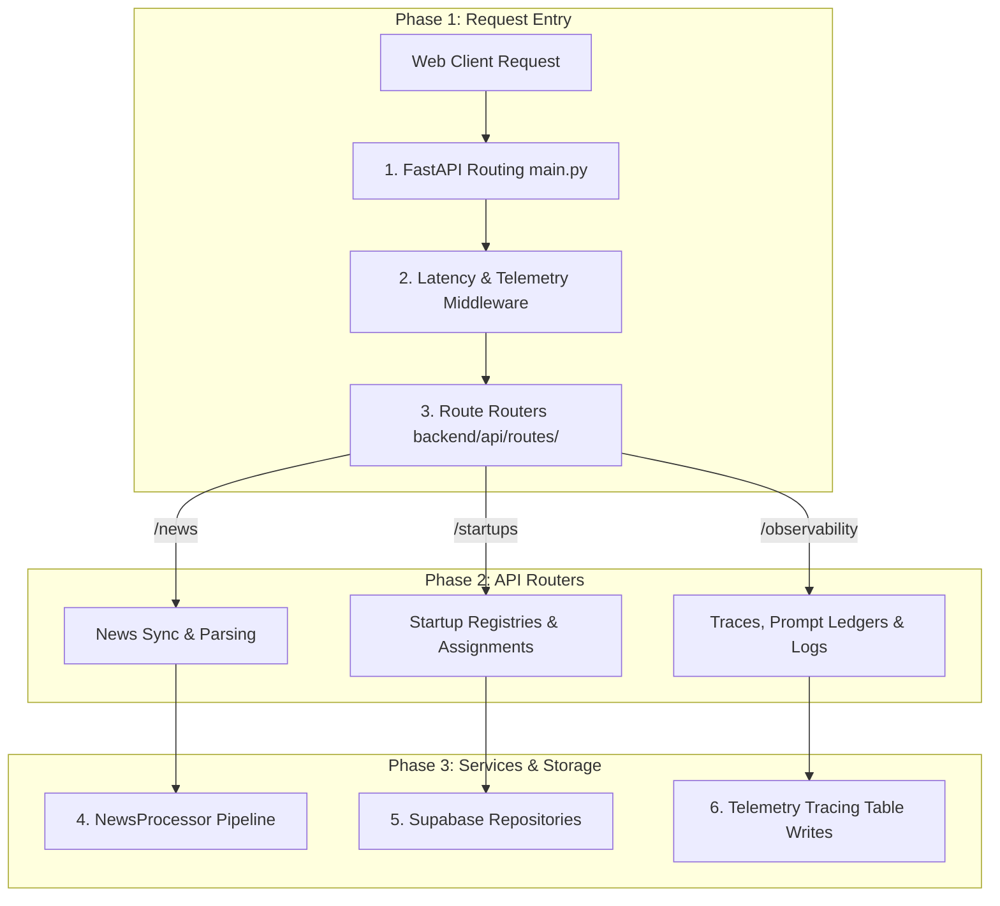
```mermaid
flowchart TB
    subgraph Entry["Phase 1: Request Entry"]
        Client["Web Client Request"] --> API["1. FastAPI Routing main.py"]
        API --> Middleware["2. Latency & Telemetry Middleware"]
        Middleware --> Routers["3. Route Routers backend/api/routes/"]
    end
    
    subgraph RouteHandlers["Phase 2: API Routers"]
        Routers -->|"/news"| News["News Sync & Parsing"]
        Routers -->|"/startups"| Startups["Startup Registries & Assignments"]
        Routers -->|"/observability"| Obs["Traces, Prompt Ledgers & Logs"]
    end
    
    subgraph Services["Phase 3: Services & Storage"]
        News --> Proc["4. NewsProcessor Pipeline"]
        Startups --> Repos["5. Supabase Repositories"]
        Obs --> DB["6. Telemetry Tracing Table Writes"]
    end
```

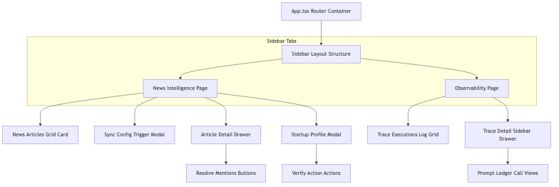


---

## 2. Main Application & Middleware (`backend/main.py`)

*   **FastAPI Initialization**: Configures host, port, title, and swagger schemas routing endpoints.
*   **CORS Policies**: Declares permissive origins config supporting React client connections from local developer hosts (e.g. `http://localhost:5173`).
*   **On-Startup Hook**:
    *   Creates connections to the Supabase client.
    *   Spawns the background asyncio task running `scheduler_loop()` for hourly news ingestion and daily email dispatches.

---

## 3. Route Handlers & Controllers (`backend/api/routes/`)

*   **`news.py`**:
    *   `POST /news/trigger`: Triggers manual RSS scraper syncs.
    *   `GET /news/sync/status`: Polls running sync state and active logs terminal strings.
    *   `POST /news/resolve-startup`: Links news mentions to startup IDs and spawns enrichment threads.
    *   `POST /news/send-digest`: Dispatches manual HTML newsletter digests via Gmail.
*   **`startups.py`**:
    *   `GET /startups`: Fetches the verified/screening startups grid with query filter support (sectors, teams, priority bands).
    *   `GET /startups/{id}`: Returns a detailed startup profile containing `company_intelligence` JSON.
    *   `POST /startups/{id}/verify`: Updates startup vetting states (`Needs Review`, `Vetted`).
*   **`observability.py`**:
    *   `GET /observability/traces`: Fetches execution runs.
    *   `GET /observability/traces/{trace_id}/ledger`: Returns prompt completions and system messages.
    *   `GET /observability/traces/{trace_id}/mutations`: Returns database write transaction statistics.

---

## 4. Services & Utility Repositories (`backend/services/`)

*   **`supabase_service.py`**:
    *   Provides centralized wrappers for CRUD transactions.
    *   Implements `wrap_supabase_client` telemetry to log query execution times.
*   **`scoring_service.py`**:
    *   Computes multi-dimensional evaluations based on strategic fit weights.
    *   Normalizes sub-metrics into numeric score boundaries.
*   **`email_service.py`**:
    *   Loads `email_config.json` parameters.
    *   Uses Jinja2 templates to compile responsive HTML newsletter tables.
    *   Logs digest dispatches in local trace registries.

---

## 5. Core Error Handling & Validations

*   **HTTP Exceptions Handler**: Catches standard network timeouts, RLS credential rejections, and missing resource errors, converting them into structured error payloads:
    ```json
    {
      "detail": "Detailed descriptive error boundary reason."
    }
    ```
*   **Pydantic Payloads Validation**: Enforces strict schemas and data type checks on incoming API bodies (e.g. validating payload structures for `/resolve-startup`).
*   **Graceful Degenerations**: If external API servers (Ollama, OpenRouter, Google search engine queries) timeout, backend loops capture the exceptions, write the failures to trace ledgers, and fallback to pre-existing cached variables.

---

## 6. Code References & Cross-Links
*   For the data models, see ****Database Architecture****.
*   For details on the background tasks scheduler, see ****Configuration Registry****.


# SECTION 9 — FRONTEND ARCHITECTURE
---

This document details the frontend engineering layer of the **Startup Intelligence OS**, explaining the React single-page application structure, state management, and user interaction modals.

---

## 1. UI Views & Component Tree

Below is the layout mapping page views and component child hierarchies:

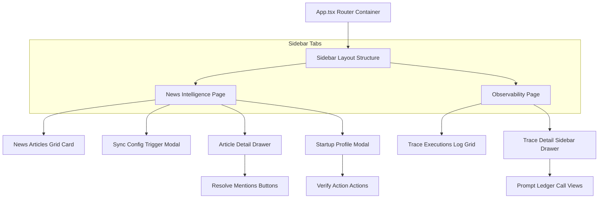
```mermaid
graph TD
    App[App.tsx Router Container] --> Layout[Sidebar Layout Structure]
    
    subgraph Sidebar Tabs
        Layout --> NewsPage[News Intelligence Page]
        Layout --> ObsPage[Observability Page]
    end
    
    NewsPage --> NewsGrid[News Articles Grid Card]
    NewsPage --> SyncModal[Sync Config Trigger Modal]
    NewsPage --> NewsDrawer[Article Detail Drawer]
    NewsPage --> DetailModal[Startup Profile Modal]
    
    NewsDrawer --> StartupResolveBtn[Resolve Mentions Buttons]
    DetailModal --> VerifyBtn[Verify Action Actions]
    
    ObsPage --> TraceGrid[Trace Executions Log Grid]
    ObsPage --> TraceDrawer[Trace Detail Sidebar Drawer]
    TraceDrawer --> LedgerView[Prompt Ledger Call Views]
```

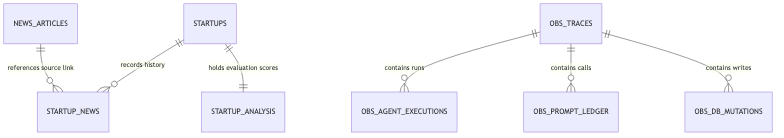


---

## 2. Page View Handlers (`frontend/src/pages/`)

### A. News Dashboard Page (`NewsDashboard.tsx`)
*   **Grid layout**: Renders article cards categorized by priority bands (`High`, `Medium`, `Low`, `Ignore`) and sync source categories.
*   **Feed sync controller**: Renders the configurations trigger modal to select target feeds and limits. Contains the live Terminal Logging box polling sync states.
*   **Startup detail modal**: Displays enriched profiles (`company_intelligence`) and computed strategic priority scores.

### B. Observability Page (`ObservabilityDashboard.tsx`)
*   **Run telemetry log**: Renders a list of execution traces (ingestion runs, manual enrichment operations) detailing duration and execution status.
*   **Trace details drawer**: Displays sub-agent execution runs, database mutation statistics, and full prompt template logs.

---

## 3. UI Components (`frontend/src/components/`)

### A. News Drawer Component (`NewsDrawer.tsx`)
*   **Slide-over drawer**: Opens when an article card is clicked, rendering the full sanitized text and the AI summary list.
*   **Resolve buttons panel**: Renders resolved startup badges.
    *   **Solid badge**: Startup is linked to a database entity. Clicking redirects to the Startup Details modal.
    *   **Dashed badge**: Unresolved startup mention. Clicking opens the resolution popup to choose **"Add Basic Info"** (Screening status) or **"Add & Enrich Profile"** (Enriching status).

### B. Startup Profile Modal (`DetailModal.tsx`)
*   **Detailed tabs layout**: Displays information categorized across tabs:
    *   **Overview**: Founding year, headquarter city, industry tags, and RM team assignment.
    *   **Products & Competitors**: Value propositions and market competitors.
    *   **Funding**: Total raised capital and round stages.
    *   **Strategic Analysis**: BFSI strategic fit score, integration readiness evaluations, and co-creation suggestions.

---

## 4. State Management, Hooks & Local Storage

*   **REST Requests**: Communicates with the FastAPI server using native `fetch` requests.
*   **State updates**: Maintains dashboard updates using standard React states (`useState`, `useEffect`).
*   **Sync Polling Hook**: When a news feed sync is active, triggers a `setInterval` loop polling `/api/news/sync/status` every 2 seconds to stream log output to the Terminal console box.
*   **Dismissible Banners**: Uses `localStorage` to persist banner dismissals. The sync success notification reads the latest completed timestamp, keeping the banner hidden on page reloads unless a new sync completes.

---

## 5. UI Loading & Error States
*   **Spinning loaders**: Renders skeleton card grids while loading list requests.
*   **Error banners**: Displays retry buttons if API endpoints fail or credentials expire.
*   **Real-time sync logs**: Provides visual feedback by streaming logs to the dashboard console while background tasks run.


# SECTION 10 — DATABASE SCHEMA
---

This document explains the PostgreSQL database structure hosted in **Supabase**, including schemas, RLS security configurations, and trace log tables.

---

## 1. Entity-Relationship (ER) Model

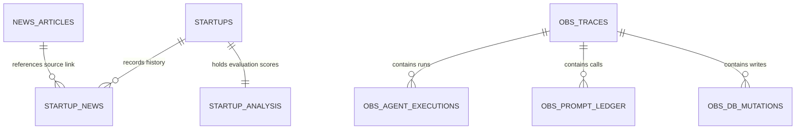
```mermaid
erDiagram
    STARTUPS ||--o{ STARTUP_NEWS : "records history"
    STARTUPS ||--|| STARTUP_ANALYSIS : "holds evaluation scores"
    NEWS_ARTICLES ||--o{ STARTUP_NEWS : "references source link"
    
    OBS_TRACES ||--o{ OBS_AGENT_EXECUTIONS : "contains runs"
    OBS_TRACES ||--o{ OBS_PROMPT_LEDGER : "contains calls"
    OBS_TRACES ||--o{ OBS_DB_MUTATIONS : "contains writes"
```

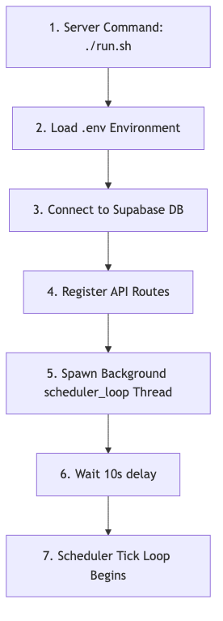


---

## 2. Table Specifications

### A. Table: `startups`
*   **Purpose**: Stores the canonical registry profile for discovered and enriched startup entities.
*   **RLS Security Policy**: Enabled. Public users are granted permissive READ access; WRITE operations are restricted to API servers.

| Column | Data Type | Key | Default | Description / JSON Schema |
|---|---|---|---|---|
| `id` | `uuid` | PK | `gen_random_uuid()` | Unique entity key identifier. |
| `startup_name` | `varchar` | Unique | | Normalized canonical startup name. |
| `website` | `varchar` | | | Validated company website homepage URL. |
| `description` | `text` | | | High-level synthesis summary of business. |
| `industry` | `varchar` | | | Core industry sector grouping (e.g. `FinTech`). |
| `status` | `varchar` | | `'Screening'` | Workflow stage tag (`Screening`, `Enriching`, `Needs Review`, `Vetted`). |
| `company_intelligence` | `jsonb` | | `'{}'` | Rich modular intelligence payload (see below). |
| `created_at` | `timestamptz` | | `now()` | Timestamp record was created. |
| `updated_at` | `timestamptz` | | `now()` | Timestamp record was updated. |

#### JSONB Payload Schema: `company_intelligence`
This column stores structured intelligence returned by the Parallel Enricher pipeline:
```json
{
  "basic_information": {
    "canonical_name": "Zepto",
    "founded_year": 2021,
    "hq_city": "Mumbai",
    "hq_country": "India",
    "legal_name": "KiranaKart Technologies Private Limited"
  },
  "founders_details": [
    {
      "name": "Aadit Palicha",
      "role": "Co-Founder & CEO",
      "linkedin_url": "https://www.linkedin.com/in/aadit-palicha"
    }
  ],
  "products_services": [
    {
      "name": "10-minute grocery delivery",
      "description": "Hyperlocal dark-store express delivery network."
    }
  ],
  "funding_details": {
    "latest_stage": "Series G",
    "total_capital_raised_usd": 1500000000,
    "funding_rounds": []
  },
  "competitors_section": {
    "competitors": [
      {
        "company_name": "Blinkit",
        "website": "https://www.blinkit.com"
      }
    ]
  }
}
```

---

### B. Table: `news_articles`
*   **Purpose**: Stores parsed, deduplicated news articles ingested from RSS or search feeds.

| Column | Data Type | Key | Default | Description |
|---|---|---|---|---|
| `id` | `bigint` | PK | Identity | Primary autoincremented story key. |
| `headline` | `text` | Unique | | The canonical title of the news story. |
| `summary` | `text` | | | AI-generated summary. |
| `source` | `varchar` | | | Originating publisher feed (e.g., `Inc42`). |
| `source_url` | `text` | Unique | | Target browser hyperlink URL. |
| `published_at` | `timestamptz`| | | Article publication date. |
| `startups_mentioned` | `jsonb` | | `'[]'` | List of startups mentioned: `[{"name": "Zepto", "id": "uuid-or-null"}]`. |

---

### C. Table: `startup_analysis`
*   **Purpose**: Stores computed strategic relevance scores, evaluation metrics, and team assignments.

| Column | Data Type | Key | Default | Description |
|---|---|---|---|---|
| `id` | `uuid` | PK | `gen_random_uuid()` | Unique analysis identifier. |
| `startup_id` | `uuid` | FK | | Reference back to `startups(id)`. |
| `priority_score` | `integer` | | | Final calculated score ($0$ to $100$). |
| `relevance_score` | `integer` | | | Score assessing BFSI relevance. |
| `strategic_fit` | `integer` | | | Fit alignment score. |
| `deployability` | `integer` | | | Integration deployment score. |
| `evaluation_summary` | `text` | | | Strategic fit analysis and opportunities. |
| `assigned_team` | `varchar` | | | Routed business team. |
| `relationship_manager` | `varchar`| | | Assigned Relationship Manager (FPR). |

---

### D. Table: `startup_news`
*   **Purpose**: Links startups with their mention history inside ingested news articles.

| Column | Data Type | Key | Default | Description |
|---|---|---|---|---|
| `id` | `bigint` | PK | Identity | Link key. |
| `startup_id` | `uuid` | FK | | Reference to `startups(id)`. |
| `news_id` | `bigint` | FK | | Reference to `news_articles(id)`. |
| `linked_at` | `timestamptz`| | `now()` | Timestamp connection was registered. |

---

## 3. Telemetry & Observability Tables

### A. Table: `obs_traces`
*   **Purpose**: Tracks root execution traces initiated by background cron loops or manual UI click runs.

| Column | Data Type | Key | Default | Description |
|---|---|---|---|---|
| `trace_id` | `varchar` | PK | | Generated run trace identifier string (`TRACE_...`). |
| `name` | `varchar` | | | Descriptor name (e.g. `News Ingestion Run`). |
| `status` | `varchar` | | | Run execution status (`RUNNING`, `SUCCESS`, `FAILED`). |
| `duration_ms` | `real` | | | Total processing latency. |
| `metadata` | `jsonb` | | `'{}'` | Source parameters and target inputs. |
| `created_at` | `timestamptz`| | `now()` | Trace start timestamp. |

---

### B. Table: `obs_agent_executions`
*   **Purpose**: Tracks sub-agent task runs executed under a root trace.

| Column | Data Type | Key | Default | Description |
|---|---|---|---|---|
| `id` | `bigint` | PK | Identity | Execution key. |
| `trace_id` | `varchar` | FK | | Reference to `obs_traces(trace_id)`. |
| `agent_name` | `varchar` | | | Target execution component name (e.g. `IdentityEnricher`). |
| `input_payload` | `jsonb` | | | Agent inputs. |
| `output_payload`| `jsonb` | | | Agent outputs. |
| `duration_ms` | `real` | | | Step latency in milliseconds. |

---

### C. Table: `obs_prompt_ledger`
*   **Purpose**: Logs all prompt tokens, prompt text templates, and LLM completions.

| Column | Data Type | Key | Default | Description |
|---|---|---|---|---|
| `id` | `bigint` | PK | Identity | Prompt call record key. |
| `trace_id` | `varchar` | FK | | Reference to `obs_traces(trace_id)`. |
| `prompt_name` | `varchar` | | | Prompt template file name (e.g., `name_discovery_prompt`). |
| `model_name` | `varchar` | | | Used engine model ID (e.g. `qwen2.5:3b`). |
| `system_prompt` | `text` | | | Used system instructions template. |
| `user_prompt` | `text` | | | Injected prompt instance values. |
| `completion` | `text` | | | Raw LLM response string returned. |
| `duration_ms` | `real` | | | LLM latency. |

---

### D. Table: `obs_db_mutations`
*   **Purpose**: Tracks write metrics, latency, and rows affected for database mutations.

| Column | Data Type | Key | Default | Description |
|---|---|---|---|---|
| `id` | `bigint` | PK | Identity | Mutation log key. |
| `trace_id` | `varchar` | FK | | Reference to `obs_traces(trace_id)`. |
| `table_name` | `varchar` | | | Modified table name. |
| `action` | `varchar` | | | Mutation type (`INSERT`, `UPDATE`, `DELETE`). |
| `rows_affected` | `integer` | | | Modified record count. |
| `duration_ms` | `real` | | | Query latency. |

---

## 4. Code References & Cross-Links
*   For instructions on migrations setup, see ****Local Setup Guide****.
*   For configuration mappings, see ****Configuration Registry****.


# SECTION 11 — CONFIG REGISTRY
---

This registry lists every configurable setting, thresholds configuration, and file location inside the **Startup Intelligence OS**. Decoupled parameter boundaries allow you to customize pipeline behaviour without editing source code.

---

## 1. Global Configurations Matrix

| Setting Name | Default Value | File Location | Loaded By | Purpose | Hot Reload? | Restart Req? | User Edit? |
|---|---|---|---|---|---|---|---|
| `SUPABASE_URL` | | `.env` | `supabase_service.py` | Target Supabase host endpoint link. | No | Yes | No |
| `SUPABASE_KEY` | | `.env` | `supabase_service.py` | Authenticating API requests to Supabase. | No | Yes | No |
| `OLLAMA_HOST` | `http://localhost:11434` | `.env` | `providers/ollama.py` | Local Ollama engine host. | No | Yes | No |
| `OPENROUTER_API_KEY`| | `.env` | `providers/openrouter.py`| Token keys for cloud routing. | No | Yes | No |
| `use_v2_pipeline` | `true` | `pipeline_config.json` | `agent_orchestrator.py` | Toggle parallel modular enrichment. | Yes | No | No |
| `parallel_workers` | `5` | `pipeline_config.json` | `agent_orchestrator.py` | Thread count for Parallel Enrichers. | Yes | No | No |
| `polling_enabled` | `false` | `scheduler.json` | `scheduler.py` | Toggle background feed scraper loop. | Yes | No | Yes |
| `default_poll_interval_minutes` | `60` | `scheduler.json` | `scheduler.py` | Delay period between feed checks. | Yes | No | No |
| `digest_scheduler_enabled` | `true` | `scheduler.json` | `scheduler.py` | Toggle daily digest emails dispatch. | Yes | No | No |
| `email.frequency` | `"twice_daily"` | `email_config.json` | `email_service.py` | Scheduling frequency of digests. | Yes | No | No |
| `email.times` | `["09:00", "18:00"]` | `email_config.json` | `email_service.py` | Specific daily trigger dispatch times. | Yes | No | No |
| `email.recipient_list` | | `email_config.json` | `email_service.py` | Recipient target emails. | Yes | No | Yes |
| `jaccard_similarity_threshold` | `0.60` | `deduplication_rules.json`| `deduplicator.py` | Auto-merge token overlap match rate. | Yes | No | No |
| `low_trust_threshold` | `50` | `crawler_rules.json` | `agent_orchestrator.py` | Confidence below which Playwright is launched. | Yes | No | No |
| `playwright_min_text_len` | `200` | `crawler_rules.json` | `agent_orchestrator.py` | Min text length triggering Playwright fallback. | Yes | No | No |
| `playwright_timeout_ms` | `5000` | `crawler_rules.json` | `agent_orchestrator.py` | Max wait time for page crawl tasks. | Yes | No | No |
| `weights.relevance` | `0.35` | `scoring_rules.json` | `ScoringService` | Relevance weight in scoring rubric. | Yes | No | No |

---

## 2. Injected System Prompt Templates

Prompt instructions are stored as text files inside `backend/prompts/` and loaded dynamically on agent execution:

*   **`name_discovery_prompt.txt`**: Maps rules for identifying startup names in scraped text.
*   **`ingestion_summary_prompt.txt`**: Governs synthesis and output format of article summaries.
*   **`strategic_analysis_prompt.txt`**: Guides evaluations of strategic fit and partner opportunities.
*   **`competitor_extraction_prompt.txt`**: Directs competitors identification and mapping.

> [!TIP]
> **Modifying Prompts**: You can adjust rules, examples, and output constraints directly in these prompt files. Modified instructions are loaded on the next agent run without requiring a server restart.

---

## 3. Feed Sources Configuration (`backend/config/sources.json`)

Feed sources crawled by the News Aggregator are defined in `sources.json`:

```json
[
  {
    "name": "Inc42",
    "url": "https://inc42.com/feed/",
    "type": "rss",
    "enabled": true
  },
  {
    "name": "Entrackr",
    "url": "https://entrackr.com/feed/",
    "type": "rss",
    "enabled": true
  }
]
```

Adding a new RSS feed target or disabling an existing crawler can be done directly by modifying this file.

---

## 4. Code References & Cross-Links
*   For details on the news sync loop, see ****Trigger Event Catalog****.
*   For the scoring weight definitions, see ****Processing Pipeline Deep-Dive****.


# SECTION 12 — TRIGGER CATALOGUE
---

This document catalogs every execution trigger, background event, and state change within the **Startup Intelligence OS**.

---

## 1. Events Matrix

| Trigger Event | Originating Actor | Initiated Component | Input Parameters | Output / Side-Effect | Failure Behavior |
|---|---|---|---|---|---|
| **App Startup** | System Process | `FastAPI.on_startup` | CLI starting arguments | Launches background scheduler loop thread. | Logs exception and exits process. |
| **Sync News Feed** | User click / API Post | `NewsProcessor` | Target sources, crawl limits | Deduplicates and updates the `news_articles` table. | Sets sync state to Idle, logs error in console. |
| **Scheduled Sync** | Scheduler Tick | `NewsProcessor` | `sources.json` configuration | Periodic background scraper run (3 articles limit per source). | Captures exceptions silently, sleeps for next tick. |
| **Dispatch Digest** | Time Match | `dispatch_gmail_digest`| `email_config.json` | Generates HTML digest and emails to recipients. | Retries delivery after 10 min, logs failure to trace. |
| **Add Basic Info** | User click / API Post | `resolve_startup_from_news`| `startup_name`, `article_id` | Inserts record with status "Screening", links mentions. | Returns HTTP 500 error code. |
| **Add & Enrich** | User click / API Post | `_enrich_single_startup_async`| `startup_name`, `article_id`, `enrich=true` | Sets status to "Enriching", updates database. | Resets status to "Needs Review", logs error. |
| **Enrich Workspace**| User click / API Post | `_enrich_single_startup_async`| `startup_id` | Refreshes and updates company profiles. | Updates status to "Needs Review", logs error. |

---

## 2. Event Workflows

### 1. Application Startup Sequence
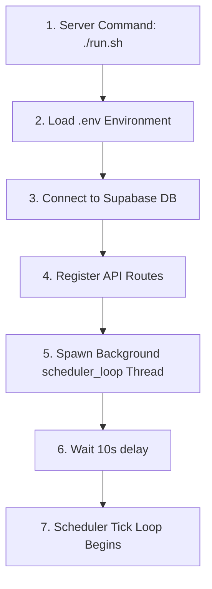
```mermaid
graph TD
    Start[1. Server Command: ./run.sh] --> Config[2. Load .env Environment]
    Config --> DB[3. Connect to Supabase DB]
    DB --> Route[4. Register API Routes]
    Route --> Loop[5. Spawn Background scheduler_loop Thread]
    Loop --> Wait[6. Wait 10s delay]
    Wait --> Tick[7. Scheduler Tick Loop Begins]
```


### 2. Manual News Sync Execution Trace
1.  **Request Dispatch**: Browser posts request payload to `/api/news/trigger`.
2.  **Acquire Lock**: Acquires `news_status_lock` thread lock to prevent concurrent sync executions.
3.  **Spawn Task**: Launches async ingestion task.
4.  **Logging**: Appends real-time logging strings to `NEWS_SYNC_STATUS["logs"]`.
5.  **Completion**: Releases `news_status_lock` on completion, setting `active` state flag back to `False`.

### 3. Background Enrichment Worker Trace
1.  **Trace Generation**: FastAPI launches worker thread, generating a unique `TRACE_ID`.
2.  **State Flags**: Writes startup status as `"Enriching"` to the database.
3.  **Agent Resolution**: Web crawlers retrieve website data, validating the candidate target.
4.  **Completion**: Updates status to `"Screening"` (or `"Needs Review"`) and logs execution telemetry.

---

## 3. Code References & Cross-Links
*   For the routing parameters catalog, see ****Configuration Registry****.
*   For table triggers details, see ****Database Architecture****.


# SECTION 13 — LOCAL DEPLOYMENT
---

This guide provides step-by-step instructions to clone, configure, build, and run the **Startup Intelligence OS** locally.

---

## 1. System Requirements
*   **Operating System**: macOS, Linux, or Windows (WSL2 recommended).
*   **Python**: Version 3.10 or 3.11.
*   **NodeJS**: Version 18 or 20 (with `npm`).
*   **Ollama**: For running local LLM instances.
*   **Supabase Database**: A Supabase account and database instance.

---

## 2. Step-by-Step Setup

### Step 1: Clone the Repository
```bash
git clone https://github.com/anuragbhayalprojects/startup-intelligence.git
cd startup-intelligence
```

### Step 2: Configure Environment Variables
Create a `.env` file in the project root:
```env
SUPABASE_URL=https://your-project-id.supabase.co
SUPABASE_KEY=your-supabase-service-role-key

OLLAMA_HOST=http://localhost:11434

OPENROUTER_API_KEY=your-openrouter-key
```

### Step 3: Run Database Migrations
Go to your **Supabase dashboard SQL Editor** and run the migration scripts located in `database/migrations/` in order:
1.  Run `001_initial_tables.sql` to initialize database structures.
2.  Run `009_create_news_articles.sql` to create news feeds tables and enable public RLS policies.

---

### Step 4: Python Backend Setup
Create a virtual environment, activate it, and install backend dependencies:
```bash
python3 -m venv venv
source venv/bin/activate
pip install -r requirements.txt
```

### Step 5: Install Headless Playwright Browsers
Install the headless Chromium browser package for web scraping fallback features:
```bash
playwright install chromium
```

---

### Step 6: Install Local Model via Ollama
Ensure Ollama is running, then pull the target model model:
```bash
ollama run qwen2.5:3b
```

### Step 7: Node Frontend Setup
Install frontend dependencies:
```bash
cd frontend
npm install
cd ..
```

---

## 3. Launching the Services

You can start both backend and frontend servers using the start script in the root directory:
```bash
chmod +x run.sh
./run.sh
```

Alternatively, you can launch them in separate terminal sessions:

### Start Backend FastAPI
```bash
source venv/bin/activate
uvicorn backend.main:app --host 127.0.0.1 --port 8000 --reload
```

### Start Frontend React Client
```bash
cd frontend
npm run dev
```
Open `http://localhost:5173` in your browser.

---

## 4. Verification & Testing

### Verification Checklist
1.  **Check API Health**: Open `http://localhost:8000/docs` in your browser to verify the Swagger API interface.
2.  **Verify Ollama Connectivity**: Run the command:
    ```bash
    curl http://localhost:11434/api/tags
    ```
    Confirm that `qwen2.5:3b` is listed in the tags payload.
3.  **Run Pipeline Tests**: Check core workflows using the test suite:
    ```bash
    pytest backend/tests/
    ```

---

## 5. Troubleshooting & FAQ

### 1. `EAGAIN` / Playwright Sandbox Errors (macOS)
*   **Symptom**: Scraper crashes during Playwright headless execution loop.
*   **Fix**: Check running processes (`ps aux | grep chrome`). Kill orphaned chrome processes or restart your machine to clear resource allocations.

### 2. Supabase HTTP/2 Protocol Issues
*   **Symptom**: Backend requests to Supabase fail or hang.
*   **Fix**: The client uses the Standard httpx connector. Ensure your environment variables do not override proxy parameters (`http_proxy`, `https_proxy`) which can disrupt connection loops.


# SECTION 14 — FUTURE EXTENSION
---

This guide explains how to extend **Startup Intelligence OS**, providing step-by-step instructions for adding new AI agents, custom scrapers, database tables, and scoring parameters.

---

## 1. Adding a New RSS Scraper Target

To add a new RSS venture feed source:

1.  **Configure source parameters**: Open `backend/config/sources.json` and append a new source configuration object:
    ```json
    {
      "name": "TechSprout",
      "url": "https://techsprout.in/feed/",
      "type": "rss",
      "enabled": true
    }
    ```
2.  **Define parsing rules**:
    *   If the RSS feed uses non-standard XML tags, add custom parsing rules inside `backend/pipeline/news_aggregator.py`.
    *   Add custom regular expressions in `content_filters.json` to filter out newsletter sign-up links, disclaimers, or ads.

---

## 2. Adding a New Modular AI Enricher Section (v2 Parallel Pipeline)

To add a new enricher section (e.g., *Patent & IP Registry Enricher*):

1.  **Create Enricher Class**: Create a new class file under `backend/enrichment/` inheriting from `BaseEnricher`:
    ```python
    from backend.enrichment.base_enricher import BaseEnricher

    class PatentEnricher(BaseEnricher):
        def enrich_v2(self, startup_name, crawled_pages, all_snippets, orchestrator, **kwargs) -> dict:
            # Implement extraction logic using search snippets or website crawls
            # Call prompt gateways
            return {"patents_count": 0, "registered_trademarks": []}
    ```
2.  **Register class in Orchestrator**:
    *   Import and instantiate the class inside `_run_v2_enrichment` in `backend/workflows/agent_orchestrator.py`.
    *   Add the task to the parallel threads dictionary (`parallel_tasks`) to run it concurrently inside the ThreadPoolExecutor.
    *   Merge results into the `company_intelligence` state object.

---

## 3. Adding a New Priority Scoring Metric

To modify or add a new evaluation metric:

1.  **Define parameter variables**: Open `scoring_rules.json` and declare the new parameter's target weight (ensuring the sum of weights equals $1.0$):
    ```json
    {
      "weights": {
        "relevance": 0.30,
        "strategic_fit": 0.20,
        "deployability": 0.20,
        "signal_score": 0.15,
        "new_metric_weight": 0.15
      }
    }
    ```
2.  **Implement evaluation logic**:
    *   Update `ScoringService` inside `backend/services/scoring_service.py` to parse the new key from `company_intelligence`.
    *   Compute the metric's subscore ($0$ to $100$) and apply the weight vector in the final calculation.

---

## 4. Registering a New API Endpoint

To add a new route:

1.  **Define router path**: Open the appropriate router script in `backend/api/routes/` or create a new router file. Register the path:
    ```python
    @router.get("/startups/{startup_id}/patents")
    async def get_startup_patents(startup_id: str):
        # Implement DB lookup query logic
        return {"id": startup_id, "patents": []}
    ```
2.  **Include Router in Main**: If you created a new router file, import and register it inside `backend/main.py`:
    ```python
    from backend.api.routes import patents
    app.include_router(patents.router, prefix="/api")
    ```

---

## 5. Adding a New Database Table

To add a new table (e.g. `startup_patents`):

1.  **Write SQL migration script**: Create a SQL script inside `database/migrations/`:
    ```sql
    CREATE TABLE startup_patents (
        id uuid PRIMARY KEY DEFAULT gen_random_uuid(),
        startup_id uuid REFERENCES startups(id) ON DELETE CASCADE,
        patent_number varchar UNIQUE NOT NULL,
        title text,
        granted_at date,
        created_at timestamptz DEFAULT now()
    );
    -- Enable Row Level Security (RLS)
    ALTER TABLE startup_patents ENABLE ROW LEVEL SECURITY;
    CREATE POLICY "Allow public read access" ON startup_patents FOR SELECT USING (true);
    ```
2.  **Run SQL query**: Apply the SQL script in your **Supabase dashboard SQL Editor**.
3.  **Update Python models**: Declare the new model and properties inside `backend/models/`.


# SECTION 15 — TOOLS AND UTILITIES
---

This document lists all the languages, frameworks, developer tools, libraries, and utilities used to build, test, and run the **Startup Intelligence OS**.

---

## 1. Core Development Platforms & Runtimes

*   **Python (v3.10 / v3.11)**: Core backend programming language. Provides virtual environment boundary execution hooks (`venv`).
*   **Node.js (v18 / v20)**: Frontend JavaScript compilation runtime engine and package ecosystem manager (`npm`).

---

## 2. Backend & Scraping Stack

*   **FastAPI**: Modern, high-performance web framework for Python API routing. Implements path routing, validation error handling, and background thread mappings.
*   **Uvicorn**: Lightning-fast ASGI web server implementation used to run FastAPI applications locally and in production.
*   **BeautifulSoup4 / lxml**: Fast HTML parsing libraries used inside news scrapers to sanitize body paragraphs.
*   **Playwright**: Headless browser automation library used to execute JavaScript rendering on websites and bypass anti-scraping paywalls.
*   **Feedparser**: Parsing library used to fetch and standardize unstructured RSS/XML venture news feeds.

---

## 3. AI & Search Integration

*   **Ollama Server**: Local AI inference engine used to serve open-source language models.
    *   **Default Model**: `qwen2.5:3b` (fast, lightweight reasoning).
*   **OpenRouter Client API**: Cloud gateway interface used for failover models routing (e.g. Gemini, Mistral) when Ollama latency limits are exceeded.
*   **Jaccard Similarity Algorithm**: Mathematical metric used to calculate syntactic overlap between article headlines.
*   **RAG Local Vector Cache**: Local filesystem JSON cache (`rag_embeddings.json`) storing calculated text chunk vector representations to reduce embedding calls.

---

## 4. Frontend & Layout Engine

*   **Vite**: Frontend build tool and dev server providing hot module replacement (HMR).
*   **React (v18)**: Component-based UI rendering layer.
*   **TypeScript**: Static typechecker for frontend logic components.
*   **Tailwind CSS**: Utility-first styling framework used to build premium SaaS dashboards.
*   **Lucide React**: Clean vector icon suite for sidebar panels, badges, and triggers.
*   **Recharts**: Interactive data charting library used to render priority score distributions.

---

## 5. Storage, Database, & Telemetry

*   **Supabase Client SDK**: Javascript & Python APIs connecting to the remote database cluster.
*   **PostgreSQL**: Relational database engine containing RLS (Row Level Security) schemas.
*   **Database Migrations Engine**: Sequential SQL migration scripts executed inside the Supabase SQL Editor.
*   **Tracing Middleware**: Intercepts backend CRUD method requests to monitor latencies and log telemetry trace schemas.

---

## 6. Development, Linting, & Build Utilities

*   **git**: Version control management tool.
*   **pytest**: Unit-testing framework for routing scripts, scraping filters, and Jaccard calculations.
*   **compileall**: Python standard library utility used to verify clean compilation of all backend modules.
*   **Graphify**: Knowledge graph generation tool used to map codebase dependencies, calculate coupling paths, and fetch structured code contexts.
