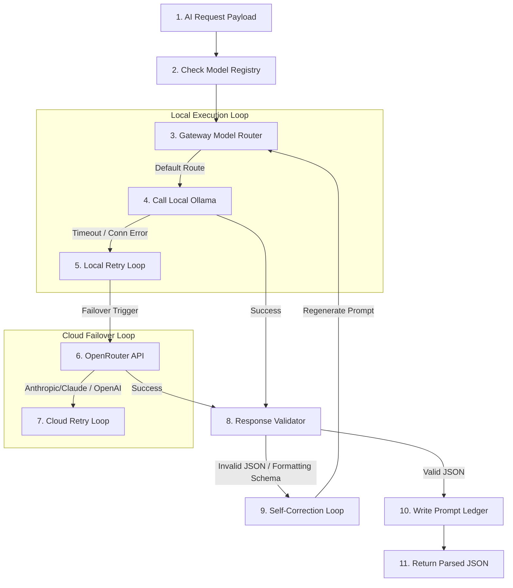

# AI Layer & Prompt Engineering Architecture

This document explains the AI Layer of the **Startup Intelligence OS**, detailing the AI Gateway client design, local-first routing rules, prompt templates, and the retrieval-first RAG embedding cache mechanism.

---

## 1. AI Execution Flow

Below is the execution flow for any AI reasoning call:



---

## 2. Gateway Client & Failover Routing (`backend/ai/gateway/ai_gateway.py`)

The `AiGateway` class acts as the centralized manager for all LLM transactions:

*   **Local-First Default**: Incoming tasks default to the local Ollama provider, running the `qwen2.5:3b` model.
*   **Failover Policies**: If the local Ollama server fails to respond (connection timeouts, process crash, missing local model), the gateway automatically captures the error, instantiates the `OpenRouter` provider client, and forwards the payload to a configured cloud model (e.g., `mistralai/mistral-7b-instruct` or `google/gemini-2.5-flash`).
*   **Token Optimizer**: The gateway includes context-pruning algorithms that scan the prompt and truncate redundant spacing and long paragraph structures if they approach the input token cap.

---

## 3. Prompts & LLM Interactions

The platform isolates system instructions into external files under `backend/prompts/` to separate engineering rules from database logic.

### Ingest-Time: Name Discovery & Ingestion Summary
*   **Prompt File**: [name_discovery_prompt.txt](file:///Users/anurag/Projects/startup-intelligence/backend/prompts/name_discovery_prompt.txt)
*   **Purpose**: Extracts startup name mentions and compile a 150-word summary from raw article paragraphs.
*   **Context Structure**: Injects the headline and first 3 clean paragraphs of the scraped article.
*   **Output JSON Schema**:
    ```json
    {
      "startups": ["string"],
      "ai_summary": "string"
    }
    ```
*   **Sanitization Filters**:
    *   Replaces realistic mock startup placeholders in templates with abstract tag indicators (`<STARTUP_NAME>`) to prevent hallucinated leakages.
    *   Cleans raw LLM text using regex filters to strip markdown markdown dashes (`- `) or asterisks (`**`) from summaries.

### Resolution-Time: Entity Vetting & Website Verification
*   **Agent File**: `backend/agents/identity_resolution_agent.py`
*   **Purpose**: Vets if a discovered target website matches the context of the news story headline.
*   **Output JSON Schema**:
    ```json
    {
      "is_match": "boolean",
      "confidence": "integer",
      "verification_notes": "string"
    }
    ```

---

## 4. Retrieval-First RAG Cache & Embeddings

To prevent repeating heavy search index scraping and expensive vector embeddings calls, the platform uses a local RAG cache layer:

*   **Embedding File**: [rag_embeddings.json](file:///Users/anurag/Projects/startup-intelligence/backend/knowledge/vector_index/rag_embeddings.json)
*   **Storage Structure**: Maps normalized query strings to cached vector matrices and text chunks:
    ```json
    {
      "query_hash_string": {
        "text_content": "Extracted website metadata chunk...",
        "embeddings": [0.012, -0.045, 0.981, "..."]
      }
    }
    ```
*   **Pruning & Reuse**: When a crawler requests search context for a startup, `backend/rag/retriever.py` queries `rag_embeddings.json` first. If a match exists (cache hit), the system pulls the cached text chunks immediately. If missing (cache miss), it generates new embeddings and stores them in the JSON registry.

---

## 5. Graphify Context Optimization

Startup Intelligence OS integrates **Graphify** to minimize input tokens. Rather than reading raw code files or documentation folders in bulk, the AI agent uses Graphify's query tool to isolate targeted context blocks:

*   **Targeted Context Extraction**: Runs `graphify query` commands with a strict `--budget` token ceiling:
    ```bash
    graphify query "Identify Jaccard deduplication logic" --budget 1000
    ```
*   **Impact Tracing**: Uses `graphify path` and `graphify affected` to check file dependencies, showing the exact scope of code impacts before making modifications.

---

## 6. Code References & Cross-Links
*   For details on the Jaccard check logic, see **[Processing Pipeline Deep-Dive](file:///Users/anurag/Projects/startup-intelligence/docs/system-architecture/processing-pipeline.md)**.
*   For the telemetry log schema, see **[Database Architecture](file:///Users/anurag/Projects/startup-intelligence/docs/system-architecture/database-schema.md)**.
