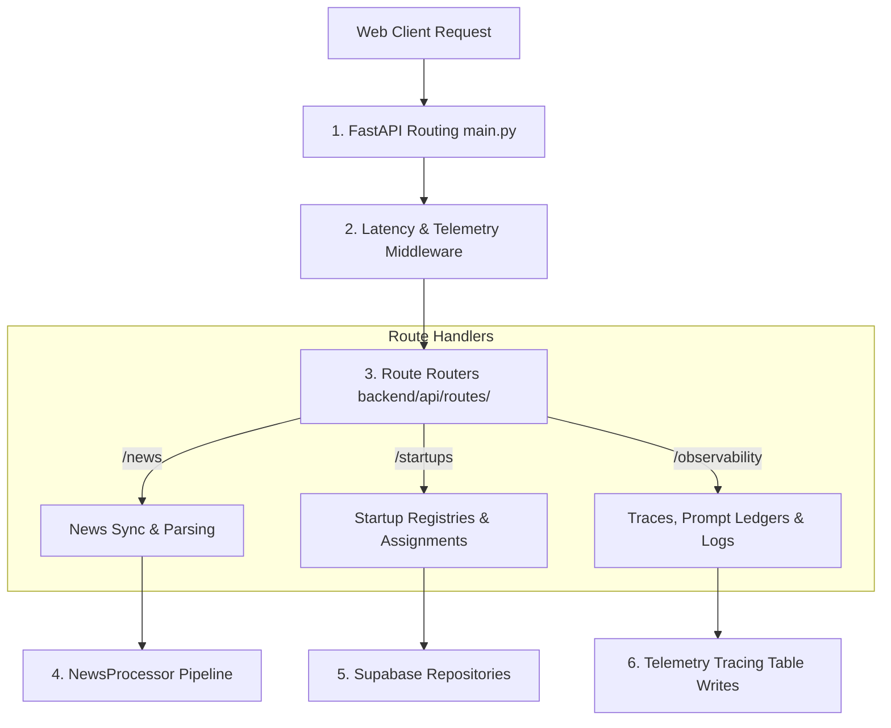

# Backend API & Services Architecture

This document details the backend engineering layer of the **Startup Intelligence OS**, explaining the FastAPI routers, service dependencies, scheduling threads, and logging middleware.

---

## 1. Request Dispatch & Routing Layers

Requests flow through a structured controller-service architecture:



---

## 2. Main Application & Middleware (`backend/main.py`)

*   **FastAPI Initialization**: Configures host, port, title, and swagger schemas routing endpoints.
*   **CORS Policies**: Declares permissive origins config supporting React client connections from local developer hosts (e.g. `http://localhost:5173`).
*   **On-Startup Hook**:
    *   Creates connections to the Supabase client.
    *   Spawns the background asyncio task running `scheduler_loop()` for hourly news ingestion and daily email dispatches.

---

## 3. Route Handlers & Controllers (`backend/api/routes/`)

*   **`news.py`**:
    *   `POST /news/trigger`: Triggers manual RSS scraper syncs.
    *   `GET /news/sync/status`: Polls running sync state and active logs terminal strings.
    *   `POST /news/resolve-startup`: Links news mentions to startup IDs and spawns enrichment threads.
    *   `POST /news/send-digest`: Dispatches manual HTML newsletter digests via Gmail.
*   **`startups.py`**:
    *   `GET /startups`: Fetches the verified/screening startups grid with query filter support (sectors, teams, priority bands).
    *   `GET /startups/{id}`: Returns a detailed startup profile containing `company_intelligence` JSON.
    *   `POST /startups/{id}/verify`: Updates startup vetting states (`Needs Review`, `Vetted`).
*   **`observability.py`**:
    *   `GET /observability/traces`: Fetches execution runs.
    *   `GET /observability/traces/{trace_id}/ledger`: Returns prompt completions and system messages.
    *   `GET /observability/traces/{trace_id}/mutations`: Returns database write transaction statistics.

---

## 4. Services & Utility Repositories (`backend/services/`)

*   **`supabase_service.py`**:
    *   Provides centralized wrappers for CRUD transactions.
    *   Implements `wrap_supabase_client` telemetry to log query execution times.
*   **`scoring_service.py`**:
    *   Computes multi-dimensional evaluations based on strategic fit weights.
    *   Normalizes sub-metrics into numeric score boundaries.
*   **`email_service.py`**:
    *   Loads `email_config.json` parameters.
    *   Uses Jinja2 templates to compile responsive HTML newsletter tables.
    *   Logs digest dispatches in local trace registries.

---

## 5. Core Error Handling & Validations

*   **HTTP Exceptions Handler**: Catches standard network timeouts, RLS credential rejections, and missing resource errors, converting them into structured error payloads:
    ```json
    {
      "detail": "Detailed descriptive error boundary reason."
    }
    ```
*   **Pydantic Payloads Validation**: Enforces strict schemas and data type checks on incoming API bodies (e.g. validating payload structures for `/resolve-startup`).
*   **Graceful Degenerations**: If external API servers (Ollama, OpenRouter, Google search engine queries) timeout, backend loops capture the exceptions, write the failures to trace ledgers, and fallback to pre-existing cached variables.

---

## 6. Code References & Cross-Links
*   For the data models, see **[Database Architecture](file:///Users/anurag/Projects/startup-intelligence/docs/system-architecture/database-schema.md)**.
*   For details on the background tasks scheduler, see **[Configuration Registry](file:///Users/anurag/Projects/startup-intelligence/docs/system-architecture/config-registry.md)**.
