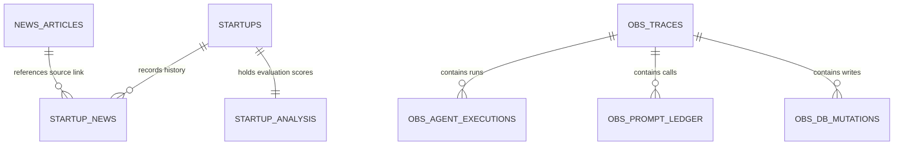

# Database Architecture & Table Schemas

This document explains the PostgreSQL database structure hosted in **Supabase**, including schemas, RLS security configurations, and trace log tables.

---

## 1. Entity-Relationship (ER) Model




---

## 2. Table Specifications

### A. Table: `startups`
*   **Purpose**: Stores the canonical registry profile for discovered and enriched startup entities.
*   **RLS Security Policy**: Enabled. Public users are granted permissive READ access; WRITE operations are restricted to API servers.

| Column | Data Type | Key | Default | Description / JSON Schema |
|---|---|---|---|---|
| `id` | `uuid` | PK | `gen_random_uuid()` | Unique entity key identifier. |
| `startup_name` | `varchar` | Unique | | Normalized canonical startup name. |
| `website` | `varchar` | | | Validated company website homepage URL. |
| `description` | `text` | | | High-level synthesis summary of business. |
| `industry` | `varchar` | | | Core industry sector grouping (e.g. `FinTech`). |
| `status` | `varchar` | | `'Screening'` | Workflow stage tag (`Screening`, `Enriching`, `Needs Review`, `Vetted`). |
| `company_intelligence` | `jsonb` | | `'{}'` | Rich modular intelligence payload (see below). |
| `created_at` | `timestamptz` | | `now()` | Timestamp record was created. |
| `updated_at` | `timestamptz` | | `now()` | Timestamp record was updated. |

#### JSONB Payload Schema: `company_intelligence`
This column stores structured intelligence returned by the Parallel Enricher pipeline:
```json
{
  "basic_information": {
    "canonical_name": "Zepto",
    "founded_year": 2021,
    "hq_city": "Mumbai",
    "hq_country": "India",
    "legal_name": "KiranaKart Technologies Private Limited"
  },
  "founders_details": [
    {
      "name": "Aadit Palicha",
      "role": "Co-Founder & CEO",
      "linkedin_url": "https://www.linkedin.com/in/aadit-palicha"
    }
  ],
  "products_services": [
    {
      "name": "10-minute grocery delivery",
      "description": "Hyperlocal dark-store express delivery network."
    }
  ],
  "funding_details": {
    "latest_stage": "Series G",
    "total_capital_raised_usd": 1500000000,
    "funding_rounds": []
  },
  "competitors_section": {
    "competitors": [
      {
        "company_name": "Blinkit",
        "website": "https://www.blinkit.com"
      }
    ]
  }
}
```

---

### B. Table: `news_articles`
*   **Purpose**: Stores parsed, deduplicated news articles ingested from RSS or search feeds.

| Column | Data Type | Key | Default | Description |
|---|---|---|---|---|
| `id` | `bigint` | PK | Identity | Primary autoincremented story key. |
| `headline` | `text` | Unique | | The canonical title of the news story. |
| `summary` | `text` | | | AI-generated summary. |
| `source` | `varchar` | | | Originating publisher feed (e.g., `Inc42`). |
| `source_url` | `text` | Unique | | Target browser hyperlink URL. |
| `published_at` | `timestamptz`| | | Article publication date. |
| `startups_mentioned` | `jsonb` | | `'[]'` | List of startups mentioned: `[{"name": "Zepto", "id": "uuid-or-null"}]`. |

---

### C. Table: `startup_analysis`
*   **Purpose**: Stores computed strategic relevance scores, evaluation metrics, and team assignments.

| Column | Data Type | Key | Default | Description |
|---|---|---|---|---|
| `id` | `uuid` | PK | `gen_random_uuid()` | Unique analysis identifier. |
| `startup_id` | `uuid` | FK | | Reference back to `startups(id)`. |
| `priority_score` | `integer` | | | Final calculated score ($0$ to $100$). |
| `relevance_score` | `integer` | | | Score assessing BFSI relevance. |
| `strategic_fit` | `integer` | | | Fit alignment score. |
| `deployability` | `integer` | | | Integration deployment score. |
| `evaluation_summary` | `text` | | | Strategic fit analysis and opportunities. |
| `assigned_team` | `varchar` | | | Routed business team. |
| `relationship_manager` | `varchar`| | | Assigned Relationship Manager (FPR). |

---

### D. Table: `startup_news`
*   **Purpose**: Links startups with their mention history inside ingested news articles.

| Column | Data Type | Key | Default | Description |
|---|---|---|---|---|
| `id` | `bigint` | PK | Identity | Link key. |
| `startup_id` | `uuid` | FK | | Reference to `startups(id)`. |
| `news_id` | `bigint` | FK | | Reference to `news_articles(id)`. |
| `linked_at` | `timestamptz`| | `now()` | Timestamp connection was registered. |

---

## 3. Telemetry & Observability Tables

### A. Table: `obs_traces`
*   **Purpose**: Tracks root execution traces initiated by background cron loops or manual UI click runs.

| Column | Data Type | Key | Default | Description |
|---|---|---|---|---|
| `trace_id` | `varchar` | PK | | Generated run trace identifier string (`TRACE_...`). |
| `name` | `varchar` | | | Descriptor name (e.g. `News Ingestion Run`). |
| `status` | `varchar` | | | Run execution status (`RUNNING`, `SUCCESS`, `FAILED`). |
| `duration_ms` | `real` | | | Total processing latency. |
| `metadata` | `jsonb` | | `'{}'` | Source parameters and target inputs. |
| `created_at` | `timestamptz`| | `now()` | Trace start timestamp. |

---

### B. Table: `obs_agent_executions`
*   **Purpose**: Tracks sub-agent task runs executed under a root trace.

| Column | Data Type | Key | Default | Description |
|---|---|---|---|---|
| `id` | `bigint` | PK | Identity | Execution key. |
| `trace_id` | `varchar` | FK | | Reference to `obs_traces(trace_id)`. |
| `agent_name` | `varchar` | | | Target execution component name (e.g. `IdentityEnricher`). |
| `input_payload` | `jsonb` | | | Agent inputs. |
| `output_payload`| `jsonb` | | | Agent outputs. |
| `duration_ms` | `real` | | | Step latency in milliseconds. |

---

### C. Table: `obs_prompt_ledger`
*   **Purpose**: Logs all prompt tokens, prompt text templates, and LLM completions.

| Column | Data Type | Key | Default | Description |
|---|---|---|---|---|
| `id` | `bigint` | PK | Identity | Prompt call record key. |
| `trace_id` | `varchar` | FK | | Reference to `obs_traces(trace_id)`. |
| `prompt_name` | `varchar` | | | Prompt template file name (e.g., `name_discovery_prompt`). |
| `model_name` | `varchar` | | | Used engine model ID (e.g. `qwen2.5:3b`). |
| `system_prompt` | `text` | | | Used system instructions template. |
| `user_prompt` | `text` | | | Injected prompt instance values. |
| `completion` | `text` | | | Raw LLM response string returned. |
| `duration_ms` | `real` | | | LLM latency. |

---

### D. Table: `obs_db_mutations`
*   **Purpose**: Tracks write metrics, latency, and rows affected for database mutations.

| Column | Data Type | Key | Default | Description |
|---|---|---|---|---|
| `id` | `bigint` | PK | Identity | Mutation log key. |
| `trace_id` | `varchar` | FK | | Reference to `obs_traces(trace_id)`. |
| `table_name` | `varchar` | | | Modified table name. |
| `action` | `varchar` | | | Mutation type (`INSERT`, `UPDATE`, `DELETE`). |
| `rows_affected` | `integer` | | | Modified record count. |
| `duration_ms` | `real` | | | Query latency. |

---

## 4. Code References & Cross-Links
*   For instructions on migrations setup, see **[Local Setup Guide](file:///Users/anurag/Projects/startup-intelligence/docs/system-architecture/local-deployment.md)**.
*   For configuration mappings, see **[Configuration Registry](file:///Users/anurag/Projects/startup-intelligence/docs/system-architecture/config-registry.md)**.
