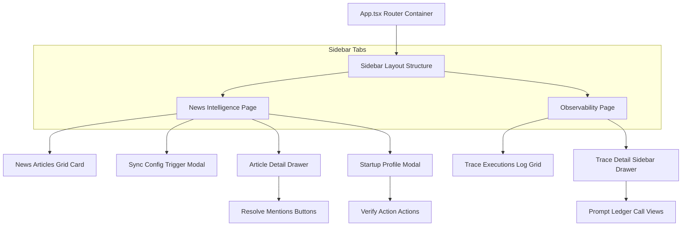

# Frontend Client SPA Architecture

This document details the frontend engineering layer of the **Startup Intelligence OS**, explaining the React single-page application structure, state management, and user interaction modals.

---

## 1. UI Views & Component Tree

Below is the layout mapping page views and component child hierarchies:

---

## 2. Page View Handlers (`frontend/src/pages/`)

### A. News Dashboard Page (`NewsDashboard.tsx`)
*   **Grid layout**: Renders article cards categorized by priority bands (`High`, `Medium`, `Low`, `Ignore`) and sync source categories.
*   **Feed sync controller**: Renders the configurations trigger modal to select target feeds and limits. Contains the live Terminal Logging box polling sync states.
*   **Startup detail modal**: Displays enriched profiles (`company_intelligence`) and computed strategic priority scores.

### B. Observability Page (`ObservabilityDashboard.tsx`)
*   **Run telemetry log**: Renders a list of execution traces (ingestion runs, manual enrichment operations) detailing duration and execution status.
*   **Trace details drawer**: Displays sub-agent execution runs, database mutation statistics, and full prompt template logs.

---

## 3. UI Components (`frontend/src/components/`)

### A. News Drawer Component (`NewsDrawer.tsx`)
*   **Slide-over drawer**: Opens when an article card is clicked, rendering the full sanitized text and the AI summary list.
*   **Resolve buttons panel**: Renders resolved startup badges.
    *   **Solid badge**: Startup is linked to a database entity. Clicking redirects to the Startup Details modal.
    *   **Dashed badge**: Unresolved startup mention. Clicking opens the resolution popup to choose **"Add Basic Info"** (Screening status) or **"Add & Enrich Profile"** (Enriching status).

### B. Startup Profile Modal (`DetailModal.tsx`)
*   **Detailed tabs layout**: Displays information categorized across tabs:
    *   **Overview**: Founding year, headquarter city, industry tags, and RM team assignment.
    *   **Products & Competitors**: Value propositions and market competitors.
    *   **Funding**: Total raised capital and round stages.
    *   **Strategic Analysis**: BFSI strategic fit score, integration readiness evaluations, and co-creation suggestions.

---

## 4. State Management, Hooks & Local Storage

*   **REST Requests**: Communicates with the FastAPI server using native `fetch` requests.
*   **State updates**: Maintains dashboard updates using standard React states (`useState`, `useEffect`).
*   **Sync Polling Hook**: When a news feed sync is active, triggers a `setInterval` loop polling `/api/news/sync/status` every 2 seconds to stream log output to the Terminal console box.
*   **Dismissible Banners**: Uses `localStorage` to persist banner dismissals. The sync success notification reads the latest completed timestamp, keeping the banner hidden on page reloads unless a new sync completes.

---

## 5. UI Loading & Error States
*   **Spinning loaders**: Renders skeleton card grids while loading list requests.
*   **Error banners**: Displays retry buttons if API endpoints fail or credentials expire.
*   **Real-time sync logs**: Provides visual feedback by streaming logs to the dashboard console while background tasks run.
