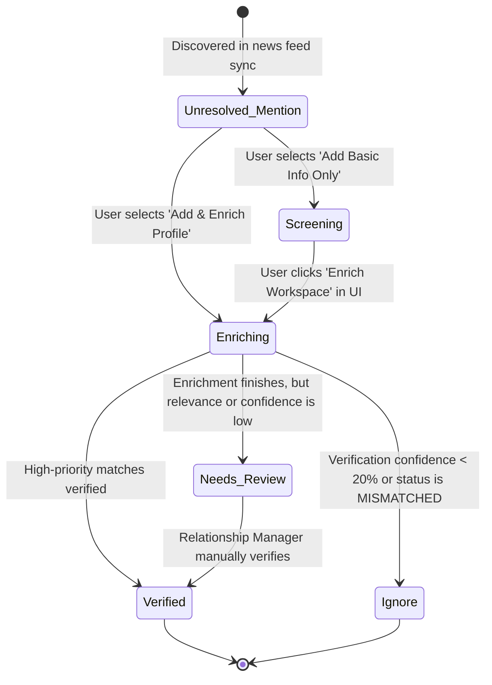

# Startup Intelligence Lifecycle

This document explains the end-to-end processing pipeline of the **Startup Intelligence OS**, detailing how raw, unstructured news articles are parsed, vetted, resolved, enriched, and stored as high-fidelity company records.

---

## 1. 20-Stage Processing Lifecycle

Below is the structured execution flow for raw data ingestion to database storage and dashboard rendering:

```mermaid
flowchart TB
    subgraph Ingestion["Phase 1: Ingestion & Deduplication"]
        A["1. News Sources"] -->|Crawl Feeds| B["2. RSS / Search Feeds"]
        B -->|Parse XML| C["3. Feed Parser"]
        C -->|Identify Link| D["4. Lazy Article Fetch"]
        D -->|HTML Parsing| E["5. 9-Layer Paragraph Filter"]
        E -->|Clean Text| F["6. Headline Jaccard Filter"]
        F -->|Syntactic Check| G["7. Semantic LLM Deduplication"]
    end

    subgraph Discovery["Phase 2: Entity Discovery & Vetting"]
        G -->|Unique Event| H["8. Content Segmentation"]
        H -->|Isolate Sections| I["9. Startup Name Discovery"]
        I -->|Identify Mentions| J["10. Unresolved Mentions Registry"]
    end

    subgraph Enrichment["Phase 3: Identity Resolution & Enrichment"]
        J -->|Synchronous Link| K["11. Identity Discovery Search"]
        K -->|Candidate List| L["12. Website & Domain Resolution"]
        L -->|Validate URL| M["13. Playwright Dynamic Crawl"]
        M -->|Extract HTML Text| N["14. Identity Resolution Verification"]
        N -->|Calculate Confidence| O["15. Parallel Modular Enrichment"]
    end

    subgraph Storage["Phase 4: Evaluation & Storage"]
        O -->|Group Results| P["16. Taxonomy & Industry Mapping"]
        P -->|Canonical Classification| Q["17. Deterministic Scoring Rubric"]
        Q -->|Compute Scores| R["18. News/Digest Linkage"]
        R -->|Dual-Write Tables| S["19. Supabase Storage"]
        S -->|Real-Time Channel| T["20. Frontend Dashboard UI"]
    end
```

---

## 2. Phase-by-Phase Execution Specifications

### Phase A: News Ingestion & Deduplication

#### 1. News Sources & Feed Parser
*   **Purpose**: Track emerging venture news stories from configured Indian and global business publications.
*   **Input**: JSON configuration profiles of feeds in `sources.json`.
*   **Output**: Stream of raw, unparsed article elements (title, link, published time).
*   **Failure Handling**: Bypasses offline feeds gracefully and registers errors to the backend system logger.

#### 2. Lazy Article Fetch & 9-Layer Paragraph Filter
*   **Purpose**: Download the full web content from the article link, stripping legal disclaimers, author bios, and subscription CTAs.
*   **Input**: Target webpage URL.
*   **Output**: Capped list of up to 10 substantive editorial text paragraphs.
*   **Validation**: Paragraphs matching regular expression rules in `content_filters.json` are discarded.
*   **Fallback**: If the scraper is blocked by paywalls or fails to load, it falls back to the short RSS synopsis body text.

#### 3. Jaccard & Semantic Deduplication
*   **Purpose**: Identify if the story has already been covered by another source in the DB to avoid repeating articles.
*   **Input**: Raw headline and description text.
*   **Output**: A clean canonical cluster list (duplicates are merged as secondary references under the primary news card).
*   **Verification**: 
    *   If headline Jaccard token overlap is $\ge 0.60$, they are directly merged.
    *   If overlap is between $0.30$ and $0.60$, the local LLM checks if they represent the same event context.
    *   If overlap is $< 0.30$, they are kept as separate news items.

---

### Phase B: Entity Discovery & Vetting

#### 4. Startup Name Discovery
*   **Purpose**: Extract unstructured startup mentions from the sanitized headline and leading paragraphs.
*   **Input**: Capped news body paragraphs.
*   **Output**: A list of cleaned startup name candidates (e.g. `["Zepto", "Lenskart"]`) and a 150-word AI summary.
*   **Validation**: Candidate names are normalized to lowercase and run against the prompt schema filters (skipping generic templates like `ExampleStartup`).

#### 5. Unresolved Mentions Registry & Sync Linkage
*   **Purpose**: Link startup mentions in `news_articles.startups_mentioned` immediately in the DB, so unlinked companies render instantly in the UI with a dashed border option.
*   **Input**: Discovered startup name.
*   **Output**: A basic, placeholder record in the `startups` table with `status: "Screening"` (or `"Enriching"` if enrichment is launched), providing a unique `startup_id` that is mapped instantly to the news article.
*   **Recovery**: Restores pre-existing validated startup IDs to avoid duplicate entity creation.

---

### Phase C: Identity Resolution & Enrichment

#### 6. Identity Discovery (Search & Domain Resolution)
*   **Purpose**: Resolve candidate company websites and LinkedIn profiles using Web Search.
*   **Input**: Discovered startup name.
*   **Output**: Target website URL (e.g. `https://www.zepto.com`) and target LinkedIn company URL.
*   **Fallback**: If search queries fail, the pipeline falls back to querying the local domain cache database using normalized brand synonyms.

#### 7. Playwright Dynamic Crawl
*   **Purpose**: Bypass client-side Javascript renders to scrape the core company website pages (homepage, about, products).
*   **Input**: Resolved website URL.
*   **Output**: Raw text dumps from candidate subpages.
*   **Failure Handling**: If standard HTTP requests fail (timeouts, blocklists), launches a headless Chromium browser instance via Playwright to fetch content.

#### 8. Verification & Resolution scoring
*   **Purpose**: Verify if the scraped website actually matches the context of the originating news article, preventing wrong domain matches (e.g. matching a local store name).
*   **Input**: Scraped website paragraphs vs. headline keywords.
*   **Output**: A confidence score ($0$ to $100$) and verification status (`VERIFIED`, `NEEDS_REVIEW`, `MISMATCHED`).
*   **Aborts**: If confidence is $< 20\%$ or status resolves to `MISMATCHED`, the pipeline aborts further processing to save tokens.

#### 9. Parallel Modular Enrichment
*   **Purpose**: Crawl deep corporate, product, funding, and competitor metrics using parallel agent threads.
*   **Input**: Sanitized website pages + search snippets.
*   **Output**: Bucketed JSON structures.
*   **Concurrency**: Spawns a ThreadPoolExecutor with 5 workers, executing `CorporateEnricher`, `IdentityEnricher`, `ProductEnricher`, `FundingEnricher`, and `CompetitorEnricher` in parallel.

---

### Phase D: Strategic Evaluation & Persistance

#### 10. Taxonomy Mapping & Scoring
*   **Purpose**: Categorize the startup into canonical sectors, business models, and compute strategic priority scores.
*   **Input**: Enriched JSON payload.
*   **Output**: Sector/industry tag mappings, and a calculated final priority score ($0$ to $100$).
*   **Rules**: Run through `ScoringService` based on strategic relevance, deployability, funding metrics, and negative flags.

#### 11. Dual-Write Storage
*   **Purpose**: Persist high-fidelity records to Supabase.
*   **Input**: Completed `StartupState` object.
*   **Output**: Database row updates in `startups` (dual-writing `company_intelligence` JSONB and raw columns) and `startup_analysis`.

---

## 3. Startup Entity State Transitions

The state diagram below maps how a startup entity status transitions in the database:

---

## 4. Code References & Cross-Links
*   For table fields and column consumers, see **[Database Architecture](file:///Users/anurag/Projects/startup-intelligence/docs/system-architecture/database-schema.md)**.
*   For the scoring formulas, see **[Processing Pipeline Deep-Dive](file:///Users/anurag/Projects/startup-intelligence/docs/system-architecture/processing-pipeline.md)**.
