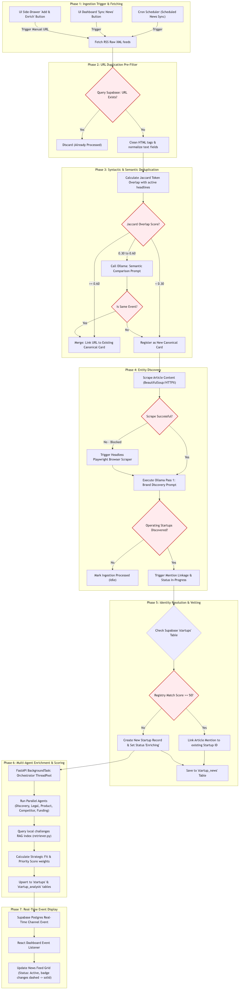

# End-to-End News Ingestion & Processing Lifecycle

This document provides a comprehensive blueprint of the end-to-end News Lifecycle within the **Startup Intelligence OS**, tracking an article from external publication to final database persistence and React UI display.

---

## 1. End-to-End News Lifecycle Flowchart

```mermaid
flowchart TD
    %% Phase 1: Ingestion Trigger & Fetching
    subgraph Phase1 ["Phase 1: Ingestion Trigger & Fetching"]
        Cron["Cron Scheduler (Scheduled News Sync)"] -->|Trigger| Fetch["Fetch RSS Raw XML feeds"]
        UI_Sync["UI Dashboard 'Sync News' Button"] -->|Trigger| Fetch
        UI_Manual["UI Side-Drawer 'Add & Enrich' Button"] -->|Trigger Manual URL| Fetch
    end

    %% Phase 2: URL Duplication Pre-Filter
    subgraph Phase2 ["Phase 2: URL Duplication Pre-Filter"]
        Fetch --> QueryDB{"Query Supabase: URL Exists?"}
        QueryDB -->|Yes| SkipIngest["Discard (Already Processed)"]
        QueryDB -->|No| CleanText["Clean HTML tags & normalize text fields"]
    end

    %% Phase 3: Syntactic & Semantic Deduplication
    subgraph Phase3 ["Phase 3: Syntactic & Semantic Deduplication"]
        CleanText --> CalcJaccard["Calculate Jaccard Token Overlap with active headlines"]
        CalcJaccard --> JaccardCheck{"Jaccard Overlap Score?"}
        
        JaccardCheck -->|Jaccard >= 0.60| MergeSource["Merge: Link URL to Existing Canonical Card"]
        JaccardCheck -->|Jaccard < 0.30| SaveNewCanonical["Register as New Canonical Card"]
        
        JaccardCheck -->|Jaccard between 0.30 and 0.60| CallLLMDedup["Call Ollama: Semantic Comparison Prompt"]
        CallLLMDedup --> LLMMatch{"Is Same Event?"}
        LLMMatch -->|Yes| MergeSource
        LLMMatch -->|No| SaveNewCanonical
    end

    %% Phase 4: Entity Discovery (Ollama)
    subgraph Phase4 ["Phase 4: Entity Discovery"]
        SaveNewCanonical --> ScrapeBody["Scrape Article Content (BeautifulSoup/HTTPX)"]
        ScrapeBody --> ScrapeSuccess{"Scrape Successful?"}
        ScrapeSuccess -->|Blocked| Playwright["Trigger Headless Playwright Browser Scraper"]
        ScrapeSuccess -->|Yes| DiscoveryPrompt["Execute Ollama Pass 1: Brand Discovery Prompt"]
        Playwright --> DiscoveryPrompt
        
        DiscoveryPrompt --> DiscoveryCheck{"Operating Startups Discovered?"}
        DiscoveryCheck -->|No| MarkProcessed["Mark Ingestion Processed (Idle)"]
        DiscoveryCheck -->|Yes| ResolveStartup["Trigger Mention Linkage & Status In-Progress"]
    end

    %% Phase 5: Identity Resolution & Vetting
    subgraph Phase5 ["Phase 5: Identity Resolution & Vetting"]
        ResolveStartup --> CheckRegistry{"Check Supabase 'startups' Table"}
        CheckRegistry --> RegistryMatch{"Registry Match Score >= 50?"}
        
        RegistryMatch -->|Yes| LinkExist["Link Article Mention to existing Startup ID"]
        RegistryMatch -->|No| CreateRegistry["Create New Startup Record & Set Status 'Enriching'"]
        
        LinkExist --> SaveStartupNews["Save to 'startup_news' Table"]
        CreateRegistry --> SaveStartupNews
    end

    %% Phase 6: Multi-Agent Enrichment & Scoring
    subgraph Phase6 ["Phase 6: Multi-Agent Enrichment & Scoring"]
        CreateRegistry --> TriggerOrch["FastAPI BackgroundTask: Orchestrator ThreadPool"]
        TriggerOrch --> ParallelAgents["Run Parallel Agents (Discovery, Legal, Product, Competitor, Funding)"]
        ParallelAgents --> RAGLookup["Query local challenges RAG index (retriever.py)"]
        RAGLookup --> PriorityScore["Calculate Strategic Fit & Priority Score weights"]
        PriorityScore --> SaveRegistry["Upsert to 'startups' & 'startup_analysis' tables"]
    end

    %% Phase 7: Real-Time Event Display
    subgraph Phase7 ["Phase 7: Real-Time Event Display"]
        SaveRegistry --> PushEvent["Supabase Postgres Real-Time Channel Event"]
        PushEvent --> UI_Listener["React Dashboard Event Listener"]
        UI_Listener --> UI_Grid["Update News Feed Grid (Status: Active, badge changes dashed -> solid)"]
    end

    %% Styling
    style JaccardCheck fill:#ffebee,stroke:#c62828,stroke-width:2px
    style RegistryMatch fill:#ffebee,stroke:#c62828,stroke-width:2px
    style QueryDB fill:#ffebee,stroke:#c62828,stroke-width:2px
    style LLMMatch fill:#ffebee,stroke:#c62828,stroke-width:2px
    style DiscoveryCheck fill:#ffebee,stroke:#c62828,stroke-width:2px
    style ScrapeSuccess fill:#ffebee,stroke:#c62828,stroke-width:2px
```

