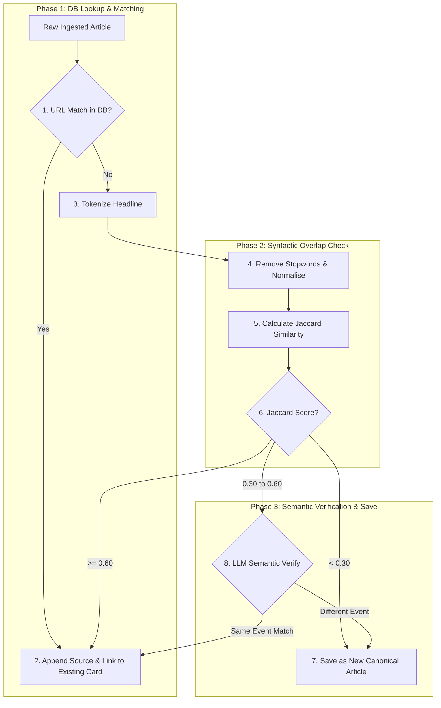
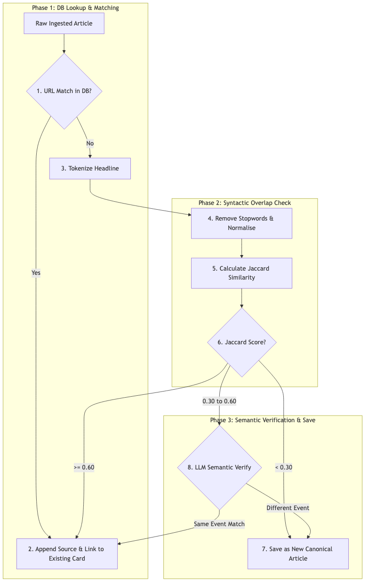

# Startup Ingestion & Processing Pipeline

This document explains the processing pipeline, covering headline deduplication formulas, the verification scoring matrices, and the BFSI priority assignments.

---

## 1. Hybrid Deduplication Workflow

To prevent duplicate stories from polluting the dashboard, the pipeline runs a hybrid (syntactic + semantic) deduplication process inside `backend/pipeline/deduplicator.py`:

### Jaccard Syntactic Deduplication Formula
We compute Jaccard similarity by dividing the intersection of unique words by the union of unique words in both headlines:

$$\text{Jaccard}(A, B) = \frac{|A \cap B|}{|A \cup B|}$$

*   **Expanded Stopword Tokenizer**: Common words, prepositions, and pronouns (e.g. `and`, `of`, `for`, `the`, `is`, `a`) are stripped before calculation.
*   **Merge Threshold ($\ge 0.60$)**: Directly groups rewrites (e.g. *"DPIIT Issues Guidelines for Startup Fund"* vs *"DPIIT Sets Rules for Startup Fund"*).
*   **LLM Verification Threshold ($0.30$ to $0.60$)**: Passes the headline and short body snippet to the local LLM (`are_contexts_describing_same_event`) to confirm if the stories describe the exact same event.

---

## 2. In-Progress Startup Matching & Resolution

When an article mention is resolved:

1.  **Instant placeholder link**: The backend `/resolve-startup` endpoint creates a basic startup record in the DB and links the ID to the news article immediately, updating the card badge in the UI.
2.  **Website Candidate Crawl**: Gathers candidate websites via Web Search, validating and scoring them inside `IdentityResolutionAgent`.
3.  **Verification Scoring**:
    *   Computes a matching confidence score ($0$ to $100$) based on entity overlap.
    *   Assigns a status: `VERIFIED`, `NEEDS_REVIEW`, or `MISMATCHED`.
    *   If confidence is $< 20\%$ or status is `MISMATCHED`, it aborts further enrichment processing.

---

## 3. Modular Enrichment Layer (Phase 3 Parallel Run)

If verified, `AgentOrchestrator` launches parallel modular enrichment threads via a `ThreadPoolExecutor` (5 workers):

*   **`CorporateEnricher`**: Extracts headquarters location, founded year, legal name, and basic metadata.
*   **`IdentityEnricher`**: Extracts founders, leadership teams, and profiles.
*   **`ProductEnricher`**: Maps product catalog lists, use-cases, and value propositions.
*   **`FundingEnricher`**: Resolves total funding capital raised and latest round stage.
*   **`CompetitorEnricher`**: Extracts direct and indirect market competitors.
*   **`IntelligenceEnricher`** (Runs sequentially after): Synthesizes strategic fit, BFSI use-cases, and co-creation opportunities.

---

## 4. Priority Scoring Framework (`ScoringService`)

Once enrichment is complete, `ScoringService` computes the final priority score ($0$ to $100$) based on four weight vectors:

$$\text{Priority Score} = (\text{Relevance} \times 0.35) + (\text{Strategic Fit} \times 0.25) + (\text{Deployability} \times 0.25) + (\text{Signal Score} \times 0.15)$$

### Weighted Scores

1.  **Relevance Score ($0$ to $100$)**:
    *   Evaluates how closely the startup aligns with financial services (BFSI).
    *   Higher scores are given for FinTech, InsurTech, RegTech, and WealthTech.
2.  **Strategic Fit ($0$ to $100$)**:
    *   Vets alignment with ICICI Group focus areas.
    *   Higher scores for enterprise readiness and integration feasibility.
3.  **Deployability Score ($0$ to $100$)**:
    *   Assesses integration ease.
    *   If the startup uses legacy architectures or lacks APIs, the score is penalized.
4.  **Signal Score ($0$ to $100$)**:
    *   Tracks positive momentum signals (e.g. funding rounds, expansion) and negative flags (e.g. layoffs, legal issues).

### Priority Bands
Based on the final score, the startup is placed in a priority band:
*   **High** (Score $\ge 75$)
*   **Medium** ($50 \le \text{Score} < 75$)
*   **Low** ($30 \le \text{Score} < 50$)
*   **Ignore** (Score $< 30$)

---

## 5. Relationship Manager (FPR) Assignments

Startups are matched with a Relationship Manager (FPR) in `backend/api/routes/startups.py` based on their sector classification:
*   **FinTech / Payments**: Routed to the Payments Team.
*   **WealthTech / Asset Management**: Routed to the Wealth Management Team.
*   **InsurTech / Claims**: Routed to the Insurance Team.
*   **DeepTech / SaaS**: Routed to the Corporate Technologies Team.

If a startup cannot be classified, it is assigned to a default triage queue.

---

## 6. Code References & Cross-Links
*   For the data models, see **[Database Architecture](file:///Users/anurag/Projects/startup-intelligence/docs/system-architecture/database-schema.md)**.
*   For config mappings, see **[Configuration Registry](file:///Users/anurag/Projects/startup-intelligence/docs/system-architecture/config-registry.md)**.
