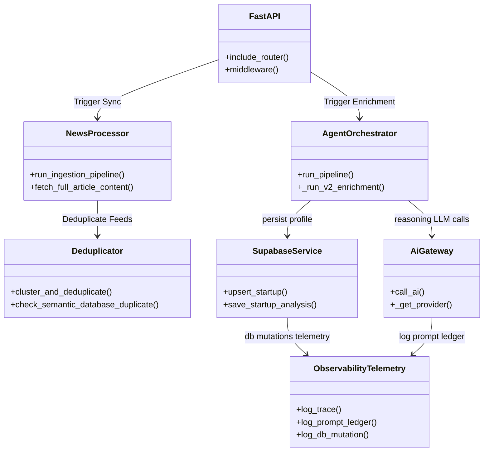
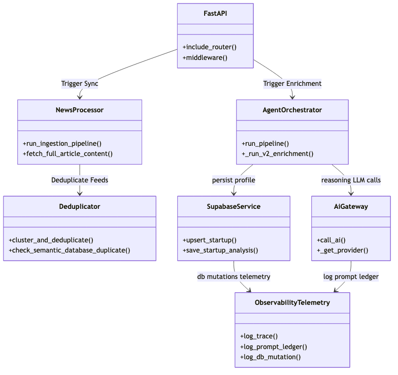

# Repository Architecture & Package Abstractions

## 1. Directory Tree Overview

Below is the structured layout of the Startup Intelligence OS repository:

```text
startup-intelligence/
├── backend/                             # FASTAPI Backend Application
│   ├── agents/                          # V1 Legacy Agent definitions (preserved)
│   ├── ai/                              # Gateway layer & Model Routing rules
│   │   ├── gateway/                     # AI Gateway client and response validator
│   │   ├── providers/                   # Ollama / OpenRouter client interfaces
│   │   └── registry/                    # Model registry and capabilities map
│   ├── api/                             # REST API Router endpoints
│   │   └── routes/                      # News, Startups, Observability, Scraping routers
│   ├── config/                          # Configuration registries (.json)
│   ├── enrichment/                      # V2 Modular Enrichment components
│   ├── knowledge/                       # Vector DB local store index files
│   ├── models/                          # Pydantic states and features declarations
│   ├── pipeline/                        # News sync pipelines & Deduplication checks
│   ├── prompts/                         # System LLM instruction templates (.txt)
│   ├── rag/                             # Knowledge base retriever and embedding tools
│   ├── scrapers/                        # Target content scrapers (Inc42, YC, etc.)
│   ├── services/                        # DB Repositories, scoring, & external services
│   ├── tests/                           # Unit and integration test suites
│   ├── utils/                           # Core utilities (tracing, crawling, taxonomy)
│   └── workflows/                       # High-level pipeline choreographers
├── database/                            # Database setup files
│   └── migrations/                      # PostgreSQL migrations (.sql)
├── frontend/                            # React Client Single Page Application (SPA)
│   ├── src/
│   │   ├── components/                  # Custom UI elements (drawer, modals)
│   │   ├── pages/                       # Master page views (News, Observability)
│   │   ├── types/                       # TypeScript model schemas
│   │   ├── App.tsx                      # App navigation routes
│   │   └── main.tsx                     # React client renderer
│   ├── index.html                       # HTML main template
│   ├── vite.config.ts                   # Vite bundler parameters
│   └── package.json                     # NodeJS module definitions
```

---

## 2. Directory Responsibilities & Code Boundaries

### A. Backend Package Modules (`backend/`)

| Directory | Responsibility | Key Classes / Functions | Dependencies | Consumers |
|---|---|---|---|---|
| `backend/ai` | Standardizes all LLM interactions, payload validation, model routing. | `AiGateway`, `ModelRegistry`, `OllamaProvider`, `OpenRouterProvider` | `openai`, `httpx` | `backend/agents`, `backend/enrichment` |
| `backend/api` | Declares REST routers for dashboard grids, manual sync controls, and status polls. | `resolve_startup_from_news()`, `get_prompt_ledger()`, `list_traces()` | `fastapi`, `pydantic` | Frontend Client |
| `backend/enrichment` | Modular intelligence extraction (v2 pipeline parallel layers). | `IdentityEnricher`, `ProductEnricher`, `FundingEnricher`, `CompetitorEnricher` | `backend/ai`, `backend/utils` | `AgentOrchestrator` |
| `backend/pipeline` | Orchestrates the hourly background feed aggregations, syntactic/semantic deduplication. | `NewsProcessor`, `Deduplicator`, `NewsAggregator`, `scheduler_loop()` | `beautifulsoup4`, `feedparser` | FastAPI startup hook |
| `backend/scrapers` | Crawls target websites, parsing body text and matching headline context. | `extract_clean_paragraphs()`, `crawl_startup_targets()` | `playwright`, `beautifulsoup4` | `NewsProcessor`, `IdentityDiscoveryAgent` |
| `backend/services` | Direct database interface (read/write wrappers), scoring rules, and outreach email tools. | `supabase_service.py`, `ScoringService`, `dispatch_gmail_digest()` | `supabase`, `jinja2` | `backend/api`, `backend/workflows` |
| `backend/utils` | Cross-module helper functions (telemetry tracking, name taxonomy normalization). | `log_trace()`, `wrap_supabase_client()`, `normalize_taxonomy()` | `contextvars` | Repository-wide |
| `backend/workflows`| Coordinates high-level process flows (e.g. discovery, resolving, and enrichment). | `AgentOrchestrator`, `run_pipeline()` | `backend/enrichment`, `backend/agents` | `backend/api`, `backend/pipeline` |

---

## 3. Major Abstractions & Relationships





*   **`AgentOrchestrator`** acts as the core dispatcher for the intelligence engine. It initializes a clean `StartupState` object, coordinates calls to the `IdentityDiscovery` and `IdentityResolution` agents (Phase 2), and executes the 5 parallel `Enricher` threads (Phase 3) before calculating metrics and writing to database tables.
*   **`AiGateway`** acts as a proxy for all LLM calls. It wraps prompt loading, rate-limiting, and error-handling. It manages dynamic fallback routing, shifting execution to the local Ollama instance or external OpenRouter targets based on health configuration variables.
*   **`ObservabilityTelemetry`** (`backend/utils/tracing.py`) intercepts call-flows repo-wide. It wraps the Supabase PostgreSQL connector to intercept query latency, logs execution logs in `obs_prompt_ledger`, and maintains trace-state propagation across background threads using `ContextVar` namespaces.

---

## 4. Code References & Cross-Links
*   For request flows, see **[Request Lifecycle](file:///Users/anurag/Projects/startup-intelligence/docs/system-architecture/request-lifecycle.md)**.
*   For data mapping details, see **[Database Architecture](file:///Users/anurag/Projects/startup-intelligence/docs/system-architecture/database-schema.md)**.
