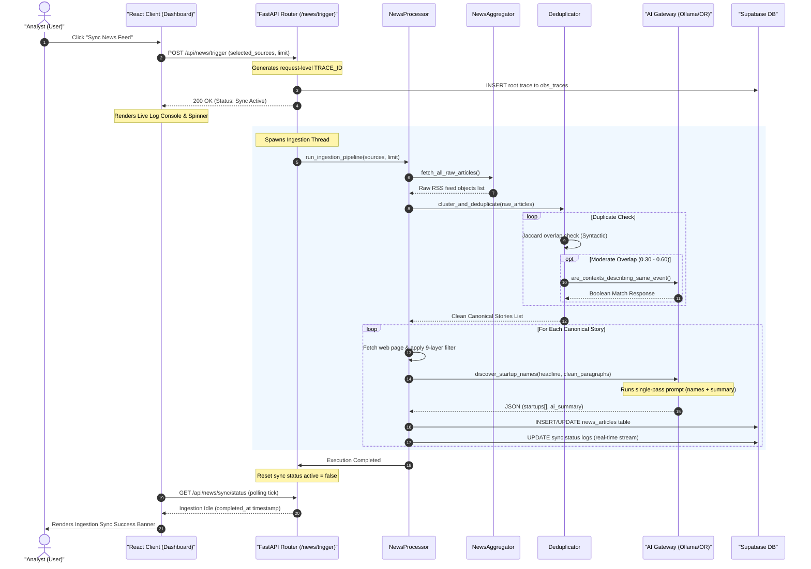
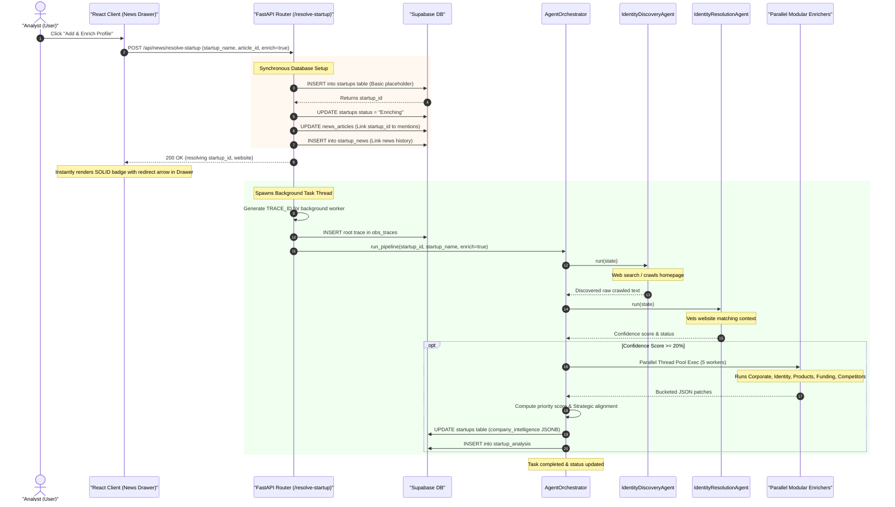

# Request Lifecycle & Sequence Flows

This document traces the request, processing, and database execution lifecycle for the two primary operations in the **Startup Intelligence OS**: Manual News Feed Ingestion and Single Startup Enrichment.

---

## 1. News Ingestion Workflow (Manual Sync Feed)

This workflow traces the sequence of operations when a user triggers a manual sync of news feeds from the React dashboard.

### sequence Diagram

---

## 2. Startup Resolution & Enrichment Workflow ("Add & Enrich Profile")

This workflow traces the sequence of operations when an analyst clicks **"Add & Enrich Profile"** for a discovered startup mention inside an article drawer.

### sequence Diagram

---

## 3. Observability & Database Mutation Telemetry

Every write transaction executed during these lifecycles is intercepted by the backend tracing utility class:
1.  **Intercepted Execute**: When a repository script invokes `.execute()` on the Supabase client builder, the wrapper `wrap_supabase_client` intercepts the method call.
2.  **Generate transaction ID**: Generates a random transaction ID prefix `TXN_[a-z0-9]{16}`.
3.  **Trace context binding**: Fetches the active `trace_id` from the thread's `ContextVar` namespace.
4.  **Telemetry log**: Inserts a log record into the `obs_db_mutations` table capturing:
    *   Target database table name (e.g. `startups`).
    *   Operation action type (`INSERT`, `UPDATE`, `DELETE`, `SELECT`).
    *   Count of database rows affected.
    *   Query transaction execution duration (latency in milliseconds).
5.  **Failure tolerance**: DB logging operations are wrapped in safe try-except blocks. If the observability log fails, the primary database transaction execution continues unaffected.

---

## 4. Code References & Cross-Links
*   For API routes registration, see **[Backend Architecture](file:///Users/anurag/Projects/startup-intelligence/docs/system-architecture/backend-architecture.md)**.
*   For DB schemas, see **[Database Architecture](file:///Users/anurag/Projects/startup-intelligence/docs/system-architecture/database-schema.md)**.
