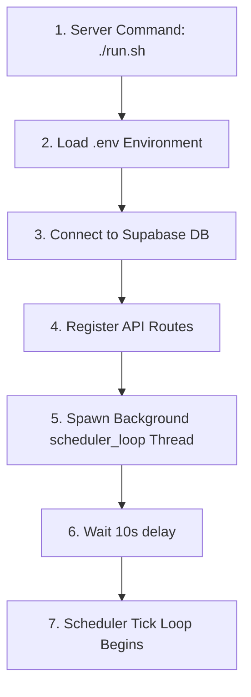

# Trigger & Event Catalogue

This document catalogs every execution trigger, background event, and state change within the **Startup Intelligence OS**.

---

## 1. Events Matrix

| Trigger Event | Originating Actor | Initiated Component | Input Parameters | Output / Side-Effect | Failure Behavior |
|---|---|---|---|---|---|
| **App Startup** | System Process | `FastAPI.on_startup` | CLI starting arguments | Launches background scheduler loop thread. | Logs exception and exits process. |
| **Sync News Feed** | User click / API Post | `NewsProcessor` | Target sources, crawl limits | Deduplicates and updates the `news_articles` table. | Sets sync state to Idle, logs error in console. |
| **Scheduled Sync** | Scheduler Tick | `NewsProcessor` | `sources.json` configuration | Periodic background scraper run (3 articles limit per source). | Captures exceptions silently, sleeps for next tick. |
| **Dispatch Digest** | Time Match | `dispatch_gmail_digest`| `email_config.json` | Generates HTML digest and emails to recipients. | Retries delivery after 10 min, logs failure to trace. |
| **Add Basic Info** | User click / API Post | `resolve_startup_from_news`| `startup_name`, `article_id` | Inserts record with status "Screening", links mentions. | Returns HTTP 500 error code. |
| **Add & Enrich** | User click / API Post | `_enrich_single_startup_async`| `startup_name`, `article_id`, `enrich=true` | Sets status to "Enriching", updates database. | Resets status to "Needs Review", logs error. |
| **Enrich Workspace**| User click / API Post | `_enrich_single_startup_async`| `startup_id` | Refreshes and updates company profiles. | Updates status to "Needs Review", logs error. |

---

## 2. Event Workflows

### 1. Application Startup Sequence

### 2. Manual News Sync Execution Trace
1.  **Request Dispatch**: Browser posts request payload to `/api/news/trigger`.
2.  **Acquire Lock**: Acquires `news_status_lock` thread lock to prevent concurrent sync executions.
3.  **Spawn Task**: Launches async ingestion task.
4.  **Logging**: Appends real-time logging strings to `NEWS_SYNC_STATUS["logs"]`.
5.  **Completion**: Releases `news_status_lock` on completion, setting `active` state flag back to `False`.

### 3. Background Enrichment Worker Trace
1.  **Trace Generation**: FastAPI launches worker thread, generating a unique `TRACE_ID`.
2.  **State Flags**: Writes startup status as `"Enriching"` to the database.
3.  **Agent Resolution**: Web crawlers retrieve website data, validating the candidate target.
4.  **Completion**: Updates status to `"Screening"` (or `"Needs Review"`) and logs execution telemetry.

---

## 3. Code References & Cross-Links
*   For the routing parameters catalog, see **[Configuration Registry](file:///Users/anurag/Projects/startup-intelligence/docs/system-architecture/config-registry.md)**.
*   For table triggers details, see **[Database Architecture](file:///Users/anurag/Projects/startup-intelligence/docs/system-architecture/database-schema.md)**.
